# 2D Animation

### Workflow

Define Sprite in Sprite Editor ---> Create bones in the Bone Editor ---> Generate and Edit Geometry and Assign Skin Weights in the Geometry and Weight Editor ---> Place Sprite in the Scene and add a Sprite Skin Component to generate the bones ---> Animate Sprite!

## Bone Editor

This is where a hierarchy of bones for Sprites are defined and edited.

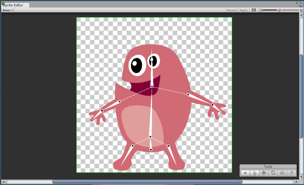

#### Create and Edit Bones

There are two modes to creating bones. The Create Chain Bone mode which will create a continuous chain of bones. The Create Free Bone mode will create stand-alone ( isolated ) bones that are parented to a selected bone.

The first bone created will be set as the **Root** bone for the hierarchy.  In Create Chain Bone mode, new bones are always parented to the previous bone. In Free Bone mode, new bones are parented to a currently selected bone. If a bone is not selected the new bone will be parented to the Root bone. 

When none of the tools are selected, the editor is in Transform mode. Bones can be selected and transformed.

##### Chain Bone Tool

Select the Create Chain Bone tool  and click anywhere on the Sprite to start creating a chain of bones. Press the Escape key to deselect the tool. In Chain mode, child bones are not only parented but are connected to the parents. This allows easier manipulation of bone lengths and positions.

​	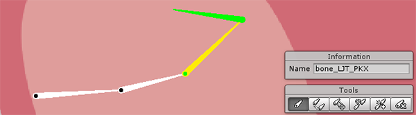

##### Free Bone Tool

The Create Free Bone tool is used to create bones that are not part of a chain of bones. Select the Create Free Bone tool and click anywhere on the Sprite to set the Pivot of the new bone move the cursor to where the bone should end and click again to set the Tip of the bone. The new bone created will be parented to a currently selected bone or the Root bone if none is selected.

​	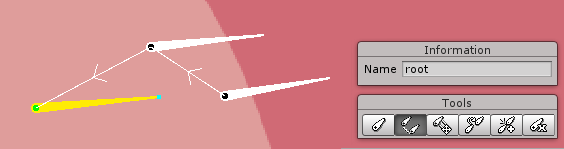

##### Free Move Tool

Bones can be transformed by default when none of the tools are selected. The Pivot, Body and Tail can be selected and transformed. The Free move tool is used to detach a bone from a chain. It will no longer be connected to the chain but will still be parented to it original parent.

​	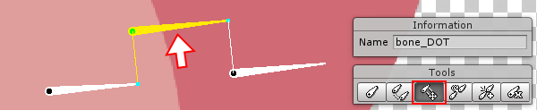

##### Parent Bone Tool

The Parent Bone Tool is used to re-parent a bone to another bone. To change the Parent of a bone. Select the child bone, click on the Parent Bone Tool then click on the target parent.

​	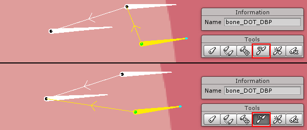

##### Split Bone Tool

The Split Bone Tool will split a selected bone. To use the tool, select a bone and click on the Split Bone Tool. The selected bone will be split in two.

​	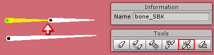

**Bone Editor Shortcut Keys**

| ****Tool          |   Shortcut    |
| ----------------- | :-----------: |
| Create Chain Bone |       B       |
| Create Free Bone  |       N       |
| Free Move         |       M       |
| Parent Bone       |       P       |
| Split Bone        |       S       |
| Delete            |    Delete     |
| Escape            | Deselect Tool |

## Geometry and Weight Editor

This where the Sprite geometry is generated and vertex weights are assigned to bones. 

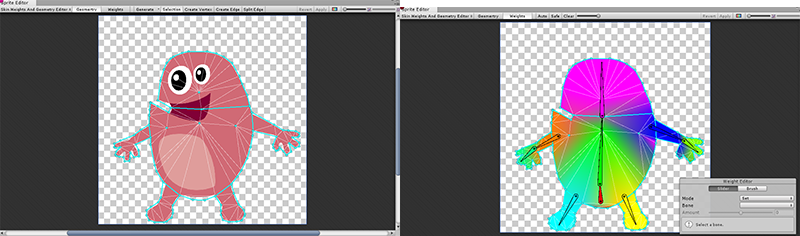

Sprite geometry has to be generated first before weights can be auto-generated or applied.

#### Creating and Editing Geometry

Geometry can be generated automatically or created manually. 

##### Generating geometry automatically

To auto-generate the mesh, first select a Sprite by double-clicking it. Then click on the Generate button on the top menu.

​		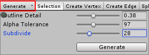

Adjust the parameters to automatically generate a mesh that is suitable for the Sprite

| Parameter       | Description                              |
| --------------- | ---------------------------------------- |
| Outline Detail  | Specifies the density of the outline for the mesh. |
| Alpha Tolerance | The amount of transparency considered when generating the outline. |
| Subdivide       | Subdivides the mesh to create additional tessellation inside of the outline. |

##### Creating geometry manually

Mesh geometry can be created manually by using the Create Vertex or Create Edge feature. If there are multiple Sprites defined, Double-Click on a Sprite to select it.

​	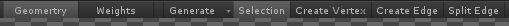

To use Create Vertex, select it from the top menu. Left-Click anywhere within the Sprite Rect to create a vertex. Create Edge requires at least one vertex already created to be used. Click on vertices to create edges.

Additionally, in Selection mode geometry can also be edited. Double-Clicking will create a vertex. Holding Shift will create edges. 

​	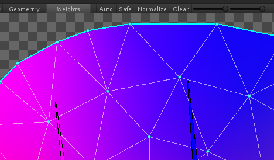

#### Assigning Skin Weights

Switch to the Weights section. Select a Sprite to apply weights. Click on the Auto button 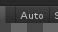 in the top menu to automatically generate weights based on the bones.

In some cases the automatically generated skin weights would suffice but the skin weights can also be edited manually.

##### Editing Skin Weights

The Weight Editor is used to manually edit skin weights.

​	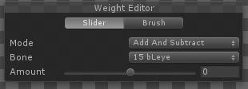

The weights for selected vertices can also be viewed and further adjusted with the vertex inspector.

​	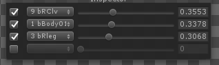

##### Using the Skin Weight Editor

The Weight Editor has two tools - Slider and Brush. Both tools have similar modes but provides different interactions to cater for various scenarios. While the Slider focuses on direct manipulation of directly selected vertices, the Brush tool requires a more painter approach to editing skin weights.****

###### Modes

There are three modes available to be used with either the Slider or Brush tool.

​	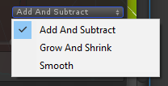

- ###### **Add and Subtract**

  This mode will either add or subtract the value specified to the value of the selected vertices.

- ###### Grow and Shrink

  This mode will add or subtract the value specified to the value of the selected vertices only if the vertices already have influence from the selected bone, effectively growing or shrinking the pre-existing weight influence.

- ###### Smooth

  This mode will smoothen the different weight influence on the applied triangles effectively blending the influences. 

###### Slider Tool

The Slider tool uses a Slider control to apply the selected mode. To use the Slider Tool, select vertices in the mesh and select a target bone. Then drag the Slider Control to the right or left for positive or negative values respectively. Upon releasing the Slider Control it will reset to zero and the process can be repeated. This allows incremental adjustments. Values can also be typed in directly if required.

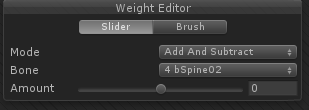

###### Brush Tool

The Brush tool is alternate method of applying bone influence to vertices. 

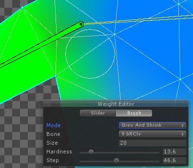

## Sprite Skin Component

The Sprite Skin Component is required for the bones to deform the Sprite mesh. To use the Sprite Skin Component, add the component to a Sprite. Click on the Generate bones to generate the bone hierarchy of the Sprite.

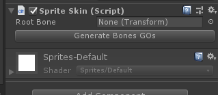 

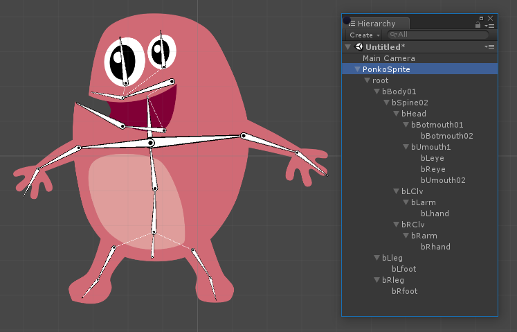

The bones can then be manipulated with the standard Transform tools to deform the mesh and animated the Sprite. Note the Sprite Rect tool cannot be used to transform the bone gizmos.

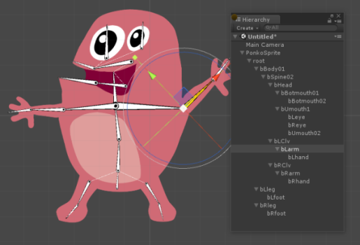

