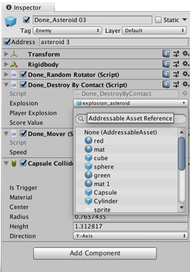
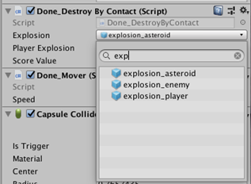

# Getting started with Addressable Assets

## Installing the Addressable Assets package

Requires Unity 2018.2 or later.

To install this package, follow the instructions in the [Package Manager documentation](https://docs.unity3d.com/Packages/com.unity.package-manager-ui@1.7/manual/index.html).

## Marking Assets as addressable

There two ways to mark an item as an Addressable Asset. Once the Addressable Assets package is installed, you can mark an Asset as addressable in the __Inspector__ window or drag it into the __Addressables__ window.

In the __Inspector__ window for the item, click the __Address__ checkbox and enter a name to identify the Asset.


To open the **Addressables** window, click __Window &gt; Asset Management &gt; Addressable Assets__.

Drag the item from the Project window’s Asset folder into a group in the __Addressables__ window’s Asset tab.


The default address for your Asset is the path to the Asset in your project. For example, *Assets/images/myImage.png*. You can use the **Addressables** window to change the address to any unique name.

To change the address, double click the current address of the Asset and enter the new address.

When you first start using Addressable Assets, the system saves some edit-time and run-time data Assets for your Project in *Assets/AddressableAssetsData* which should be added to your version control check in.

### Loading or instantiating by address

You can load or instantiate an Asset at run-time. Loading an Asset loads all dependencies into memory (including Asset bundle data if relevant). This allows you to use the Asset when you need to. Instantiating loads the Asset, and then immediately adds it to the scene.

To access an Asset in script using a string address:

`Addressables.LoadAsset<GameObject>("AssetAddress");`

or

`Addressables.Instantiate<GameObject>("AssetAddress");`

`LoadAsset` and `Instantiate` are asynch operations. You must provide a callback to work with the Asset once it is loaded. 

```
    GameObject myGameObject;
    
    
        ...
        Addressables.LoadAsset<GameObject>("AssetAddress").Completed += onLoadDone;
    }

    private void onLoadDone(UnityEngine.ResourceManagement.IAsyncOperation<Sprite> obj)
    {
        // In a production environment, you should add exception handling to catch scenarios such as a null result;
        myGameObject = obj.Result;
    }
```

### Using the AssetReference Class

The *AssetReference* class provides a mechanism to access Assets without the need to know string (or other) addresses.

To access an Addressable Asset using the *AssetReference *class:

1. Select an Asset.
2. In the Inspector, click the __Add Component__ button and then select the component type.
3. Add a public *AssetReference* object in the component.  For example:

    public AssetReference explosion;

4. In the Inspector, set which Asset the object is linked to by either dragging an Asset from the Project window onto the entry or clicking the entry to choose from previously defined addressable Assets (shown below).

|  |  <br/>Begin typing the AssetReference name for easy filtering.  |
|:---|:---|

### Loading an Addressable Asset by object reference

To load an `AssetReference`, call one of the methods defined on it. For example:

`AssetRefMember.LoadAsset<GameObject>();`

or

`AssetRefMember.Instantiate<GameObject>(pos, rot);`

`LoadAsset` and `Instantiate` are asynch operations. You must provide a callback to work with the Asset once it is loaded. 

### Downloading in Advance

Calling the `Addressables.PreloadDependencies()` method loads the dependencies for the address or label that you pass in. Typically, this is the asset bundle.

The `IAsyncOperation` object returned by this call includes a `PercentComplete` attribute that you can use to monitor progress of downloads. You can use the percent complete to display a progress bar and have the app wait until the content has loaded.

While it can be advantageous to download assets for your app in advance, there are instances where you might choose not do so. For example:

1. If your app has a large amount of online content, and you generally expect users to only ever interact with a portion of it.

2. You have an app that must be connected online to function. For example, a multiplayer game. If all the content for the app is in small bundles, you might choose to wait and download content as-needed.

You can also choose to partially use the preload functionality. Rather than using the percent complete to wait until the content is loaded, you can start the download then continue on. You would need to create a loading/waiting screen later on when you actually load the asset. If the preload has finished, the load is quick, otherwise the app would need to wait until the content is loaded.
