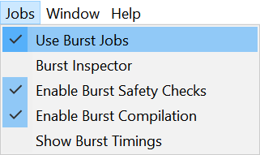
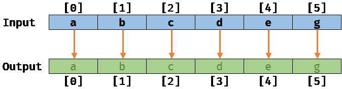
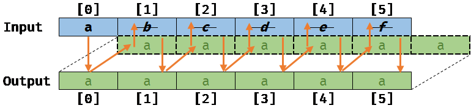
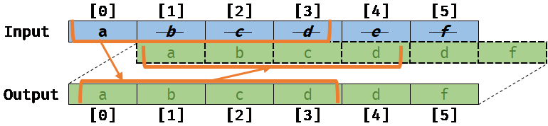

# **_Burst User Guide_**

# Overview

Burst is a compiler, it translates from IL/.NET bytecode to highly optimized native code using LLVM. It is released as a unity package and integrated into Unity using the Unity Package Manager.

# Quick Start

## Compile a Job with the burst compiler

Burst is primarily designed to work efficiently with the Job system. 

You can start using the burst compiler in your code by simply decorating a Job struct with the attribute `[BurstCompile]`

```C#
using Unity.Burst;
using Unity.Collections;
using Unity.Jobs;
using UnityEngine;

public class MyBurst2Behavior : MonoBehaviour
{
    void Start()
    {
        var input = new NativeArray<float>(10, Allocator.Persistent);
        var output = new NativeArray<float>(1, Allocator.Persistent);
        for (int i = 0; i < input.Length; i++)
            input[i] = 1.0f * i;

        var job = new MyJob
        {
            Input = input,
            Output = output
        };
        job.Schedule().Complete();

        Debug.Log("The result of the sum is: " + output[0]);
        input.Dispose();
        output.Dispose();
    }

    // Using BurstCompile to compile a Job with burst
    // Set CompileSynchronously to true to make sure that the method will not be compiled asynchronously
    // but on the first schedule
    [BurstCompile(CompileSynchronously = true)]
    private struct MyJob : IJob
    {
        [ReadOnly]
        public NativeArray<float> Input;

        [WriteOnly]
        public NativeArray<float> Output;

        public void Execute()
        {
            float result = 0.0f;
            for (int i = 0; i < Input.Length; i++)
            {
                result += Input[i];
            }
            Output[0] = result;
        }
    }
}
```

By default within the Editor, burst JIT compile jobs asynchronously, but in the example above, we are using the option `CompileSynchronously = true` to make sure that the method will be compiled on the first schedule. In general, you should use asynchronous compilation. See [`[BurstCompile]` options](#synchronous-compilation)

## Jobs/Burst Menu

Burst adds a few menu entries to the Jobs menu:



- **Use Burst Jobs**: When this is checked, Jobs with the attribute `[BurstCompile]` will be compiled by burst. Default is checked
- **Burst Inspector**: Opens the [Burst Inspector Window](#burst-inspector)
- **Enable Burst Safety Checks**: When this is checked, code that will use collection containers (e.g `NativeArray<T>`) will check safety usages most notably the job data dependency checking system and containers index out of bounds. Note that this option disables by default the noaliasing performance optimizations. Default is checked
- **Enable Burst Compilation**: When this is checked, burst will compile jobs and burst custom delegates that are tagged with the attribute `[BurstCompile]`. Default is checked
- **Show Burst Timings**: When this is checked, everytime burst will have to JIT compile a job in the Editor, the time taken to compile this method will be displayed in the log. Default is unchecked

## Burst Inspector

From the Jobs menu, you can open the burst inspector. The inspector allows you to view all the jobs that can be compiled, you can also then check the generated native code.


On the left pane, we have **Compile Targets** which provides a list of Jobs that burst can compile. Jobs that are highlighted in white can be compiled by burst, while the ones that are disabled don't have the `[BurstCompile]` attribute.

1. Select an active compile target from the _left pane_.
2. On the _right pane_, press the button **Refresh Disassembly**
3. Switch between the different tabs to display the details:
   * The tab **Assembly** provides the final optimized native code generated by burst
   * The tab **.NET IL** provides a view on the original .NET IL extracted from the Job method
   * The tab **LLVM (Unoptimized)** provides a view on the internal LLVM IR before optimizations.
   * The tab **LLVM (Optimized)** provides a view on the internal LLVM IR after optimizations.
   * The tab **LLVM IR Optimization Diagnostics** provides detailed LLVM diagnostics of the optimizations (i.e if they succeeded or failed).
4. You can also switch different options:
   * The *Safety Checks* if enabled will generate code that includes container access safety checks (e.g check if a job is writing to a native container that is readonly)
   * The **Optimizations** option if enabled allows the compiler to optimize the code.
   * The **Fast Math** option if enabled allows the compiler to collapse mathematical operations to be more efficient, at the expense of not respecting an exact mathematical correctness (See the [compiler relaxation option](#compiler-relaxation))

# C#/.NET Language Support

Burst is working on a subset of .NET that doesn't allow the usage of any managed objects/reference types in your code (class in C#).

The following sections gives more details about the constructs actually supported by burst.

## Supported .NET types

### Primitive types

Burst supports the following primitive types:

- `bool`
- `char`
- `sbyte`/`byte`
- `short`/`ushort`
- `int`/`uint`
- `long`/`ulong`
- `float`
- `double`

Burst does not support the following type:

- `string` as this is a managed type
- `decimal`

### Vector types

Burst is able to translate vector types from `Unity.Mathematics` to native SIMD vector types with first class support for optimizations:

- `bool2`/`bool3`/`bool4`
- `uint2`/`uint3`/`uint4`
- `int2`/`int3`/`int4`
- `float2`/`float3`/`float4`

> Note that for performance reasons, the 4 wide types (`float4`, `int4`...) should be preferred

### Enum types

Burst supports all enums including enums with a specific storage type (e.g `public enum MyEnum : short`)

> Burst doesn't currently support `Enum` methods (e.g `Enum.HasFlag`)

### Struct types

Burst supports regular structs with any field with supported types.

Burst supports fixed array fields.

Regarding the layout, `LayoutKind.Sequential` and `LayoutKind.Explicit` are both supported

> The `StructLayout.Pack` packing size is not supported

The `System.IntPtr` and `UIntPtr` are supported natively as an intrinsic struct directly representing pointers.

### Pointer types

Burst supports any pointer types to any burst supported types

### Generic types

Burst supports generic types used with structs. 
Specifically, it supports full instantiation of generic calls for generic types with interface constraints (e.g when a struct with a generic parameter requiring to implement an interface)

### Array types

Managed arrays are not supported by burst. You should use instead a native container, `NativeArray<T>` for instance.

## Language Support

Burst supports the following code flows and syntaxes:

- Regular C# control flows:
  - `if`/`else`/`switch`/`case`/`for`/`while`/`break`/`continue`
- Extension methods
- Unsafe code, pointers manipulation...etc.
- Instance methods of structs
- By ref/out parameters
- Calling an icall/internal function
- Limited support for `throw` expressions, assuming simple throw patterns (e.g `throw new ArgumentException("Invalid argument")`). In that case, we will try to extract the static string exception message to include it in the generated code.
- Some special IL opcodes like `cpblk`, `initblk`, `sizeof`
- Loading from static readonly fields

Burst does not support:

- DllImport or `calli` (This should be supported in a future version) 
- `catch`
- `try`/`finally` (which will come at some point)
- `foreach` as it is requiring `try`/`finally` (This should be supported in a future version)
- Loading from non readonly static fields or storing to static fields 
- Any methods related to managed objects (e.g array access...etc.)

### Intrinsics

#### `System.Math`

Burst provides an intrinsic for all methods declared by `System.Math` except for the following methods that are not supported:
 - `double IEEERemainder(double x, double y)` 
 - `Round(double value, int digits)`

#### `System.IntPtr`

Burst supports all methods of `System.IntPtr`/`System.UIntPtr`, including the static fields `IntPtr.Zero` and `IntPtr.Size`

#### `System.Threading.Interlocked`

Burst supports atomic memory intrinsics for all methods provided by `System.Threading.Interlocked` (e.g `Interlocked.Increment`...etc.)

#### `NativeArray<T>`

Burst supports intrinsics with `noalias` only for the following `NativeArray<T>` methods:

- `int Length { get; }`
- `T this[int index] { get; set; }`

Any usage of other members will disable `noalias` optimizations automatically.

# Optimization Guidelines

## Memory Aliasing and `noalias` 

Memory aliasing is an important concept that can lead to significant optimizations for a compiler that is aware about how data is being used by the code.

### The problem

Let's take a simple example of a job copying data from an input array to an output array:


```c#
[BurstCompile]
private struct CopyJob : IJob
{
    [ReadOnly]
    public NativeArray<float> Input;

    [WriteOnly]
    public NativeArray<float> Output;

    public void Execute()
    {
        for (int i = 0; i < Input.Length; i++)
        {
            Output[i] = Input[i];
        }
    }
}
```
#### No memory aliasing:

If the two arrays `Input` and `Output` are not slightly overlapping, meaning that their respective memory location are **not aliasing**, we will get the following result after running this job on a sample input/output:



#### No memory aliasing with the auto-vectorizer:

Now, if the compiler is **noalias aware**, it will be able to optimize the previous scalar loop (working at a scalar level) by what is called **vectorizing**: The compiler will rewrite the loop on your behalf to process elements by a small batch (working at a vector level, 4 by 4 elements for example) like this:


#### Memory aliasing:

Next, if for some reasons (that is not directly easy to introduce with the JobSystem today), the Output array is actually overlapping the Input array by one element off (e.g `Output[0]` points actually to `Input[1]`) meaning that memory are **aliasing**, we will get the following result when running the `CopyJob` (assuming that the auto-vectorizer is not running):



#### Memory aliasing with invalid vectorized code:

Worse, if the compiler was not aware of this memory aliasing, it would still try to auto-vectorize the loop, and we would get the following result, which is different from the previous scalar version:



The result of this code would be invalid and could lead to very serious bugs if they are not identified by the compiler.

### The solution with `burst` and the JobSystem

To ensure that a Job can be safely vectorized (when there is a loop), burst relies on:

- The assumption brought by the safety of the JobSystem regarding the data in input/output that you can specify in the Job: It means that by default, all data accessed safety through a job are not aliasing
- A further analysis of burst on the code to make sure that the code is also safe

The alias analysis in burst is currently relying on a few constraints that your code needs to follow in order to let the auto-vectorizer to work correctly:

- Only `NativeArray<T>` is used and only the property `Length` and or the indexer `this[index]` are used
- Native containers (e.g `NativeArray<T>`) or a struct containing indirectly a container should not be copied to a local variable
- Native containers can be passed by value to a method argument, at the condition that all arguments are coming from identified source, either from fields or other arguments from static methods, but not both and that the method is static
- Native Containers or a struct containing indirectly a container are not stored to a field of a struct
- Assuming that the option **Enable Burst Safety Checks** is unchecked in the [Jobs menu](#jobsburst-menu)

We are expecting to improve the alias analysis with a finer grained model that will allow to relax a few of these constraints.

### Example of generated code with noalias analysis

Let's take the example of the `CopyJob`, with the compiled to native code with the `noalias` analysis disabled.

The following loop is the result of the compilation `x64` using `AVX2` instructions with **noalias analysis enabled**:
(Note that we are only copying the core loop, not the full prolog, epilog of the whole method)

The instruction `vmovups` is moving 8 floats  here, so a single auto-vectorized loop is now moving 4 x 8 = **32 floats copied per loop iteration** instead of one! (So there will be /32th of loop step iterations compare to the original loop)

```
.LBB0_4:
    vmovups ymm0, ymmword ptr [rcx - 96]
    vmovups ymm1, ymmword ptr [rcx - 64]
    vmovups ymm2, ymmword ptr [rcx - 32]
    vmovups ymm3, ymmword ptr [rcx]
    vmovups ymmword ptr [rdx - 96], ymm0
    vmovups ymmword ptr [rdx - 64], ymm1
    vmovups ymmword ptr [rdx - 32], ymm2
    vmovups ymmword ptr [rdx], ymm3
    sub     rdx, -128
    sub     rcx, -128
    add     rsi, -32
    jne     .LBB0_4
    test    r10d, r10d
    je      .LBB0_8
```

The same loop with the **noalias analysis disabled** will be **copying only a single float per loop iteration**:

```
.LBB0_2:
    mov     r8, qword ptr [rcx]
    mov     rdx, qword ptr [rcx + 16]
    cdqe
    mov     edx, dword ptr [rdx + 4*rax]
    mov     dword ptr [r8 + 4*rax], edx
    inc     eax
    cmp     eax, dword ptr [rcx + 8]
    jl      .LBB0_2
```

As we can see, the performance difference can be significant here. That's why noalias aware native code generation is fundamental, and that's what burst is trying to solve.

## Compiler options

When compiling a job, you can change the behavior of the compiler:

- Using a different accuracy for the math functions (sin, cos...)
- Allowing the compiler to re-arrange the floating point calculations by relaxing the order of the math computations.
- Forcing a synchronous compilation of the Job (only for the Editor/JIT case)
- Using internal compiler options (not yet detailed)

These flags can be set through the `[BurstCompile]` attribute, for example `[BurstCompile(Accuracy.Med, Support.Relaxed)]`

### Accuracy

The accuracy is defined by the following enumeration:

```C#
    public enum Accuracy
    {
        Std,
        Low,
        Med,
        High,
    }
```

Currently, the implementation is only providing the following accuracy:

- `Std` is providing an accuracy of 1 ULP. This is the **default value**.
- `High`, `Med`, `Low` are providing an accuracy of 3.5 ULP

Using the `High` accuracy should be largely enough for most games.

An ULP (unit in the last place or unit of least precision) is the spacing between floating-point numbers, i.e., the value the least significant digit represents if it is 1.

> We expect to support more ULP accuracy for `Med` and `Low` in a future version of burst

### Compiler relaxation

The compiler relaxation is defined by the following enumeration:

```C#
    public enum Support
    {
        Strict,
        Relaxed
    }
```

- Strict: The compiler is not performing any re-arrangement of the calculation and will be careful at respecting special floating point values (denormals, NaN...). This is the **default value**.
- Relaxed: The compiler can perform instructions re-arrangement and/or using dedicated/less precise hardware SIMD instructions.

Typically, some hardware can support Multiply and Add (e.g mad `a * b + c`) into a single instruction. Using the relaxed calculation can allow these optimizations.
The reordering of these instructions can lead to a lower accuracy.

Using the `Relaxed` compiler relaxation can be used for many scenarios where the exact order of the calculation and the uniform handling of NaN values are not strictly required.

### Synchronous compilation

By default, the burst compiler in the editor will compile the jobs asynchronously.

You can change this behavior by setting `CompileSynchronously = true` for the `[BurstCompile]` attribute:

```C#
[BurstCompile(CompileSynchronously = true)]
public struct MyJob : IJob
{
    // ...
}
```

## `Unity.Mathematics`

The `Unity.Mathematics` provides vector types (`float4`, `float3`...) that are directly mapped to hardware SIMD registers.

Also, many functions from the `math` type are also mapped directly to hardware SIMD instructions.

> Note that currently, for an optimal usage of this library, it is recommended to use SIMD 4 wide types (`float4`, `int4`, `bool4`...)

# Standalone Player support

The burst compiler is supporting standalone players.

## Usage

When building a player, burst will compile a single dynamic library for all the burst jobs in your game. Depending on the platform, the dynamic library will be output to a different folder (on Windows, it is in the path `Data/Plugins/lib_burst_generated.dll`)

This library will be loaded by the Job system runtime on the first job compiled by burst.

The settings to enable the compilation are controlled by the Jobs/burst menu, the same way than for the editor.

In a future iteration, these settings will be moved to proper settings per platform/player.

## Supported platforms

Burst is supporting the following platforms for standalone players:

- Windows
- MacOS
- Linux
- Xbox One
- PS4
- Android (ARM v7 and v8+)
- iOS (ARM v7 and v8+)

## Known issues

- Accuracy/Precision are currently not supported 
- The target CPU is currently hardcoded per platform (e.g SSE4 for Windows 64 bits)

These known issues will be resolved in a future release of burst.
