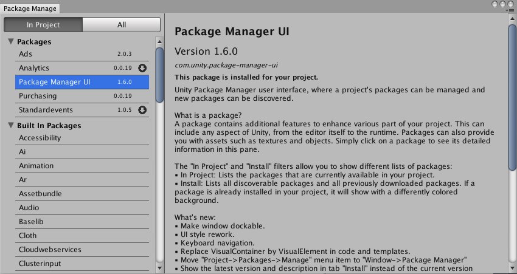
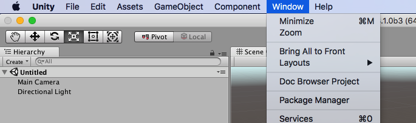
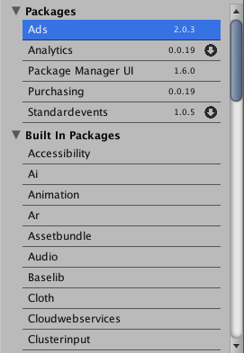
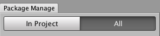
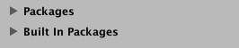
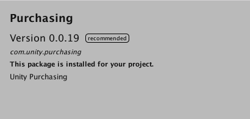
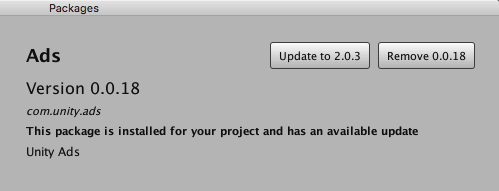
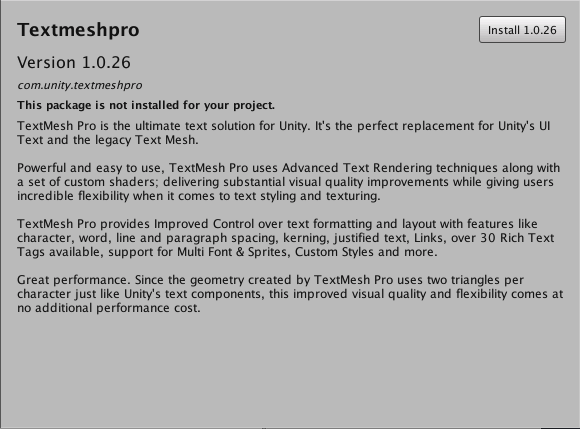
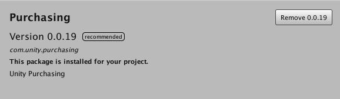

### **_Package Manager Documentation_**

# About Package Manager

Use the package manager to manage which packages are available in your project.

#### What is a package?

A package contains additional features to enhance various part of your project. This can include any aspect of Unity, from the editor itself to the runtime. Packages can also provide you with assets such as textures and objects.

# Using the Package Manager

#### Opening the Package Manager Window

To open the package manager window, simply go into the *Project* menu, then into the *Packages* sub-menu and finally click on the *Manage* menu item.

#### Packages List

This lists a series of packages organized by group. Simply click on a package to get its detailed information on the right pane. If a package has errors, is in conflict or has newer versions available, you will see a status icon next to its name.

##### Filters

The *In Project* and *Install* filters allow you to show different lists of packages.

###### In Project

Lists the packages that are currently available in your project.

###### Install

Lists all discoverable packages and all previously downloaded packages. If a package is already installed in your project, it will show with a differently colored background.

##### Groups

Packages are organized by groups for easier browsing and display.

###### Packages

These are the packages that are either installed by default or added manually to Unity.

###### Built-in Packages

These are the built-in packages that are bundled with the editor and that affect your game's build in some way. You can remove the built-in packages that you don't need in order to reduce you game's build size.

##### Tags

The "recommended" tag next to the version in the package details indicates that this package
is officially tested and approved by Unity.

Others tags like "alpha", "beta" and "experimental" are used as a mechanism to give the ability to users to test a package's features before it has been fully documented and validated by either the development team or Unity's Quality Assurance team.

#### Package Actions

##### Update

This button found in the details section of a package allows you to update a package to the version
on the button's label. Updating a package should add any new functionality instantly, if available.
A restart should not be necessary.

##### Install

This button found in the details section of a package allows you to install a package with the version on the button's label. Installing a package should add the new functionality instantly.
A restart should not be necessary.

##### Remove

This button found in the details section of a package allows you to remove a package. Be aware that removing
a package will also remove its related functionality, so parts of your editor or runtime may disappear.
Also, if the package is required by another package, it may not be removed.

## Manifest

While not essential to use the package manager, it can be useful to know some of its inner workings.

One such aspect is the manifest file where all the packages used in a project are listed. This file is named
`manifest.json` and can be found in the `UnityPackageManager` folder of your project. The
file format is *Json*, which is a popular data file format. All the packages of your project are listed under
the *dependencies* property of the manifest. Since *Json* is a text format, you can copy the dependencies
by hand from one project to the other by simply editing the file. Once the manifest file is modified, simply
going back into the Unity Editor will update to reflect all changes, and any new package will be added
automatically.

# Technical Details

## Requirements

This Package Manager version is compatible with the following versions of the Unity Editor:

* 2018.1 and later (recommended)

## Known Limitations

The Package Manager includes the following known limitations:

* Modifying the manifest.json by hand doesn't update the package list. You need to either re-open the window or change filters to force an update.
* Built-in packages can't be enable or disable right now.

## Package Contents

The following table provides an alphabetical list of the important files and folders included in this package.

|Folder or Filename|Description|
|---|---|
|Documentation|Folder containing the documentation's sources.|
|Editor|Folder containing the source code for the package manager window.|
|Tests|Folder containing the package manager tests.|

## Documentation Revision History

|Date|Reason|
|---|---|
|Jan 12, 2018|Document updated. Matches package version 1.4.0.|
|Nov 7, 2017|Document created. Matches package version 1.0.0.|
