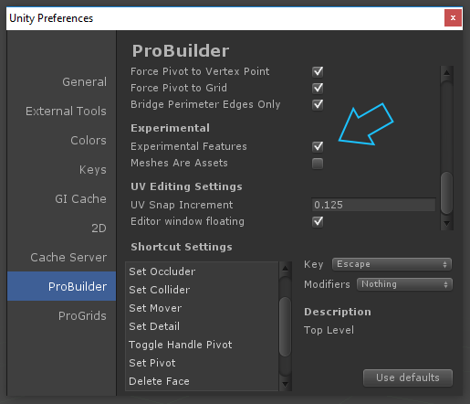
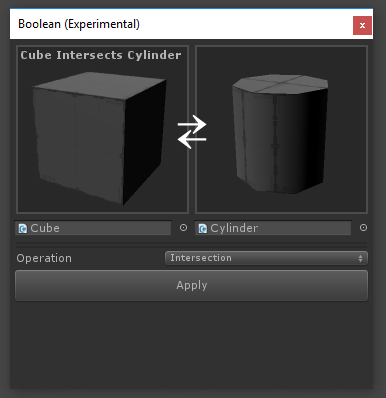
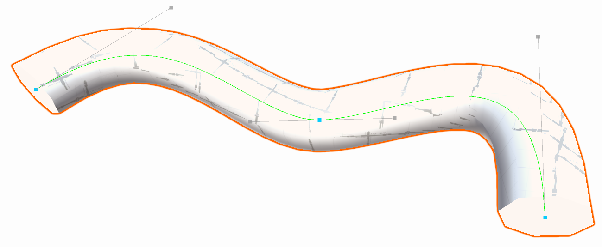
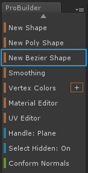

---

## Overview

ProBuilder has some additional features that are considered experimental. These are features that are either close to being complete, or complete with some caveats.

By default **Experimental Features** are disabled. To enable experimental features:

- Open Unity Preferences (`Edit / Preferences` on Windows, `Unity / Preferences` Mac)
- Under the **Experimental** header, enable **Experimental Features**

## Boolean (CSG) Tool

The Boolean Tool provides an interface for creating new meshes from boolean operations.

Each function (Union, Subtract, Intersect) accepts 2 gameObjects: the left and right side. A new mesh is created.

##  Bezier Shape

Section Video: <a href="https://youtu.be/WIyPObt3lro">Creating and Editing Bezier Shapes</a>

### Quick Start

- In the [ProBuilder Toolbar](overview-toolbar) select **New Bezier Shape**.
- Move control & tangent points by dragging.
- For precise controls, click a control point to select it (selected control points have a tranlate and rotation handle).
- To add a point click on the bezier path line.
- To remove a point, select it and press `Backspace` (`Delete` on Mac).
- To finish editing, click the "Editing Bezier Shape" button.
- To re-enter editing, click the "Edit Bezier Shape" button.

> **Important:** Modifying bezier control points or settings will clear any mesh edits.

### Bezier Shape Inspector

|**Inspector:** |**Description:** |
|:---|:---|
|__Edit Bezier Shape__ |Toggle in and out of shape editing mode. |
|__Position__ |The local position of the selected control point. |
|__Tan. In__ |The local position of the selected control tangent in handle. |
|__Tan. Out__ |The local position of the selected control tangent out handle. |
|__Rotation__ |An additional rotation to be applied to the vertices of the extruded tube. |
|__Tangent Mode__ |Allows you to modify how interacting with tangent handles works. |
|__Clear Points__ |Clear all control points on this mesh. |
|__Add Point__ |Add a new control point at the end of the bezier path. |
|__CloseLoop__ |Should the extruded path loop back around to the start point. |
|__Smooth__ |Determines if the extruded pipe faces have hard or soft normals. |
|__Radius__ |The radius of the extruded pipe. |
|__Rows__ |How many segments to insert between control points when extruding the pipe. |
|__Columns__ |How many vertices make up the ring around the radius of the pipe. |

### Tangent Modes

|**Icon** |**Tangent Mode** |**Description** |
|:---|:---|:---|
|  |Free |Adjusting one tangent does not affect the other. |
|  |Aligned |Adjusting a tangent will set the other tangent to match it's magnitude. |
|  |Mirrored |Tangent handles are locked in a straight line. |

