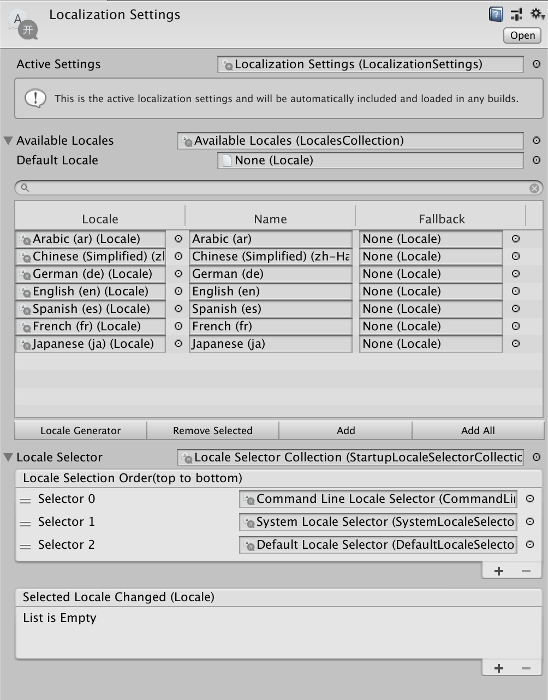
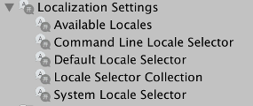
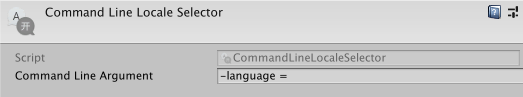
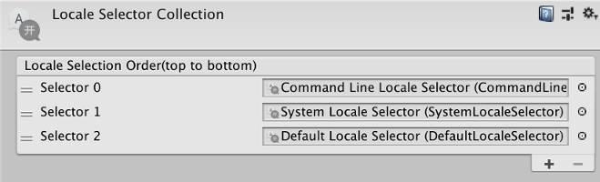
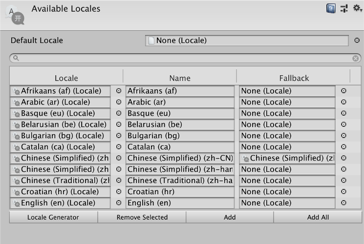
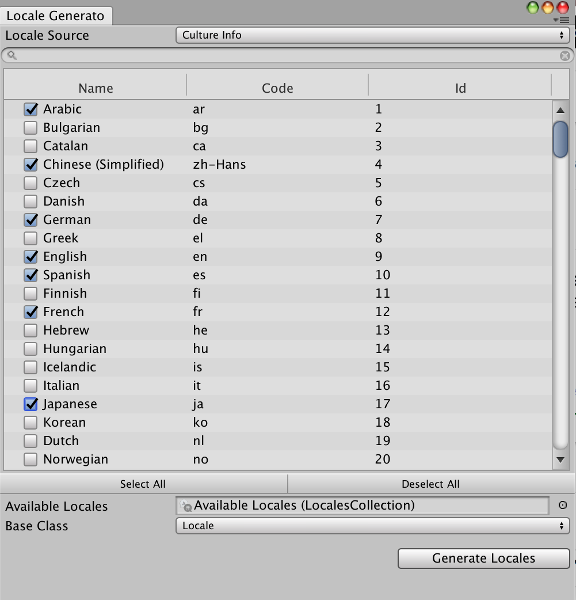
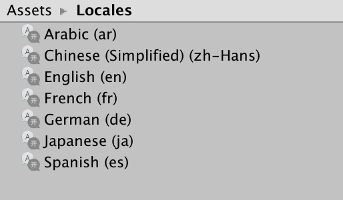

### **_Localization  Documentation_**

# About Localization

The Localization package provides tools for adding support for multiple languages and regional variants to your application. For example, supporting text in multiple languages or culture specific assets such as audio or textures.

## Requirements

This Localization version *0.1.0-experimental* is compatible with the following versions of the Unity Editor:

* 2018.2 and later (recommended)

## Known Limitations

The Localization version 0.1.0 includes the following known limitations:

* Only supports defining supported locales, no actual text or asset localization support.

# Using Localization

## Localization Settings

The Localization Settings is an asset that references all the components required for localizing the application. Each reference can be replaced with a custom version by inheriting from the relevant base class and creating a new asset of the custom type.

A new Localization Settings asset can be created from the menu *Assets/Create/Localization/Localization Settings*. It is possible to have multiple Localization Settings assets per project although most use cases will only require one. The active Localization Settings asset will be automatically included into the build and preloaded during startup and so does not need to be referenced through scripts or added to a scene.

*Default Localization Settings* 

*Default Localization Settings Asset* 

## Startup Locale Selector

The Startup Locale Selector is used to determine what locale should be used when the application starts or no locale is currently selected.
The selector will attempt to find the locale in the LocalizationSettings AvailableLocales.
Custom Locale Selectors can be created by inheriting from the StartupLocaleSelector class.
The following Startup Locale Selectors are provided:

### Command Line Locale Selector

*Command Line Locale Selector Inspector View* 

The Command Line Locale Selector provides the ability to configure the selected locale through a command lime argument. The provided argument can be either a locale code or id.

### Default Locale Selector

The Default Locale Selector will attempt to use the default locale that was assigned to the AvailableLocales.

### System Locale Selector

The System Locale Selector will read the locale from the system that the application is being run from, it will then attempt to find a matching locale or fallback locale from the AvailableLocales.

### Startup Locale Selector Collection

*Startup Locale Selector Collection Inspector View* 

The Startup Locale Selector Collection allows for multiple Startup Locale Selectors to be used, each Locale Selector will be tried until one successfully returns a non-null locale. The order the locales should be attempted in can be configured via the inspector or scripting api.

## Locales Collection

*Locales Collection Inspector View* 

The Locales Collection determines what Locales are supported by the application. 
Locales can be added individually or all locales in the project can be added by pressing the *Add All* button.

## Locale

A Locale is an asset that represents a language. It supports regional variations and can be configured with an optional fallback locale.
Custom locales can be created by inheriting from the Locale class, for example information on custom fonts or right to left text could be added to a custom locale.
Locales can be created through the Asset creation menu however the recommend way is to use the *Locale Generator*.

## Locale Generator Window

*Locale Generator Window* 

The Locale Generator Window is a tool that can be used to quickly generate Locale assets for chosen languages. The generators source can be configured to either use the SystemLanguage enum or the .Net CultureInfo class. The generated Locale assets can be added to the Localization Settings during the process by populating the Available Locales field.
The base class field allows for selecting what Locale class should be used to represent the Locale assets, if a custom Locale class has been created then this will appear in the dropdown and can be used. 
The Locale Generator Window is accessible through the menu *Windows/Localization/Locale Generator* or through the Locales Collection button *Locale Generator*.

*Example Locales generated by the Locale Generator* 

# Document Revision History

|Date|Reason|
|---|---|
|Jan 15, 2018|Document created. Matches package version 0.1.0-experimental|

