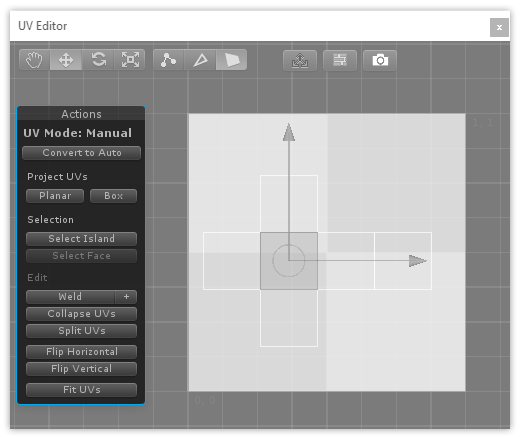
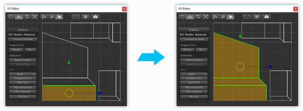
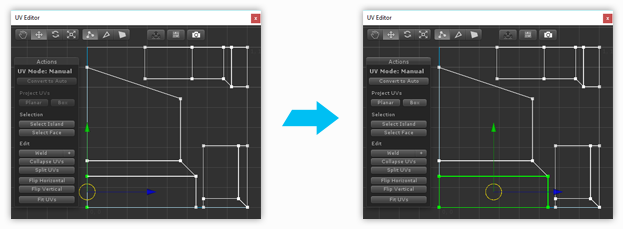
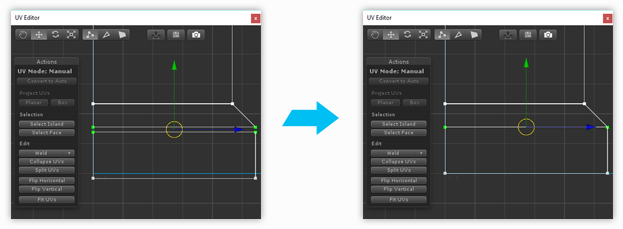
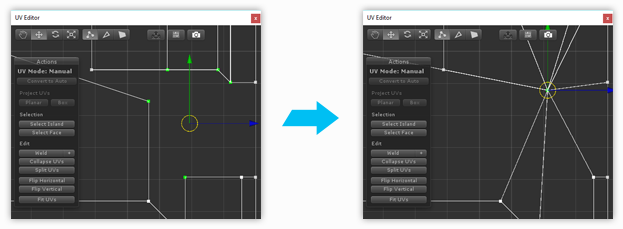
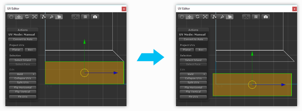
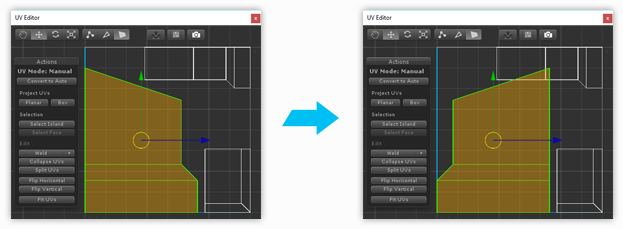
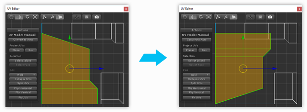
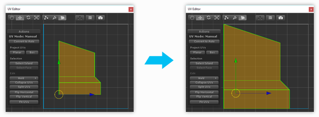

---

## Convert to Auto

Converts all selected faces to [Auto UVs](auto-uvs-actions).

## Project UVs: Planar

Unwraps the selected face(s) using a Planar Projection method.

## Project UVs: Box

Unwraps the selected face(s) using a Box Projection method.

## Select Island

With a UV element selected, clicking this will expand the selection to include all other connected UV elements.

## Select Face

With a Vertex or Edge selected, click to select all elements on the same face.

## Weld

Collapses selected vertices together, but only if they are within a set distance.

To adjust the distance modifier, click the "+" button on the right side of the Weld button.

## Collapse UVs

Collapses all selected vertices to a single vertex, regardless of distance.

## Split UVs

Breaks off the selected UV element(s)) from any UV element(s), allowing them to be manipulated independantly.

## Flip Horizontal

Flip the selected UV element(s) in the horizontal direction.

## Flip Vertical

Flip the selected UV element(s) in the vertical direction.

## Fit

Scale and move the selected UV element(s) to fit exactly within the UV space.

## Continue UVs

`Control + Click` to align an adjacent face UV coordinates to the current selection.

To use:

1. Open the UV Editor
2. Select a face in the Scene View
3. `Control + Click` a face that shares an edge with the current selection

