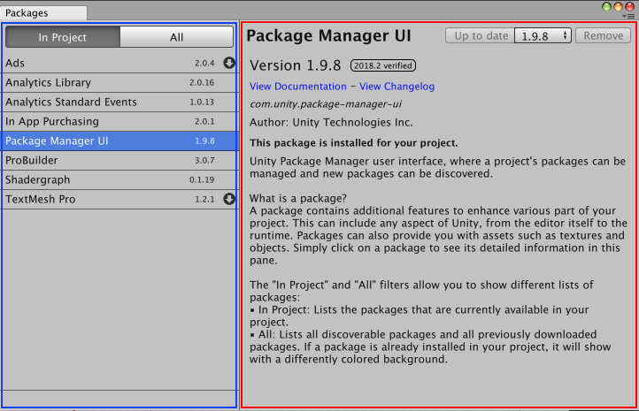
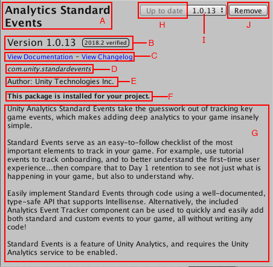
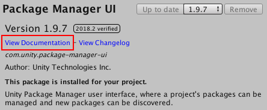
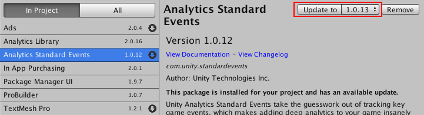

# Package Manager
A package is a container that holds any combination of Assets, Shaders, Textures, plug-ins, icons, and scripts that enhance various parts of your project. Unity packages are newer, more tightly integrated versions of Asset Store packages, able to deliver a wide range of enhancements to Unity. 

Use the Package Manager window to view which packages are available for installation or already installed in your project. In addition, you can use this window to [install](#PackManInstall), [remove](#PackManRemove), or [update](#PackManUpdate) packages for each project.

The Package Manager window displays a [list view](#PackManLists) on the left and a [detail view](#PackManDetails) on the right.

## Finding packages
By default, the Package Manager window displays the list of packages in the **In Project** mode, so that only the packages already installed in your project appear in the list. 

To expand the list to include all available packages, click the **All** button. The list now displays everything registered in the [package registry](#PackManRegistry), regardless of whether they are already installed in the project.

## Viewing package details
The pane on the right side of the Package Manager window displays details about the selected package.

These details include the following information:
 - (A) The display name 
 - (B) The version number (and tag, if available)
 - \(C\) The link to open the package documentation page 
 - (D) The official package name from the registry starting with `com.unity.` 
 - (E) The author
 - (F) The installation or update status
 - (G) A brief description 
 - (H) Buttons to install, remove, or update the package
 - (I) The link to open the package change log

### Version tags
Some packages display special tags next to the version number. These tags convey special information about that version of the package. 

Package Manager uses the following values:

| **Tag** | **Meaning** |
|--|--|
| `recommended` | This package is officially tested and approved by Unity. |
| `alpha` or `beta` | This package is at an early stage of the release cycle and may not have been documented and validated by either the development team or Unity's Quality Assurance team. |
| `experimental` | This package is in development. |

### Finding more information
You can find out more about a package by viewing the documentation. 

To access it, click the View Documentation link in the Details pane:

The package documentation page opens.

## Accessing the Package Manager window
You can perform a variety of tasks through the Package Manager window:

 - [Install a new package](#PackManInstall)
 - [Remove an installed package](#PackManRemove)
 - [Update an installed package](#PackManUpdate)

 To open the Package Manager window, select **Window > Package Manager** from the main menu. 
 

### Installing a new package

To install a new package:
 1. Open the Project Manager window and click the **All** button. 
 2. Select the package you want to install from the **Packages** list. The package information appears in the Details pane.
 3. Click the **Install X.X.X** button. When the progress bar finishes, the new package is ready to use.

### Removing an installed package

To remove an installed package:
 1. Open the Project Manager window. 
 2. Click the **In Project** button if you are in **All** mode. 
 3. Select the package you want to remove from the **Packages** list. The package information appears in the Details pane.
 4. Click the **Remove X.X.X** button. When the progress bar finishes, the package disappears from the list.

**Notes:** 
 - You can only remove packages which are not required by another package. 
 - When you remove a package, any editor or runtime functionality which it implemented is no longer available.

### Updating an installed package

You can update a package while in either the **In Project** or **All** mode:
 1. Open the Project Manager window. Any packages that have updates available appear with an arrow indicator.
 2. Select the package you want to update from the **Packages** list. The package information appears in the Details pane. 
 3. Click the **Update to X.X.X** button. When the progress bar finishes, the new package version information appears in the Details pane and any new functionality is available. 

## Advanced package topics
This section provides more advanced information about the package manifest file but you don't need to know anything about these topics to install, remove, and update packages.

A Unity package contains a [package manifest file](#PackManManifestsPackage) in addition to the contents (Assets, Shaders, Textures, plug-ins, icons and scripts). The package manifest tells Unity how to display its information page in the Package Manager window and how to install the package in the project.

In addition, there are several files that help manage the package deployment, including the tests, the samples, the license, the changelog, and the documentation.

### Manifests
There are two types of manifest files: [project](#PackManManifestsProject) manifests (`manifest.json`), and [package](#PackManManifestsPackage) manifests (`package.json`). Both files use JSON (JavaScript Object Notation) syntax to communicate with Package Manager by describing which packages are available for each project and what each package contains. 

#### Project manifests
Project manifests (`manifest.json`) tell Package Manager which packages and versions are available to the project.

The following value is supported:

| Key | JSON Type | Description |
|--|--|--|
| `dependencies` | Object |List of packages for Package Manager to load. These are usually packages officially registered with Unity. |

Example of a `manifest.json` file:

	{
		"dependencies": {
			"com.unity.package-1": "1.0.0",
			"com.unity.package-2": "2.0.0",
			"com.unity.package-3": "3.0.0"
		}
	}

Unity stores each project manifest in the `[your_project_root_folder]/Packages/manifest.json` file.

#### Package manifests
Package Manager uses package manifests (`package.json`) to determine which version of the package to load and what information to display in the Package Manager window.

The following values are supported:

| Key | JSON Type | Description |
|--|--|--|
| `name` | String |Officially registered package name, following this naming convention: `"com.unity.[your package name]"`. For example, `"com.unity.resourcemanager"` |
| `displayName` | String |Package name as it appears in the Package Manager window. For example, `Resource Manager"` |
| `version` | String |Package version `"MAJOR.MINOR.PATCH"`. Unity packages follow the [Semantic Versioning](https://semver.org) system. For example, `"1.3.0"`. |
| `unity` | String |The Unity version that supports this package. For example, `"2018.1"` indicates compatibility starting with Unity version 2018.1. |
| `description` | String |Brief description of the package. This is the text that appears on the Details pane of the Package Manager window. Some special formatting character codes are supported, such as line breaks (`\n`) and bullets (`\u25AA`). |
| `keywords` | Array of Strings |Keywords used for searching in the Package Manager window specified as a JSON array of strings. For example, `["Physics", "RigidBody", "Component"]`. |
| `category` | String |Category of the package. For example, `"Forces"`. |
| `dependencies` | Object |List of packages this package depends on, expressed as a JSON dictionary where the key is the package name and the value is the version number. Unity downloads all dependencies and loads them in the project with the package. |

Example of a `package.json` file: 

	{
		"name": "com.unity.package-4",
		"displayName": "Package Number 4",
		"version": "2.5.1",
		"unity": "2018.1",
		"description": "This package provides X, Y, and Z. \n\nTo find out more, click the \"View Documentation\" link.",
		"keywords": ["key X", "key Y", "key Z"],
		"category": "Controllers",
		"dependencies": {
			"com.unity.package-1": "1.0.0",
			"com.unity.package-2": "2.0.0",
			"com.unity.package-3": "3.0.0"
		}
	}

Unity stores each package manifest in the `[your_package_root_folder]/package.json` file.

### The Package Registry
Unity maintains a central registry of official packages that are available for distribution. When Unity loads, Package Manager communicates with the registry, checks the project manifest file, and displays the status of each available package in the Package Manager window.

When you remove a package from the project, Package Manager updates the project manifest to exclude that package from the list in **In Project** mode but it is still available in **All** mode because it is still on the registry.

When you install or update a package, Package Manager downloads the package from the registry.

# Technical details

## Requirements

This version of Package Manager is compatible with the following versions of the Unity Editor:

* 2018.1 and later (recommended)

## Known limitations

Package Manager includes the following known limitations:

* If you manually edit the `manifest.json` file, the Package Manager window doesn't refresh the list of packages. You need to either [re-open the window](#PackManOpen) or [toggle between In Project and All modes](#PackManLists) to force an update.

## Documentation revision history
|Date|Reason|
|---|---|
|Feb 19, 2018|Documentation updated. Matches package version 1.8.0.|
|Feb 8, 2018|Documentation updated. Matches package version 1.7.0.|
|Feb 6, 2018|Documentation cleaned up. Matches package version 1.6.1.|
|Jan 31, 2018|Documentation updated (developmental review)|
|Jan 29, 2018|Document updated. Matches package version 1.6.0.|
|Jan 18, 2018|Document updated. Matches package version 1.5.1.|
|Jan 17, 2018|Document updated. Matches package version 1.5.0.|
|Jan 12, 2018|Document updated. Matches package version 1.4.0.|
|Nov 7, 2017|Document created. Matches package version 1.0.0.|
