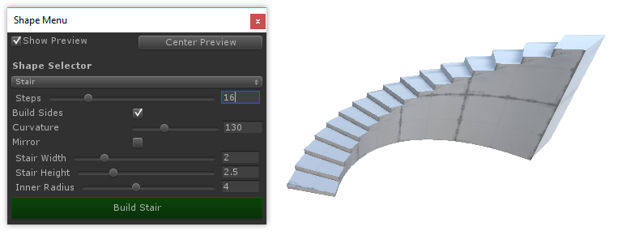

# About ProBuilder

Use the ProBuilder package to Build, Edit, and Texture custom geometry in the Unity editor. For example, use ProBuilder for in-scene level design, prototyping props and items, or custom collision, with on-the-fly playtesting. The ProBuilder package also includes tools for UV editing, vertex color and texture blending, dynamic object tools, FBX exporting, and more.

## Requirements

This ProBuilder version 2.10.0 is compatible with the following versions of the Unity Editor:

* **Recommended:** 2018.1 and later
* Compatible: 2017.1 and higher

## Help and Support

Need to report a bug, or just ask for advice? Post on the Official Support Forum at **www.procore3d.com/forum** and we'll help out right away.

For general questions and info, email us via **contact@procore3d.com**.

# Installing ProBuilder

("The text and cross-reference is still to be determined. It will be added by the Documentation Team")

## Package Manager (recommended)

(what's the exact method here? is it 100% known yet?)

## Asset Store

(2018.1 version probably won't be cross-compatible with Asset Store)

1. Open your Unity project, and ensure you have zero errors (red-colored text) in the Console
2. From the top menu, choose "Window > Asset Store"
3. In the Asset Store window, type "ProBuilder" into the Search bar
4. Click the "ProBuilder" icon in the Search Results
5. Click the blue "Download" button, and wait for the download to complete
	* If you have already downloaded ProBuilder, the button will show "Import", click this and continue as usual
6. When ready, an Import Unity Package window will appear- click "Import" at the bottom-right
7. After the Import process completes, choose "Tools > ProBuilder > ProBuilder Window" from the top menu to begin using ProBuilder

# Using ProBuilder

**Note:** Browse the complete ProBuilder Documentation online at [**procore3d.com/docs/probuilder**](www.procore3d.com/docs/probuilder)

## The ProBuilder Toolbar

All of ProBuilder's specialized editing functions are available via the [ProBuilder Toolbar](http://procore3d.github.io/probuilder2/toolbar/overview-toolbar), which dynamically adapts to your Edit Mode and selection.

Each Toolbar button will display detailed information about it's use, options, and keyboard shortcuts when hovered over. Viewing tooltips is a great way to start learning about ProBuilder's functionality.

*More Info: [**ProBuilder Toolbar**](http://procore3d.github.io/probuilder2/toolbar/overview-toolbar)*

## Creating a New Mesh

Press `CTRL K` on your keyboard to spawn in a new ProBuilder-editable cube.

To start with a more complex shape, ProBuilder also includes a library of shapes (cylinder, torus, stairs, etc), to begin modeling with. Which each of these shapes, you can customize both starting dimensions and unique parameters.

*More Info: [**Shape Tool**](http://procore3d.github.io/probuilder2/toolbar/tool-panels/#shape-tool)*

## Object vs Element

**Object Mode** is standard Unity mode, no surprises.

**Elements** are the individual parts that make up a mesh: **Vertices**, **Edges**, and **Faces**. If it helps, you can think of these like levels of detail on a map- for example, "city, state, country". Click in the [Edit Mode Toolbar](http://procore3d.github.io/probuilder2/toolbar/overview-toolbar/#edit-mode-toolbar) to change Mode, or use it's shortcut keys.

* **Vertex Editing**: Select and edit Vertices for detailed editing and functions like vertex splitting and connecting.
* **Edge Editing**: Select and edit Edges for semi-complex geometry editing, and Edge Loop Modeling techniques.
* **Face Editing**: Select and edit Faces on an object, performing basic tasks like deleting faces and extruding.

### Element Selection and Manipulation

First, choose which Element type you'd like to edit by clicking it's button in the [Edit Mode Toolbar](http://procore3d.github.io/probuilder2/toolbar/overview-toolbar/#edit-mode-toolbar).

Then, use any of the standard Unity selection methods (click, drag, etc) and manipulation controls (move, rotate, scale), just as you would on any other object(s).

### Building and Editing Complex Meshes

ProBuilder follows many of the same conventions as other 3D modeling applications, so experienced 3D artists will likely be able to jump right in after reading the [ProBuilder Toolbar](http://procore3d.github.io/probuilder2/toolbar/overview-toolbar) section.

If you are new to 3D modeling, ProBuilder is a great way to get your feet wet.  Now would be a good time to check out [ProBuilder Tutorial Videos](https://www.procore3d.com/videos).

## Texturing and UVs

### Applying Materials

You can apply **any** material (including Substance) to ProBuilder meshes using the Unity drag and drop method or the [Material Palette](http://procore3d.github.io/probuilder2/toolbar/tool-panels/#material-tools).

Materials can also be applied to individual faces of a ProBuilder mesh, while in [Element Mode](http://procore3d.github.io/probuilder2/toolbar/overview-toolbar/#edit-mode-toolbar).

*More Info: [**Material Tools**](http://procore3d.github.io/probuilder2/toolbar/tool-panels/#material-tools)*

### Editing UVs

ProBuilder includes both [Auto UVs](http://procore3d.github.io/probuilder2/texturing/auto-uvs-actions) (default), and a complete [Manual UV Editing and Unwrapping](http://procore3d.github.io/probuilder2/texturing/manual-uvs-actions) system.

**Auto UV** mode lets you tweak basics like Offset, Tiling, and Rotation, while ProBuilder handles the complex UV work automatically.

**Manual UV** mode enables complete control of the UVs, including Projection Mapping, UV Stitching, and more, similar to UV editors in major tools like 3DS Max, Blender, etc.

**You may use whichever you prefer, or a mix of both, even on the same mesh.**

*More Info: [**Texturing and UVs**](http://procore3d.github.io/probuilder2/texturing/overview-texture-mapping)*

## More Info

Browse the complete ProBuilder Documentation online at: [**procore3d.com/docs/probuilder**](www.procore3d.com/docs/probuilder)

---

# Document Revision History

|Date|Reason|
|---|---|
|Nov 9, 2017|Document created. Matches package version 2.9.8f3.|

