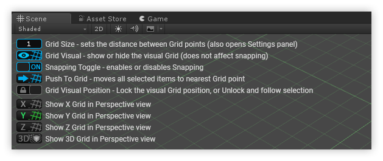

# About ProGrids

Simple, functional grids and snapping for:

- Aligning items and prefabs
- Greyboxing in ProBuilder
- Eliminating mesh gaps
- Modular level design

## Requirements

ProGrids is compatible with Unity 2018.1 and later.

## Help and Support

Need to report a bug, or just ask for advice? Post on the [support forum](http://www.procore3d.com/forum).

For general questions and info, email us at [contact@procore3d.com](mailto:contact@procore3d.com).

# Installing ProGrids

## Unity 2018.1 and later (recommended)

To install this package, follow the instructions in the [Package Manager documentation](https://docs.unity3d.com/Packages/com.unity.package-manager-ui@1.7/manual/index.html).

Verify that ProGrids is correctly installed by opening `Tools > ProGrids > About`.

## Unity 2017.3 and earlier

**Important** - The Asset Store version of ProGrids will only receive critical bug fixes going forward. New features are available in the 2018.1 and later Package Manager version of ProGrids.

1. Open your Unity project and ensure you have no persistent errors (red-colored text) in the Console.
1. From the top menu, choose `Window > Asset Store`.
1. In the Asset Store window type "ProGrids" into the search bar.
1. Click the "ProGrids" icon in the search results.
1. Click the blue "Download" button, and wait for the download to complete.
1. After Unity has downloaded the package, click "Import."
1. An "Import Unity Package" window will appear. Click "Import" at the bottom-right.
1. After the import process completes, choose `Tools > ProGrids > ProGrids Window` from the top menu to begin using ProGrids.

# Using ProGrids

## Quick Start

- Open ProGrids by navigating to `Tools > ProGrids > ProGrids Window`
- Close ProGrids by navigating to `Tools > ProGrids > Close ProGrids`
- Click the "Close" button in the Scene Toolbar to hide the interface.
- Click the "grid" button in the Scene Toolbar to show the interface.

Once activated, ProGrids will work in the background, keeping your objects snapped to the Grid. Use the ProGrids Window as needed:

## Learn More

For complete info, view the [ProGrids Online Documentation](https://www.procore3d.com/docs/progrids).

## Document revision history

|Date|Reason|
|---|---|
|March 26, 2018|Document updated. Matches package version 2.5.0f0|
|Feb 1, 2018|Document created. Matches package version 2.5.0f0|

