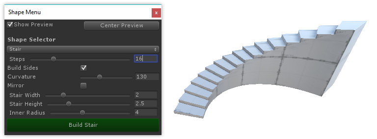
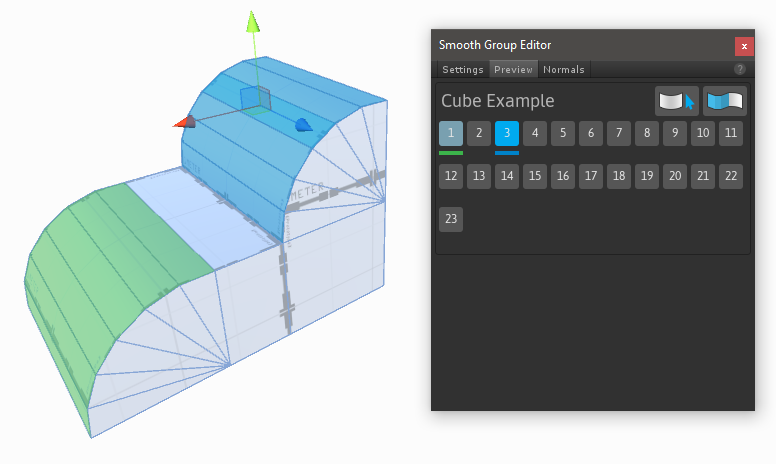

---

##  Shape Tool

**Keyboard Shortcut** : `CTRL SHIFT K`

**Purpose** : Create new editable shapes such as cylinder, arch, and stairs.

Each shape has specific properties which can be customized before creation. For example, the stairs shape lets you choose items like step height, arc, and which parts of the stairway to build.

**Usage**

1. Click **New Shape**.
1. If *Shape Preview* is enabled, you will see a blue preview object in the scene.
1. Choose the shape you'd like to create (ex, cube, cylinder, torus, etc).
1. Set the options (ex, width, height, radius, number of stairs, etc).
1. You may move or rotate the preview object within your scene.
1. Click **Build Shape** to create your final shape.

##  Material Tools

**Purpose** : Apply materials to objects or faces.

**Quick Material Usage**

- **(A)** The current *Quick Material*.
- **(B)** Apply the material to the selected faces.
- **(C)** Pick your material from the selected face.
- **(D)** Preview of the current *Quick Material*.

Hold `CTRL SHIFT` while clicking on a face to apply the *Quick Material*.

**Material Palette Usage**

- **(E)** Drag-and-drop your often-used materials to these slots.
- **(F)** Create additional Material Palette slots.

You can also press `ALT (number key)` to apply materials from the Palette.

##  Texturing and UVs

**Purpose**: Opens the UV Editor.

The UV Editor Panel includes both [Auto UV](auto-uvs-actions) tools, and a complete [Manual UV Editing and Unwrapping](manual-uvs-actions) system.

For more information, see [Texturing and UVs](overview-texture-mapping).

##  Vertex Color Tools

**Purpose** : Opens the Vertex Coloring controls, for applying or painting vertex colors onto meshes.

> **Warning:**  Not all shaders will show vertex colors on a mesh.

Applying Vertex Colors is a great way to colorize levels for prototyping, team layout, zones, etc.

##  Smoothing Groups

Section Video: <a href="https://www.youtube.com/watch?v=6bwZ9vN7uN0&index=4&list=PL1GU9r7hfosDHqJBqsBzkrLRDOH2EXCMa">ProBuilder Toolbar: Smoothing Groups</a>

**Purpose**: Create a smooth and rounded look, or sharp and hard cornered.

**Usage**:

- Choose Face editing from the [Edit Mode Toolbar](overview-toolbar#edit-mode-toolbar)
- Select a group of faces that you want to have smooth adjoining edges
- Click an unused smooth group number in the Smooth Group Editor
	- *Note* Smooth groups already in use are shown with a light blue highlight
- To clear selected face smoothing groups, select the faces and click the  icon
- To select all faces matching with the current smooth group index, use the  icon
