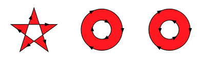

# About Vector Graphics

The Vector Graphics package provides an SVG importer as well as generic vector graphics APIs.

## Requirements

This Vector Graphics package version 1.0.0 is compatible with the following versions of the Unity Editor:

* 2018.1 and later (recommended)

## Known Limitations

The SVG importer from this package implements a subset of the SVG 1.1 specification, with some limitations:

* Clipping/masking is not yet supported [(SVG 1.1 section 14)](https://www.w3.org/TR/SVG11/masking.html)
* Patterns are not yet supported [(SVG 1.1 section 13.3)](https://www.w3.org/TR/SVG11/pservers.html#Patterns)
* Text elements are not yet supported [(SVG 1.1 section 10)](https://www.w3.org/TR/SVG11/text.html)
* Any interactivity feature are not supported [(SVG 1.1 section 16)](https://www.w3.org/TR/SVG11/interact.html)

# Using Vector Graphics

## SVG Importer

This package provides an SVG importer that reads and interprets SVG documents and generates 2D sprites to be used by the Unity engine.

You import SVG files like any other assets.  You either drop them directly into the Assets Browser, or you use the `Assets > Import New Asset...` menu item.  Once imported, you can instantiate the resulting assets in the Hierarchy View or the Scene View.

The SVG importer has the following properties:


**Pixels Per Unit**: How many SVG units correspond to 1 scene unit.

**Tessellation Step Distance**: At which distance are triangles generated when tessellating the paths.  A smaller step distance will result in smoother curves at the expense of more triangles.

**Gradient Resolution**: The texture size used to store gradients.

**Pivot**: The location of the pivot for the generated sprite.  This follows the same convention as regular sprites, with an additional "SVG Origin" pivot value.  When using "SVG Origin", the pivot will be the (0,0) position of the SVG document.

The tessellation settings can be provided in two ways: **Basic** or **Advanced**.  When using **Basic**, you only need to provide a **Target Resolution** and a **Zoom Factor**.  The importer will automatically configure the advanced settings to make sure your SVG document will render at a high enough tessellation for that resolution at that zoom factor.


If you want full control over the tessellation of the SVG document, you can specify the following advanced settings:

**Step Distance**: Distance at which vertices will be generated along the paths. Lower values will result in a more dense tesselation.

**Sampling Steps**: Number of samples evaluated on paths.  More samples may lead to more precise curves, especially when they have sharp corners.

**Max Cord Deviation**: When enabled, specifies the distance on the cord to a straight line between two points after which more tesselation will be generated.

**Max Tangent Angle**: When enabled, specifies the max tangent angle (in degrees) after which more tesselation will be generated.

 

The curves will subdivide for as long as every enabled constraints aren't satisfied.

The **Sprite Editor** is also available and works exactly the same way as regular sprite assets.

## Vector Graphics API

Classes and methods are provided to work with vector data directly in code.  The SVG importer internally uses these APIs to generate and tessellate the resulting sprites.  The same APIs are available to users.

The whole API is designed as a set of simple classes and structures that holds the vector data together.  This is accompanied by static methods to manipulate and transform this data.

At the core of the Vector Graphics package lives the `Scene` class, which stores a graph of vector objects.  Its `root` property is an instance of `SceneNode`, which contains a list of drawable items, a list of child nodes and a transform.

```
public class SceneNode
{
    public List<SceneNode> children { get; set; }
    public List<IDrawable> drawables { get; set; }
    public Matrix2D transform { get; set; }
}
```

There are two main kind of drawable instances: paths and shapes.

### Paths

Paths are drawables that are defined by a `BezierContour`, which contains an array of `BezierPathSegment` and a flag that tells if the contour is closed or not.

```
public class Path : IDrawable
{
    public BezierContour contour { get; set; }
    public PathProperties pathProps { get; set; }
}
    
public struct BezierContour
{
    public BezierPathSegment[] segments { get; set; }
    public bool closed { get; set; }
}

public struct BezierPathSegment
{
    public Vector2 p0;
    public Vector2 p1;
    public Vector2 p2;
}
```

The `BezierPathSegment` is used to define a chain of cubic Bézier curves. For a given segment, only the first point `p0` and the two control points `p1` and `p2` are specified.  The `p0` value of the next segment in the array is used to complete the curve. So, you will always need at least two segments to define a valid `BezierContour.  Using this approach allows the chaining of multiple segments and guarantees the continuity of the curve.  For example, consider this path:


This path could be constructed like so:

```
var s = new BezierPathSegment[] {
	new BezierPathSegment() { p0 = a, p1 = b, p2 = c },
	new BezierPathSegment() { p0 = d, p1 = e, p2 = f },
	new BezierPathSegment() { p0 = g }
};

var path = new Path() {
	contour = new BezierContour() {
		segments = s,
		closed = false
	},
	pathProps = new PathProperties() {
		stroke = new Stroke() { color = Color.red, halfThickness = 1.0f }
	}
};
```

### Shapes

Just like paths, shapes are defined by a `BezierContour`, but they also provide a filling method:

```
public class Shape : Filled
{
    public BezierContour[] contours { get; set; }
}

public abstract class Filled : IDrawable
{
    public IFill fill { get; set; }
    public Matrix2D fillTransform { get; set; }
    public PathProperties pathProps { get; set; }
}
```

There are several classes that implements the `IFill` interface: 

 * `SolidFill` for a simple colored fillings
 * `TextureFill` for a texture fillings
 * `GradientFill` for linear or radial gradient fillings


**Gradients**

Gradient fills are defined by a type (`Linear` or `Radial`) and a series of colors/percentage pairs, called `stops`:

```
public class GradientFill : IFill
{
    public GradientFillType type { get; set; }
    public GradientStop[] stops { get; set; }
    public FillMode mode { get; set; }
    public AddressMode addressing { get; set; }
    public Vector2 radialFocus { get; set; }
}

public struct GradientStop
{
    public Color color { get; set; }
    public float stopPercentage { get; set; }
}
```

Consider the following linear fill, as well as the `GradientFill` instance to generate it:


```
var fill = new GradientFill() {
	type = GradientFillType.Linear,
	stops = new GradientFillStop[] {
		new GradientFillStop() { color = Color.blue, stopPercentage = 0.0f },
		new GradientFillStop() { color = Color.red, stopPercentage = 0.5f },
		new GradientFillStop() { color = Color.yellow, stopPercentage = 1.0f }
	}
};
```

The gradient addressing modes define how the colors will be chosen when the gradient coordinates fall outside of the range, as illustrated here:


**Fill Mode**

The filling classes also provide a fill mode, which determines how holes are defined inside the shapes.

`FillMode.NonZero` determines which points are inside shape by intersecting the contour segments with an horizontal line. The direction of the contour determines if the points are inside or outside the shape:


`FillMode.OddEven` also works by intersecting the segments with an horizontal line. Points inside the shape occur when an even number of segments is crossed, and points outside the shape occur when an odd number of segments is crossed:



### Vector Graphics Rendering

> Note: We currently rely on tessellation for vector graphics rendering.  However, we have  plans to provide native "pixel perfect" rendering that won't require any tessellation at all.  Stay tuned!

Once you have a `VectorScene` instance in hand, you can tessellate it using the following `VectorUtils` method:

```
public static List<Geometry> TesselateVectorScene(Scene scene, TesselationOptions options);

```

The `TesselationOptions` are reminiscent of the importer settings discussed earlier:

```
public struct TesselationOptions
{
    public float stepDistance { get; set; }
    public float maxCordDeviation { get; set; }
    public float maxTanAngleDeviation { get; set; }
    public float samplingStepSize { get; set; }
}
```

Note that `maxTanAngleDeviation` is specified in radians.

To disable the `maxCordDeviation` constraint, set it to `float.MaxValue`.  To disable the `maxTanAngleDeviation` constraint, set it to `Mathf.PI/2.0f`.  Disabling the constraints will make the tessellation faster, but will generate more vertices.

The resulting list of `Geometry` objects contains all the vertices and accompanying information required to render the scene properly:

```
public class Geometry
{
    public Vector2[] vertices;
    public Vector2[] uvs;
    public UInt16[] indices;
    public Color color;
    public Matrix2D worldTransform;
    public IFill fill;
    public Matrix2D fillTransform;
}
``` 

You can render the geometry in several ways. For example:

* Using Unity's low level graphics library (the `GL` class)
* Building a `Mesh` asset
* Building a `Sprite` asset

Building a `Sprite` asset is the simplest solution, and this package provides a helper method to build a sprite asset from the tessellated geometry in the `VectorUtils` class:

```
public static Sprite BuildSprite(
	List<Geometry> geoms,       // The geometry resulting from the "TesselateVectorScene" call
	float svgPixelsPerUnit,     // How many "SVG units" should fit in a "Unity unit"
	Alignment alignment,        // The sprite alignement
	Vector2 customPivot,        // If alignment is "Custom", this will be used as the custom pivot
	UInt16 gradientResolution); // The resolution used for the gradient texture
```

We also provide a utility method in the `VectorUtils` class that renders the generated sprite using low-level `GL` commands:

```
public static void RenderSprite(Sprite sprite, Material mat);
```


# Document Revision History

|Date|Reason|
|---|---|
|Feb 01, 2018|Document created. Matches Vector Graphics version 0.0.1.|

