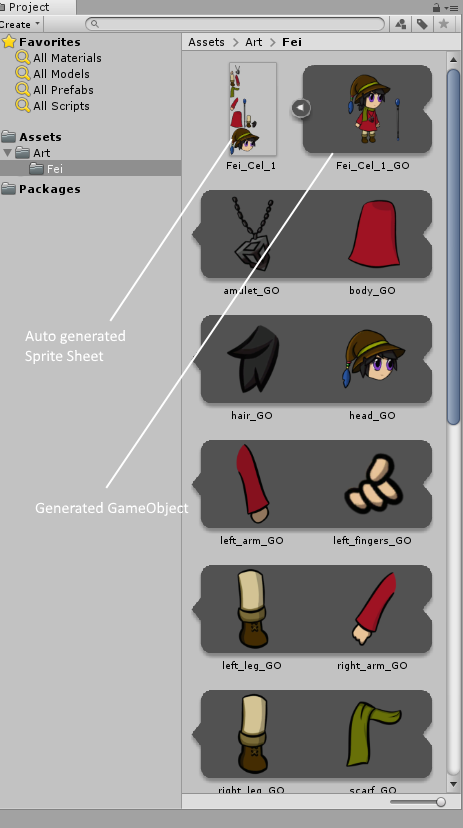
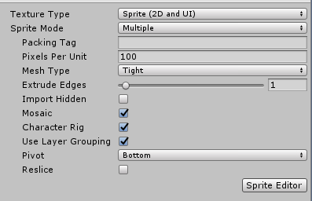
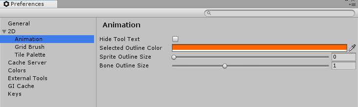
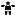

# Introduction

The aim of this manual is to guide you to quickly rig and animate a 2D character in Unity with the 2D Animation V2 package and tools. This package is only supported for Unity 2018.3.

## Adobe Photoshop PSB format

For character animation with the __2D Animation V2 package__, the __PSD Importer__ package is required. Currently the PSD Importer package only supports Adobe Photoshop PSB format, and does not support the Adobe PSD format. The PSB format has identical functions as PSD, with the additional support for much larger image sizes.

## Preparing and Importing artwork

When the art Asset is imported with the PSD Importer, Unity automatically arranges the individual characters parts (prepared as Layers) into a Sprite Sheet layout. The __PSD Importer__ imports the graphic data from each Photoshop layer and does the following:

1. Arrange/Mosiac the layers into a Sprite Sheet layout.
2. Generate a __Sprite__ from each layer’s graphic data.

When an artist designs a character for animation (see Example 1), they would usually manually separate and arrange the different parts of the character (see Example 2). The PSD Importer can generate a Prefab that reassembles the Sprites in their original positions as arranged in the PSB source file automatically (see Example 3), making it more convenient for the artist to begin animating the character.

Example 1: Layered character artwork in Adobe Photoshop.

Example 2: Manually created Sprite Sheet with different layer parts.

Example 3: The layers mosaic into a Sprite Sheet, with a generated Prefab of the character in source pose.

## Import settings

Prepare your character by separating the character's limbs and parts into separate layers, and arrange them in a default pose. 

1. Save your artwork as a PSB file in Adobe Photoshop by selecting the **Large Document Format** under the **Save As** menu. You can convert an existing PSD file to PSB in the same way.
2. Import the PSB file into Unity as an Asset.
3. Select the Asset to bring up the __PSD Importer__ Inspector window.
4. In the Inspector window, ensure these settings are set (see the example below):
   - Set __Texture Type__ to 'Sprite(2D and UI)'.
   - Set **Sprite Mode** to 'Multiple'.
   - Check __Mosaic Layer__.
   - Check __Character Rig__.
   - Check __Use Folder Grouping__.

Click __Apply__ to apply the settings when ready. Refer to the __PSD Importer__ package documentation for more information about these settings.

# Skinning Editor module

1. Select the imported __Asset__ and select the __Sprite Editor__.
2. Select the **Skinning Editor** module from the dropdown menu in the **Sprite Editor** window. The following options and tools then appear.

| Tool                                                         | Default Shortcut | Function                                                     |
| :----------------------------------------------------------- | :--------------: | :----------------------------------------------------------- |
| Preview Pose |    Shift + Q     | Preview character poses after rigging.                       |
| Edit Joints    |    Shift + W     | Reposition the bones into a new positions. These changes are automatically saved as the default bind pose for the Restore Bind Pose tool. Sprite geometry does not deform with the bones in this mode, even if the bones are attached as influencers. |
| Create Bone    |    Shift + E     | Click and drag to create bones.                              |
| Split Bone       |    Shift + R     | Splits the selected bone.                                    |
| Reparent Bone |    Shift + T     | Reparents a child bone to a different parent bone, changing the bone hierarchy. |
| Auto Geometry      |    Shift + A     | Autogenerate meshes for Sprites.                             |
| Edit Geometry        |    Shift + S     | Edit generated meshes by repositioning vertices.             |
| Create Vertex |    Shift + D     | Create new vertices to create geometry.                      |
| Create Edge    |    Shift + G     | Create new edges to create geometry.                         |
| Split Edge       |    Shift + H     | Split an existing edge into two.                             |
| Auto Weights   |    Shift + Z     | Autogenerate weights for geometry.                           |
| Weight Slider |    Shift + X     | Adjust weights via slider control.                           |
| Weight Brush |    Shift + C     | Adjust weights by painting with a brush.                     |
| Bone Influence |    Shift + V     | Select which bones influence a Sprite.                       |
| Reset Pose |    Shift + 1     | Restore a character’s bones and joints to their original positions. |
| Toggle View Mode |    Shift + 2     | Switch between the Character and Sprite Sheet view           |
| Copy                       |     Ctrl + C     | Copy the data from the current selection.                    |
| Paste                    |     Ctrl + V     | Pastes the copied data.                                      |
| Paste                    |    Shift + B     | Show additional pasting options.                             |
| Visibility     |    Shift + P     | Toggle visibility of selected Sprites or bones.              |
| Toggle Tool Text     |    Shift + `     | Show or hide text on tool buttons              |

## Sprite selection

1. Double-click a Sprite to select it.
2. If there are multiple Sprites that overlay each other, double-click to cycle through all Sprites at the cursor location.
3. Double-click on a blank area to deselect all Sprites.

## Bone and mesh vertex selection

1. Click a bone or mesh vertex to select it.
2. Click and drag a selection box over multiple bones or vertices to select them at once.
3. Right click to deselect any selected bone or mesh vertices.

# Tool Preferences

The Unity 2D Animation preferences menu is found in the Preferences menu by going to  **Edit** > **Preferences** > **Unity 2D Animation**. It provides several options to customize aspects of the animation tool.

| Setting                    | Function                                                     |
| -------------------------- | ------------------------------------------------------------ |
| **Hide Tool Text**        | Enable this option to hide tool text to have a compact view (see example below). |
| **Selected Outline Color** | Customize the outline color of selected Sprite and bone.            |
| **Sprite Outline Size**    | Use the slider to adjust the outline thickness of a selected Sprite. |
| **Bone Outline Size**      | Use the slider to adjust the outline thickness of a selected  bone. |

# Character rigging

1. Select the__Create Bone__ tool to begin creating the bones of the character skeleton.

2. With the tool selected, click in the **Sprite Editor **window to define the start-point of the bone. Move the cursor to where the bone should end, and click again to set the bone’s end-point.

3. To create a continuous chain of bones, select the __Create Bone__ tool and click the end-point of an existing bone. The new bone is started from the end-point, creating a chain.

4. Once all bones are created, generate the mesh geometry for the Sprites. It is recommended to use the __Auto Geometry__ tool to autogenerate the Sprites’s geometry mesh. Then refine the geometry with the __Create Vertex__ and __Create Edge__ tools.

5. To edit the bones that influence a Sprite, select the __Bone Influence__ tool and double-click a Sprite to select it. A list of bones currently influencing the Sprite appears. 

    * To remove any of the listed bones, select it in the list and click '-' to remove them.

    - To add a bone, select it in the **Sprite Window** and click + to add it to the list.

6. The weight attached to vertices affects the influence between bones and the Sprites' geometry. Select the  __Auto Weights__ tool to autogenerate the weight of a selected Sprites. To generate weights for all Sprites at once, deselect all Sprites before selecting the tool. Refine the weights of the vertices with the __Weight Brush__ and __Weight Slider__ tools.

7. Test the skeleton rig previewing poses with the __Preview Pose__ tool. Move and rotate the different bones to check their influence on the geometry mesh. Previewing poses can also be done while using the following tools: the __Reparent Bone__, __Weight Brush__, __Weight Slider__, __Bone Influence__, __Auto Weights__, and __Visibility__ tools.

    * To restore a skeleton rig to its original pose, select __Reset Pose__. The default pose can be edited with the __Edit Joints__ tool.

# Animating

To begin animating, drag the Asset into the Scene. This creates a GameObject that reassembles the imported character as it originally appeared in the PSB file. The GameObject contains multiple child GameObjects in the order that represents the bone hierarchy.

With the new GameObject in the scene, begin animating it with the usual [Unity animation workflow and tools](https://docs.unity3d.com/Manual/AnimationSection.html).
