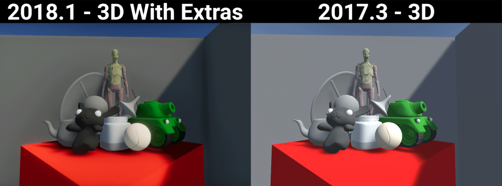
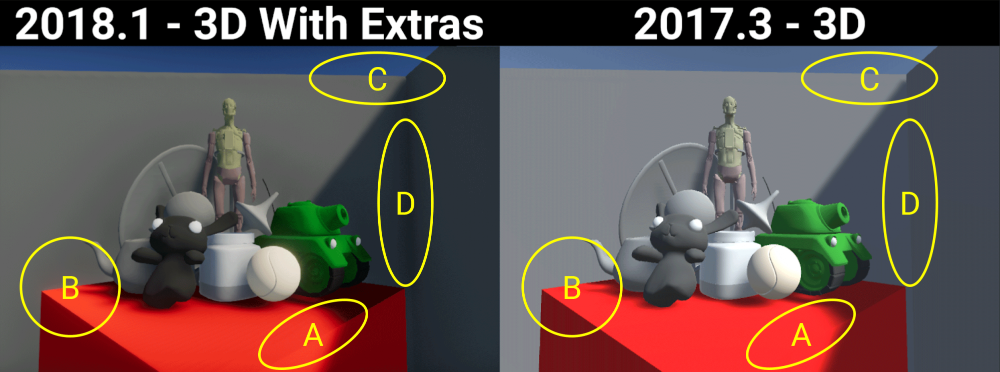

## _3D With Extras Project Template_ ##

This Project Template is a great starting point for a brand new user looking to experiment and learn more about using Unity. 
It uses Unity’s built-in render pipeline so you can easily find answers to questions and tutorials online. It is also great 
for artists who want to easily see what their content looks like in a balanced, outdoor lighting scenario.
This project includes the new Post-Processing stack, several presets to jump-start development, and example content.

This Project Template uses the following features:

* Post-processing stack - The Post-Processing Stack enables artists and designers to apply full -screen filters to scenes using an artist-friendly interface. For more information, see the <a href="https://github.com/Unity-Technologies/PostProcessing/wiki">wiki</a>  on the Post-Processing GitHub repository.

*Note:* The Post-processing stack is currently in development, so consider it incomplete and subject to change (API, UX, scope). As such, it is not covered by regular Unity support. Unity is seeking feedback on the feature. To ask questions about the feature, visit the <a href="https://forum.unity.com/forums/graphics-experimental-previews.110/?_ga=2.9250101.1048197026.1528313382-1647295365.1509665782">Unity preview forum</a>.

## Using the _3D With Extras Project Template_ ##

This Template includes default content intended to showcase how to set up lighting, materials, and post-processing for the great visual results using Unity's built-in renderer. The content itself provides a good 
reference for how to lightmap your meshes 
(for meshes marked as Lightmap Static), place light probes, and author textures for use with Unity's Standard PBR material.

If you don’t want the example content in the scene you can easily delete it by deleting the ExampleAssets Object in the Hierarchy and ExampleAssets folder in the Project’s asset directory.

This will remove all the example content without breaking any Post-Processing or lighting settings. From here you can add your own meshes to this scene and have a well-lit asset without any additional work.

Notable improvements include:
* More balanced colors throughout the scene; no color is too dark or too bright and we aren’t losing any details. This is because the color space is now linear by default and the scene contains post-processing that utilizes the filmatic ACES tonemapper.
* Improved anti-aliasing, our scene is much smoother than before. Anti-aliasing (now with new options) is now controlled through our Post-Processing volume.
* Shadows line up better; we don’t have large gaps where two pieces of geo meet. The bias settings of our directional light have been tuned to balance between shadow contact quality while minimizing artifacting and banding.
* Ambient occlusion has been added to our scene to make everything feel more grounded. This is, again, due to the addition of post-processing in our project.

By default you will also find a script on the Camera that allows for simple WASD navigation through the scene and the speed of your movement is tunable via the camera inspector. This allows you to quickly navigate while in Play to inspect your geometry without having to write any C# code.

There are also a number of presets, most notably those that can help set import settings for textures and audio.

## Document revision history
|July 16, 2018|Initial Documentation Pass Added|
