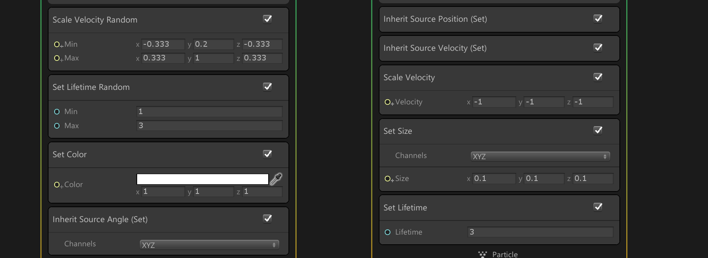
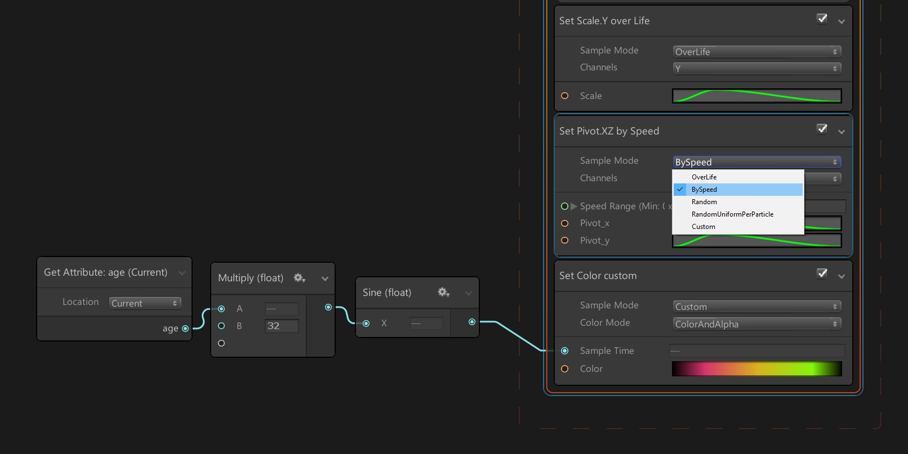

Attribute blocks are used to perform generic operation over attributes. These blocks share features with the following concepts:

#### Composition

Attribute blocks can compose the value to the attribute depending on a composition setting:

* *Overwrite* : sets the value directly to the attribute. (`attrib = sampledValue`)
* *Add* : adds the sampled value to the current attribute's value (`attrib += sampledValue`)
* *Scale* : scales the current attribute value by the sampled value (`attrib *= sampledValue`)
* *Blend* : blends the current attribute value to the sampled value using a *blend* input property.
   (`attrib = lerp(attrib,sampledValue, blend)`)

#### Variadic

Variadic attributes are attributes which can be of different vector sizes. For instance, size can be float if we want to describe particles scaled uniformly, but it can be float2 to describe rectangle quads or float3 to describe non-uniform scale for 3D particles (eg: mesh).

Variadic attributes can be customized by the usage of *channel* setting and choose among the list (X,Y,Z, XY, YZ, XZ, XYZ) which values to set.

Every time a new channel is set, the variadic size increases. Data from other channels are not automatically copied into new channels.

## Set Attribute

The Set Attribute block is used to set a value directly to an attribute with options.

* **Composition** : Overwrite, Add, Scale or Blend 
* **Random** : Off (Constant), Uniform or Per-Component
* **Source** : Slot (Value taken from the Input Property) or Source Attribute
* **Channels** : When setting values to a variadic attribute, you can specify channels.

Setting source to Source Attribute transforms the Set Attribute node to **Inherit Source Attribute** where the value is not fetched from the Input property but from the **Source Attribute** instead.

## Attribute from Curve/Gradient

Attribute from Curve/Gradient enables sampling values from curve structures, based on various samplers.

Fetched Values can be composited to the attribute using Overwrite, Add, Scale or Blend.

<u>Description of samplers:</u>

* *OverLife* : uses the Age over Lifetime ratio of the particle to sample the Curve(s)/Gradient.
* *BySpeed* : uses the particle speed (normalized from the Speed Range inputProperty) to sample the Curve(s)/Gradient
* *Random*: a value will be fetched from the curve/gradient at a random position, every time the block is executed.
* *RandomUniformPerParticle*: a value will be fetched from the curve/gradient at a random position, this random position will always be the same for each particle.
* *Custom* : provides a custom sample time inputproperty to fetch values through expression graph.

## Attribute from Map

Attribute form Map samples values from textures and sets them to attributes, based on various samplers.

Fetched Values can be composited to the attribute using Overwrite, Add, Scale or Blend.

<u>Description of samplers:</u>

- *IndexRelative*: provides a Relative Position input property which value Normalized (0..1) corresponds to Position among the total count of pixels to read
- *Index*: provides a index input property to define the Actual pixel index to read
- *Sequential*: reads the position at given index where index is particle ID
- *Sample2DLOD*: samples the 2D Texture at given LOD and position input properties
- *Sample3DLOD*: samples the 3D Texture at given LOD and position input properties
- *Random*: a value will be fetched from the texture at a random position, every time the block is executed.
- *RandomUniformPerParticle*: a value will be fetched from the texture at a random position, this random position will always be the same for each particle.