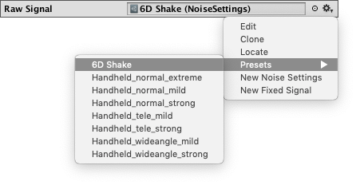

# Raw Vibration Signals

Raw vibration signals are curves that vibrate as a function of time. Cinemachine provides two types of raw signal Asset:

- A 6D (x, y, z, pitch, roll, and yaw) noise profile. See [Using Noise Pofiles](CinemachineImpulseNoiseProfiles.md) for details.

- A 3D Fixed Signal. See [Using Fixed Signals](CinemachineImpulseFixedSignals.md) for details.

Usually these raw signals are Assets in the Project.

In the Impulse Source Inspector window, use the **Raw Signal** field to see which signal is connected to the Impulse Source. The Settings menu (indicated with a gear icon) next to the field provides options for working with raw signals:

- **Edit** opens the signal in either the Noise Profile Inspector or the Fixed Signal Inspector.
- **Clone** duplicates the signal Asset. This is useful when you want to use a preset or an existing Asset as a base for a new signal.
- **Locate** finds the signal in the Project view.
- **Presets** provides a menu of preset Noise Profile Assets.
- **New Noise Settings** creates a new Noise Profile Asset from scratch. See [Creating a new noise profile](CinemachineImpulseNoiseProfiles.md#CreateNoiseProfile) for details.
- **New Fixed Signal** creates a new Fixed Signal Asset from scratch. See [Creating a new fixed signal](CinemachineImpulseFixedSignals.md#CreateFixedSignal) for details.

## Creating Custom Signals

You can create your own custom signals. If you derive them from the **[CinemachineSignalSource](../api/Cinemachine.SignalSourceAsset.html)** base class, they appear automatically in the Inspector menu alongside the built-in ones.
