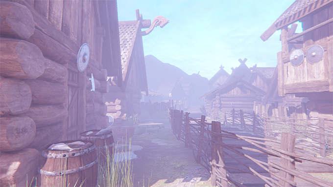

# Deferred Fog

Fog is the effect of overlaying a color onto objects dependent on the distance from the camera. This is used to simulate fog or mist in outdoor environments and is also typically used to hide clipping of objects when a camera’s far clip plane has been moved forward for performance.

The Fog effect creates a screen-space fog based on the camera’s [depth texture](https://docs.unity3d.com/Manual/SL-DepthTextures.html). It supports Linear, Exponential and Exponential Squared fog types. Fog settings should be set in the **Scene** tab of the **Lighting** window.

### Properties

| Property       | Function                          |
| :-------------- | :--------------------------------- |
| Exclude Skybox | Should the fog affect the skybox? |

### Details

This effect will only show up in your **Post-process Layer** if the camera is set to render with the **Deferred rendering path**. It is enabled by default and adds the support of **Fog** from the **Lighting** panel (which would only work with the **Forward rendering path** otherwise).

### Requirements

- Depth texture
- Shader Model 3

See the [Graphics Hardware Capabilities and Emulation](https://docs.unity3d.com/Manual/GraphicsEmulation.html) page for further details and a list of compliant hardware.