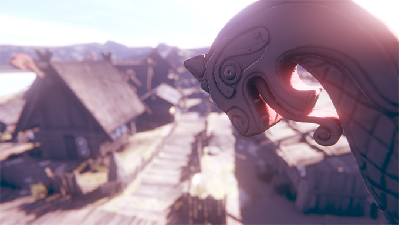

# Depth of Field

**Depth of Field** is a common post-processing effect that simulates the focus properties of a camera lens. In real life, a camera can only focus sharply on an object at a specific distance; objects nearer or farther from the camera will be somewhat out of focus. The blurring not only gives a visual cue about an object’s distance but also introduces Bokeh which is the term for pleasing visual artifacts that appear around bright areas of the image as they fall out of focus.

### Properties

| Property       | Function                                                     |
| :-------------- | :------------------------------------------------------------ |
| Focus Distance | Distance to the point of focus.                              |
| Aperture       | Ratio of the aperture (known as f-stop or f-number). The smaller the value is, the shallower the depth of field is. |
| Focal Length   | Distance between the lens and the film. The larger the value is, the shallower the depth of field is. |
| Max Blur Size  | Convolution kernel size of the bokeh filter, which determines the maximum radius of bokeh. It also affects the performance (the larger the kernel is, the longer the GPU time is required). |

### Performances

The speed of Depth of Field is tied to `Max Blur Size`. Using a value higher than `Medium` is only recommended for desktop computers and, depending on the post-processing budget of your game, consoles. Mobile platforms should stick to the lowest value.

### Requirements

- Depth texture
- Shader Model 3.5

See the [Graphics Hardware Capabilities and Emulation](https://docs.unity3d.com/Manual/GraphicsEmulation.html) page for further details and a list of compliant hardware.