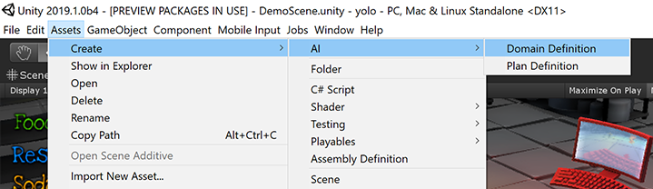
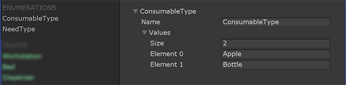
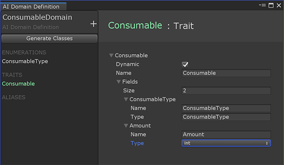
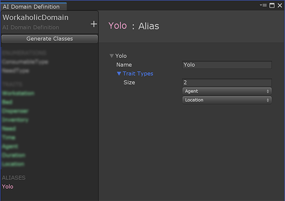

# Domain Definition

The first step in setting up a planning domain is to create a domain definition. To begin, create a new asset of type "Domain Definition" via the asset creation menu (Create -> AI -> Domain Definition) or the Create menu from the project window. 

You can edit the domain definition in the authoring pane, which is used to define enumerations, traits, and aliases.

## Enumerations

The trait-based domain language supports most basic data types, such as int, float, bool, and enum. For the latter, the authoring tool allows you to define custom enumerations to be used by properties in your domain's traits.

## Traits

Traits are the fundamental data which represents your game/simulation. Each trait specifies a quality which objects can possess, such as the ability to be carried or to be used as a weapon. Each trait is composed of properties which reflect attributes specific to each trait. For example, consider creating a trait "Consumable" which marks objects that can be consumed. Such a trait may possess a property "Consumable Type" (an enumeration) which denotes if the consumable is food or drink. In this way, traits are defined by:
* A name
* A list of typed properties

## Aliases

As an authoring shorthand, aliases provide a means of referring to established sets of traits on an object. Such aliases can be used when specifying constraints in the [plan definition](PlanDefinition.md).

