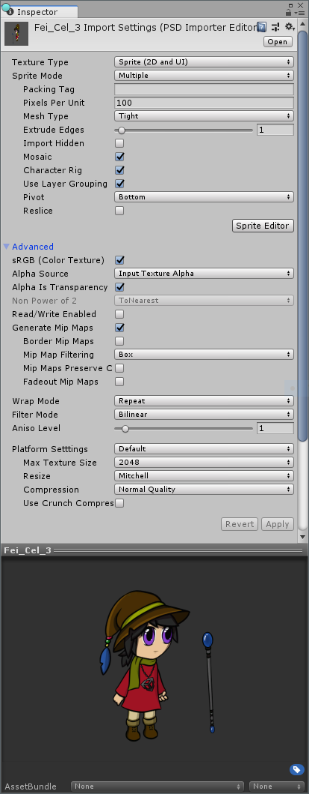
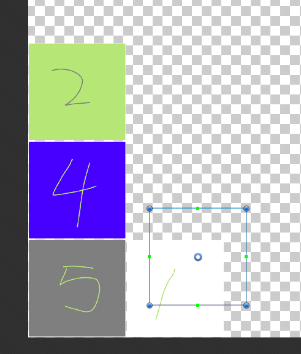
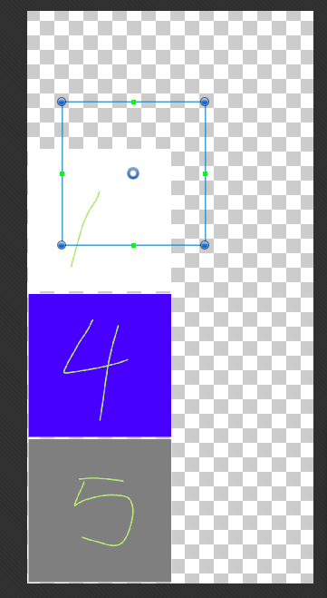

# PSD Importer

## Summary

The **PSD Importer** is a custom Asset Importer made to import Adobe Photoshop’s PSB files into Unity. The PSB file format is functionally identical to the more common Adobe PSD format, with the additional ability to support much larger images than the PSD format (up to 300,000 by 300,000 pixels in size).

Users saving or converting their PSD working files to the PSB format can import their work with the PSD Importer, and take advantage of the additional functionality and features provided by the importer.

## Function

The importer currently supports 2 **Texture Modes** - [Default](https://docs.unity3d.com/Manual/TextureTypes.html#Default) and [Sprite](https://docs.unity3d.com/Manual/TextureTypes.html#Sprite). More Texture Modes will be supported in the future. 

The following Photoshop features are **not** supported by the PSD Importer **:** 

* Channels

* Blend Modes

* Layer Opacity

* Effects

## Inspector settings

### Texture Type - Default

This is the default **Texture Type** usage when an image is imported without a specific Texture Type selected. Refer to the documentation on [Texture Types](https://docs.unity3d.com/Manual/TextureTypes.html) for further information and details.

### Texture Type - Sprite (2D and UI)

To import a PSB file for character animation with the **2D Animation V2** package, set the __Texture Type__ to __Sprite (2D and UI)__ to do so. 

Property settings that are specific to the **PSD Importer** are marked by an *.

| Property                        | Function                                                     |
| ------------------------------- | ------------------------------------------------------------ |
| __Texture Type__                | Select __Sprite (2D and UI)__ to import the Texture as a [Sprite](https://docs.unity3d.com/Manual/Sprites.html). This is required to begin using the imported images with the 2D Animation V2 package. |
| __Sprite Mode__                 | Use this setting to specify how the the Sprite graphic is extracted from the image. The default for this option is **Multiple**. |
| Single                          | Select this option if there is only a single element in the imported image. |
| Multiple                        | Select this option if there are multiple elements in the imported image. Select this option when importing a character meant for animation with the 2D Animation V2 package. |
| __Pixels Per Unit__             | The number of pixels that equal 1 Unity unit.                |
| __Mesh Type__                   | This defines the __Mesh__ type that is generated for the __Sprite__. The default for this option is 'Tight'. |
| Full Rect                       | The Sprite is mapped onto a mesh generated as a quad.        |
| Tight                           | This generates a Mesh based on pixel alpha value of the image, generating a shape that follows the shape of the Sprite. Note that any Sprite that is smaller than 32x32 pixels is generated on a quad Mesh, even if Tight is specified. |
| __Extrude Edges__               | Use the slider to determine how much area to leave around the Sprite in the generated Mesh. |
| * [Import Hidden](#ImportHidde) | Select this property to specify that hidden layers in the PSB file should be imported. Clear this option to not import the hidden layers. |
| * [Mosaic](#Mosaic)             | This option is only available if Texture Type is set to ‘Multiple’. Enable this to allow Unity to create a Sprite from each imported layer and arrange them into a Sprite Sheet layout. |
| * [Character Rig](#CharRig)     | Select the imported image(s) is to be used for a multi-Sprite character.  When selected, a Prefab containing the imported images is generated. |
| * [Use Layer Grouping](#Hierarchy)   | Select to have the generated Prefab mimic the layer hierarchy of the imported PSB file. |
| __Pivot__                       | Select the pivot point of the Sprite from the dropdown menu options. |
| Custom                          | Define the X and Y coordinates of a custom __Pivot__ location. |
| * [Reslice](#Reslice)           | Available only when __Mosaic__ is enabled. Select this to clear away all previous Sprite metadata and recreate the Sprite from the imported PSB layers. |

## SpriteRect data

The **PSD Importer** can store 4 possible sets of SpriteRect data, depending on the properties selected when importing an image. 

The 4 sets are created by enabling the following property combinations:

1. Sprite Mode: Single

2. Sprite Mode: Multiple

3. Sprite Mode: Multiple + Mosaic

4. Sprite Mode: Multiple + Mosaic + Character Rig

#### User defined SpriteRect

When the user manually creates a SpriteRect in the Sprite Editor window, the SpriteRect persists even when the Asset has changed. It persists until the user manually deletes the SpriteRect or reimports it with the __Reslice__ option. The position of the SpriteRect does not change even when the size the __Mosaic__ texture changes.

#### Modifying the SpriteRect in the Sprite Editor window

Any modification to a SpriteRect generated from an imported layer will persist and follow wherever the layer is placed in a Mosaic texture, even if it is reimported.

|                       |                     |
| ------------------------------------------------------------ | ---------------------------------------------------------- |
| A generated SpriteRect with an imported Layer Sprite that has been modified. | The modified SpriteRect follows where the layer is placed. |

If the name of the generated SpriteRect is changed, the changed name persists and changes to the layer in the source file are not reflected.

If the generated SpriteRect is deleted, it is regenerated when its source layer is reimported, and the source layer both exists and is visible in the source file.

### Effect on SpriteRect when source files are modified

| Modification                                    | Effect                                                       |
| ----------------------------------------------- | ------------------------------------------------------------ |
| **New layer added /Layer visibility turned on** | A new Sprite is automatically generated from the new layer.  |
| **Layer deleted /Layer visibility turned off**  | The Sprite and SpriteRect that was generated from the layer are deleted. |
| **Layer name changed**                          | The changed layer name is copied to the generated SpriteRect, if the SpriteRect's original name has not been modified by the user. |
| **Layer or canvas size changed**                | The SpriteRects size does not change reflect changes made to the layer or canvas size in the source file. regardless if it was modified by the user. To have the SpriteRect reflect the changed size, manually edit the size or select the [Reslice](#Reslice) option. |

## Property Details

### Import Hidden

When this is selected, layers that are hidden are imported. The behavior is identical to the user unhiding all layers in the PSB file before import.

### Mosaic

When **Mosaic** is selected, all layers in the PSB file will be imported as separate Sprites. 

### Character Rig

When this is selected, a Prefab is generated containing a Sprite GameObject with the SpriteRenderer component. If the Sprite contains bone and skin data, the **Sprite Skin** component is added as well. The name of the GameObject is the same as the name specified in it's SpriteRect.

### Use Layer Grouping

When this is selected, the generated GameObjects  mimic the layer grouping in the imported file. When the Asset hierarchy is modified, it is reflected on the next import.

### Reslice

When this is selected, all user modification is discarded and SpriteRects are regenerated based on the current source file data. Extra SpriteRect meta data (e.g. Weights, Bones) persist if they remain valid after the SpriteRects are regenerated.

## Name collision errors

A name collision can occur in the following ways:

1. 2 or more layers in the Asset has the same name. This does not affect Photoshop group name. 

2. A new layer created in the Asset has the same name as a user created SpriteRect.

3. A layer renamed to the same name as user created SpriteRect.

4. A previously hidden layer is imported and has the same name as an existing SpriteRect.

When a name collision occurs, one SpriteRect retains the original name while the rest will be appended with a running number. Which SpriteRect retains their original name is based on the following priority order:

1. A user created SpriteRect.

2. The first layer in the file, starting from the bottom of the stack.

3. Currently existing SpriteRects.

