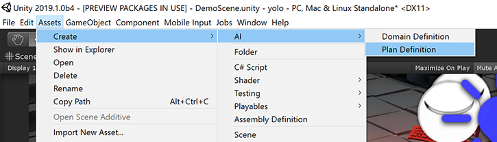
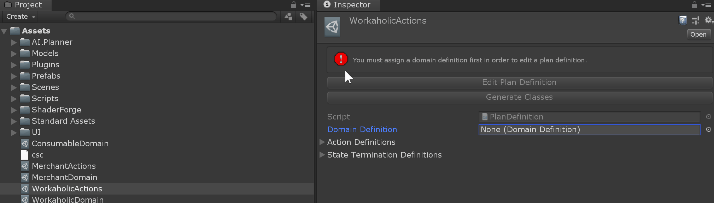
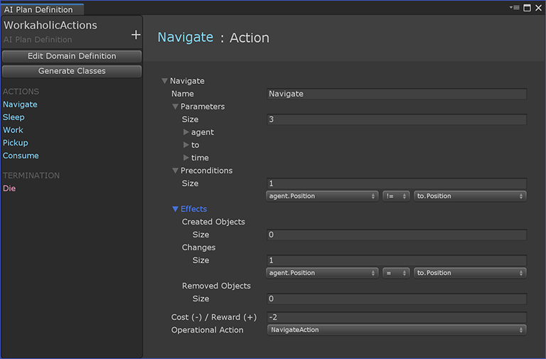
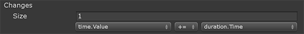
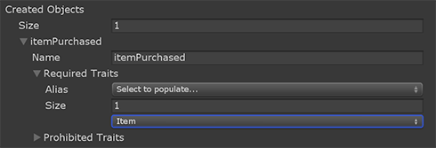
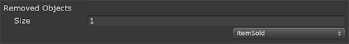

# Plan Definition

Plan definitions contain the actions or decisions that an agent makes in pursuit of its goal. Furthermore, plan definitions specify under which conditions a potential plan is considered terminal.

To create a plan definition, use the asset creation menu (Assets -> Create -> AI -> Plan Definition) or the Create menu from the project window.

Once you've created a plan definition, then you must assign a domain definition first before you can edit the plan definition.

## Actions

An action is defined by the following:
* Name - The name of the action.
* Parameters - The set of objects involved in and potentially affected by the action.
* Preconditions - The conditions under which the action may be performed.
* Effects - The changes incurred by objects as a result of the action.
* Cost / Reward - The cost (negative) or reward (positive) for taking the action.
* Operational Action - The script which facilitates the performance of the action by the agent, possibly triggering animations and/or affecting the game/simulation state.

### Parameters

Typically, an action operates on one or more objects in the world, such as in the case of an agent buying an item from a merchant, increasing the merchant's total currency and coming into possession of the desired item. In this example, the agent, the merchant, and the desired item are all parameters of the purchase action. For this action to be performed, valid targets for these parameters must exist and may have further requirements on their respective traits. To specify which objects are involved, start by adding a parameter for each.

Parameters are given a name, such that we can refer to them in the preconditions and effects of an action. Typically, this is a generic term for the type of object, such as "buyer", "location", or "item". Furthermore, each parameter is constrained by the set of traits which must and must not be possessed by an object in order for it to be considered valid for the action. In the merchant example, the merchant parameter may require a "Merchant" trait, filtering out all objects without "Merchant" from consideration.

### Preconditions

Beyond specifying the trait compositions on parameters of the action, you may specify further required conditions on the properties of the parameters' traits. These conditions may be specified on a single object (e.g. buyer -> Inventory -> Capacity > 0) or specified between properties on multiple objects (buyer -> Inventory -> Gold >= item -> Buyable -> Price). Whenever one or more of the preconditions are not met, the action is considered invalid and is excluded from the planning process. 

### Effects

The effects of an action specify _what changes_ as a result of the action, which can be changes in trait property values but may also involve the creation or deletion of objects. Changes in trait properties are defined by the trait property to be changed, an operator specifying the type of change, and a value by which the property changes. 

Created objects require a full trait specification, including the initial trait property values (specified in Changes). 

Deleted objects are specified by selecting the parameter referring to the object to be deleted.

### Reward

The reward is given by a numerical value associated with the inherent benefit or penalty associated with taking the action. Since the agent's goal is to maximize its cumulative reward over the course of the plan, it will prefer to select actions with high reward or low cost. As the agent maximizes _cumulative_ reward, it may select low reward actions in order to achieve a larger delayed payoff from future actions.

### Operational Action

Together, the previous action definition components form the representation of the action for the purpose of forming a plan, which necessitates reasoning about _when_ an action can be taken and _what occurs_ as a result. It does not, however, govern the execution of the action within the context of the game/simulation. Therefore, each action definition must be assigned an operational action, a script which executes and monitors the action. More information on operational actions can be found [here](OperationalActions.md). 

## State Termination Criteria

For many applications, there is no need to continue planning once one or more termination conditions have been met. These conditions may represent the achievement of a desired goal or possibly the circumstances in which success has become impossible, such as when an agent has been defeated.

Each state termination criteria is defined by a set of traits required to be on an object as well as conditional checks on the values of one or more properties on the object. For example, a termination criteria may be defined on objects with the "Health" trait when the "Hit Points" property reaches 0.