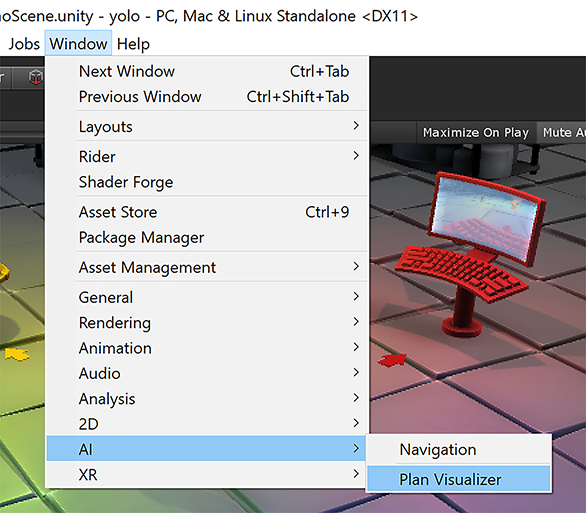
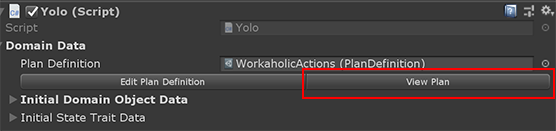
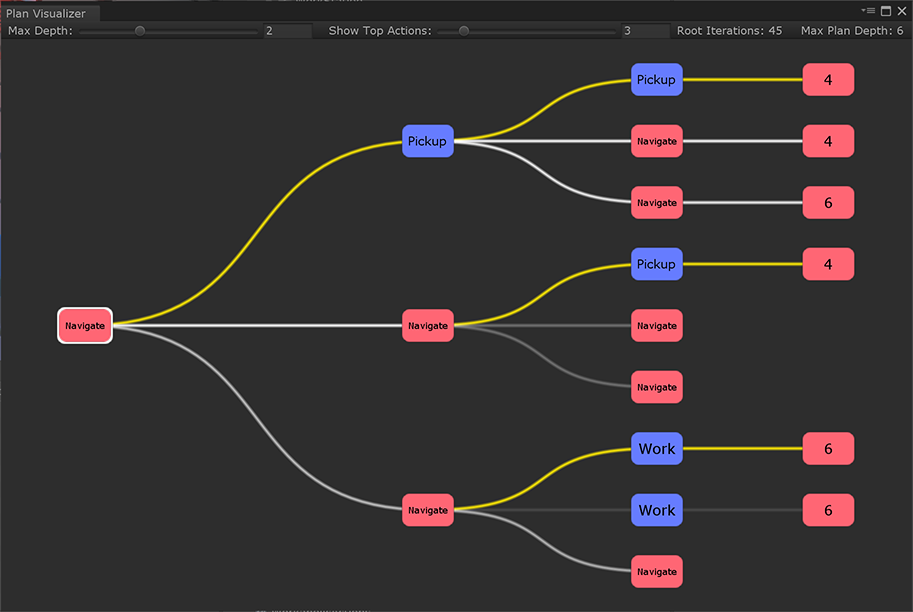
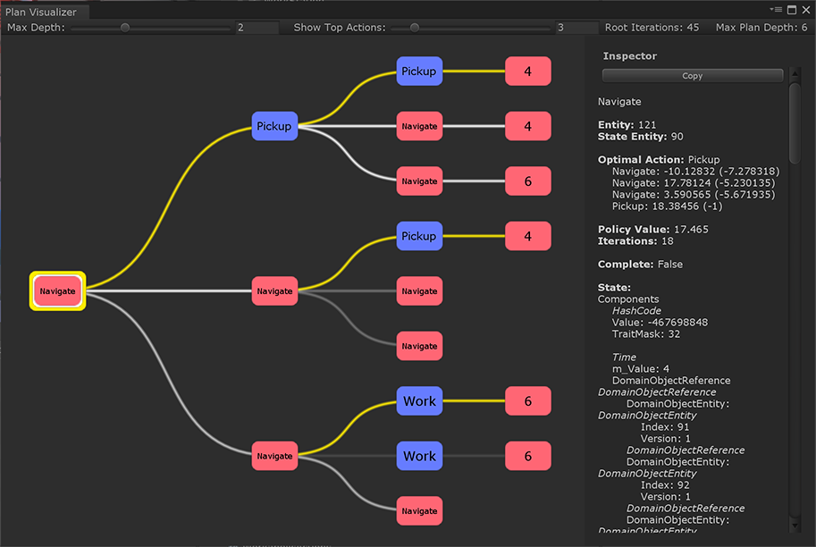

# Plan Visualizer

With the Plan Visualizer, you can debug and monitor the plan expansion for an individual agent by the planner system. You can open the Plan Visualizer either through the Window menu (Window -> AI -> Plan Visualizer)

or by selecting your agent and clicking _View Plan_

## Window

The window shows the plan in the form of a tree (although internally it is a graph). Here you can see the current action/state and the resulting states from actions taken from the current state.

The highlighted path above shows the optimal action from the current state. The nodes on the far right show that there are successor nodes not shown. You can click on any one of these to navigate further into the plan.

### Inspector

The plan visualizer has a simple inspector to view the state data for a node. Click on any node and use the scroll window to look through individual domain objects. You can also copy the state data to the clipboard, which can be useful in conjunction with a diff program to see what has changed between two states.

