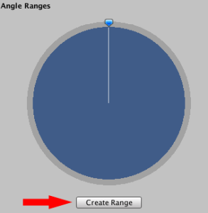
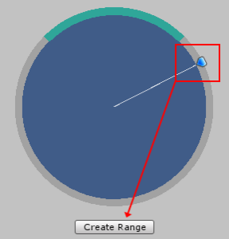
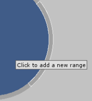
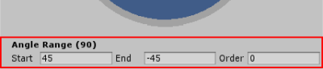
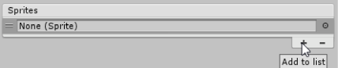
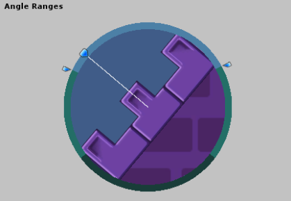
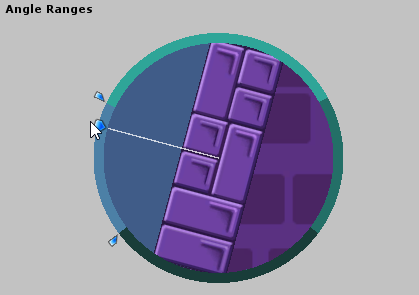

# Sprite Shape Profile

The **Sprite Shape Profile** contains the settings that determine which Sprites that appear on a Sprite Shape at specific Angle Ranges, as well as other display settings. You can use the same Profile for multiple **Sprite Shapes** in a Scene.

Create a **Sprite Shape Profile** from the Editor main menu (menu: **Assets > Create > Sprite Shape Profile**), and select from the two available options: **Open Shape** and **Closed Shape**.

| **Property**                                                 | **Function**                                                 |
| ------------------------------------------------------------ | ------------------------------------------------------------ |
| **Control Points**                                           | -                                                            |
| **Use Sprite Borders**                                       | Enable to draw the **Sprite Borders** of a Sprite at the Control Point. Define the **Sprite Borders** in the **Sprite Editor**. |
| **Fill**                                                     | -                                                            |
| **Texture**                                                  | Set the Texture to be used as a Fill to this field. Has no effect if the **Open Ended** property in the **Sprite Shape Controller** settings is enabled. |
| **Offset**                                                   | Determines the border offset at the edges of the Fill texture. |
| **Angle Ranges (tool)** | Use this tool to create Angle Ranges and assign Sprites to those ranges. |
| **Start (degrees)**                                          | Enter the starting angle for the selected Angle Range in degrees. |
| **End (degrees)**                                            | Enter the ending angle for the selected Angle Range in degrees. |
| **Order**                                                    | Determines the display priority when Sprites intersect. Sprites with higher values are rendered above lower ones. |
| **Sprites**                                                  | List of Sprites assigned to the selected Angle Range. Displays a list of all Sprites assigned to the selected Angle Range. The order of Sprites in the list determines their **Sprite Variant** number, starting from zero at the top of the list. The first Sprite at the top of the list is the Sprite displayed by default at a Control Point. |
| **Corners**                                                  | -                                                            |
| *** All Corner options**                                     | Assign specific Sprites to be displayed on the Sprite Shape at the respective corners. Refer to the documentation on [Corner Sprites]() for more information. |

## Open Shape

Use the **Open Shape** preset Profile to create Shapes made from a single edge outline with tiled Sprites along its edge. This preset is ideal for creating level elements such as platforms. 

Drag the Open Shape Profile into the Scene view to automatically generate a Sprite Shape with **Open Ended** enabled in its **Sprite Shape Controller** settings.

## Closed Shape

Use the **Closed Shape** preset Profile to create Shapes that encompass an enclosed area. The Closed Sprite Shape can display and tile a Fill texture in the enclosed area, if a Fill texture is set in its Profile settings. Use this preset to create large solid filled Shapes that are ideal for backgrounds or large platforms.

Drag the Closed Shape Profile into the Scene view to automatically generate a Sprite Shape with **Open Ended** disabled in its **Sprite Shape Controller** settings. The Closed Shape Profile's preset Angle Ranges create a square Sprite Shape by default.

A key feature of the **Sprite Shape Profile** is the Angle Ranges tool. Assigning an Angle Range determines what Sprite is displayed at specific angles, as the Sprite Shape is deformed in the Scene.

## Creating Angle Ranges 

### Method 1:

To create an Angle Range, click the **Create Range** button at the bottom of the Angle Ranges tool:

The **Create Range** button is only visible if the **Preview Handle** is over an area without an Angle Range (see the example image below).

### Method 2:

Another way is to hover your cursor over an empty area of the Angle Range circle. An outline appears to show the possible default angle range. Click to create this Angle Range.

### Editing the Angle Range degrees

The range covered by the currently selected Angle Range is displayed at the bottom of the tool.

You can edit a range by entering new values into **Start** and **End**, or drag either endpoint of the tool to the desired angles. A range cannot be extended into an existing neighboring range. To delete an Angle Range, select the range and then press the **Del/Delete** key.

## Assigning Sprites

After creating the Angle Ranges, the next step is to assign Sprites to those ranges. The **Sprites** list is found beneath the **Angle Ranges** tool. It lists all the Sprites assigned to the selected range.

To add Sprites to the list, click the **+** icon to insert a new row to the list.  Click the circle icon next to the empty row to open the **Object Picker** window, which displays all available Sprites in the project.

You can also drag a Sprite directly onto a row to add it to the list. The Sprite at the top of the list is the default Sprite displayed on the Sprite Shape.  Refer to the other Sprites in the list by their [Sprite Variant](SSController.md) number. See the [Sprite Shape Controller](SSController.md) page for more details.

Drag the leftmost ends of the rows up or down to reorder the list, which changes the **Sprite Variant** numbers of the Sprites accordingly.

## Previewing Sprites of multiple Angle Ranges

After assigning Sprites to multiple **Angle Ranges**, rotate the Preview Handle around the Angle Range tool to preview the Sprites assigned those ranges.

