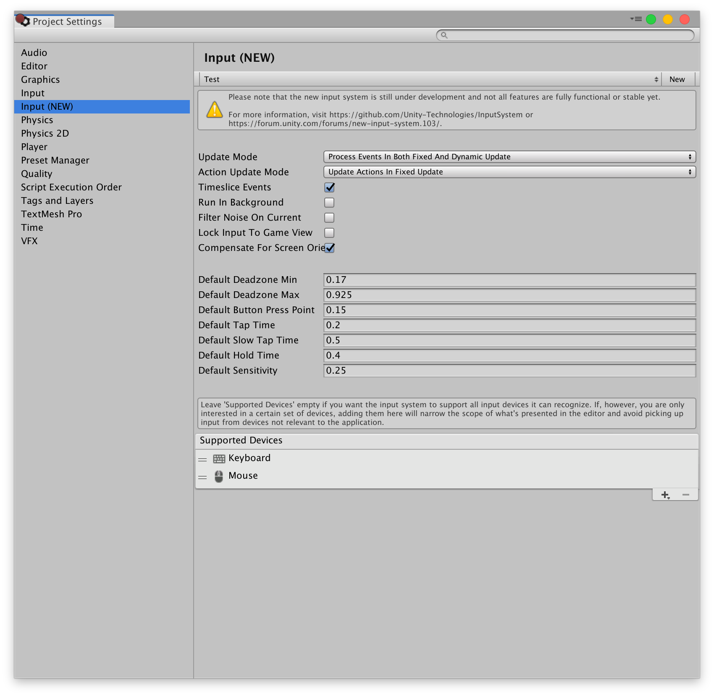
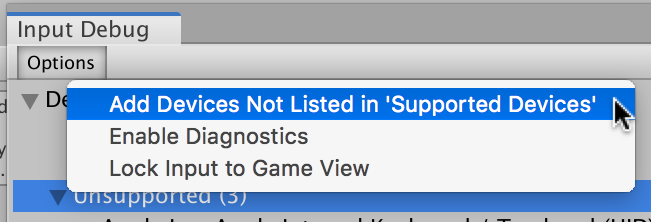

# Settings

The input system can be configured on a per-project basis by going to "Edit >> Project Settings..." and selecting "Input (NEW)".

Settings are stored in assets. To create a new asset, click "New" in the toolbar and choose a name and location for where to create an asset. A project may contain arbitrary many assets with input settings. To choose which asset is active, use the dropdown in the toolbar.

>NOTE: Modifications to settings are saved when the project is saved.

## Update Mode

This is a fundamental setting that determines when the input system processes input.

There are three distinct ways in which the input system processes input.

|Type|Description|
|----|-----------|
|Fixed Update|Events are processed in intervals of fixed length. This corresponds to how [`MonoBehaviour.FixedUpdate`](https://docs.unity3d.com/ScriptReference/MonoBehaviour.FixedUpdate.html) operates. The length of each interval is determined by [`Time.fixedDeltaTime`](https://docs.unity3d.com/ScriptReference/Time-fixedDeltaTime.html).|
|Dynamic Update|Events are processed in irregular intervals governed by the current framerate.|
|Manual Update|Events are not processed automatically by instead are flushed out whenever the user calls `InputSystem.Update()`.|

>NOTE: There are two additional types of updates performed by the system in the form of `InputUpdateType.BeforeRender` (late update for XR tracking devices) and `InputUpdateType.Editor` (for EditorWindows) but these do not fundamentally alter how input is consumed in an application.

## Action Update Mode

>NOTE: This setting will only be visible if `Update Mode` is set to `Process Events In Both Fixed And Dynamic Update`.

If the system is configured to process input in both fixed and dynamic updates, `InputActions` need to know which input state to track. By default, actions will track fixed update state. By setting `Action Update Mode` to `Actions Update In Dynamic Update`, this can be changed so that actions track dynamic update state.

The key difference is that input state for dynamic updates is allowed to run ahead of input state for fixed updates.

## Timeslice Events

>NOTE: This setting is only visible if events are processed in fixed update, i.e. if `Update Mode` is either `Process Events In Both Fixed And Dynamic Update` or `Process Events In Fixed Update`.

This setting is enabled by default. ...

## Filter Noise On Current

    ////REVIEW: should this be enabled by default

This setting is only relevant for a game that uses the various `.current` properties (like `Gamepad.current`) in the API. If these aren't used, it's recommended to leave this setting turned off (the default) as it will otherwise add needless overhead.

Whenever there is input on a device, the system make the respective device `.current`. If, for example, a given `Gamepad` receives new input, it will assume the position of `Gamepad.current`.

However, some devices have noise in their input and thus need not be interacted with to receive input. An example is the PS4 DualShock controller which generates a constrant stream of input because of its built-in gyro. This means that if both an Xbox and a PS4 controller connected and the user is playing with the Xbox controller, the PS4 controller will still continuously push itself to the front and make itself current.

To counteract this, noise filtering can be enabled. If turned on, when input is received, the system will determine whether the input is for a device that has noisy controls (`InputDevice.noisy`). If it does, it will determine whether the given input contains any state change on a control that is __not__ marked as noisy (`InputControl.noisy`). If so, the device will become current. If not, the input will still be consumed (and visible on the device) but the device will not be made current.

>NOTE: The system does not currently detect other forms of noise, principally those on gamepad sticks. This means that if the sticks are wiggled a little bit (and on most gameapds this does not require actually actuating the sticks; there will be a small tolerance within which the sticks will move when the entire device is moved) but are still within deadzone limits, the device will still be made current.

## Run In Background

## Compensate For Screen Orientation

## Supported Devices

Usually, a given project will support a known set of input methods. For example, a mobile title might support only touch whereas a console application may support only gamepads. A cross-platform title might support gamepads, mouse, and keyboard, but may have no use for XR devices, for example.

To narrow the options presented to you in the editor UI as well as to avoid creating input devices and consuming input that will not be used, the set of supported devices can be restricted on a per-project basis.

If `Supported Devices` is empty, no restrictions will be applied. Meaning that any device recognized by Unity will be added to the system and will have input consumed for it. If, however, `Support Devices` contains one or more entries, than only devices that are of one of the listed types will be added to the system.

Note that as this setting is changed, the system will remove or re-add devices as needed. Information about what devices are available for potential use is always retained meaning that no device is permanently lost as long as it is connected.

To add devices to the list, click the plus icon and choose a device from the picker.

`Abstract Devices` contains common device abstractions such as "Keyboard" and "Mouse" whereas `Specific Devices` contains specific hardware products.

### Override in Editor

In the editor, it can be undesirable to restrict input devices to those supported by the game. For example, one might want to use a tablet in the editor even if the game being developed only supports gamepads.

To force the editor, to add all locally available devices even if they are not in the list of `Supported Devices`, open the input debugger (`Window >> Input Debugger`), click `Options`, and select `Add Devices Not Listed in 'Supported Devices'`.

This setting will be persisted as a user setting (i.e. the setting will not be visible to other users that have the same project open).
