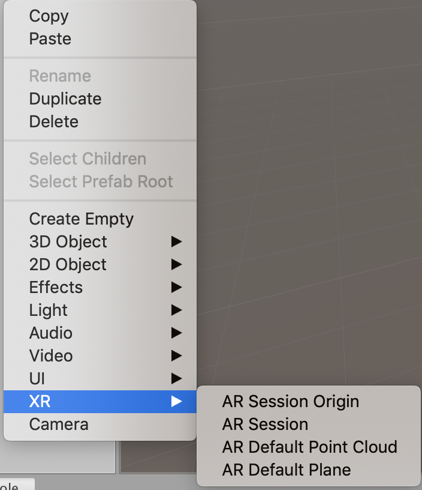
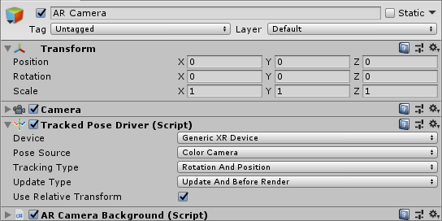
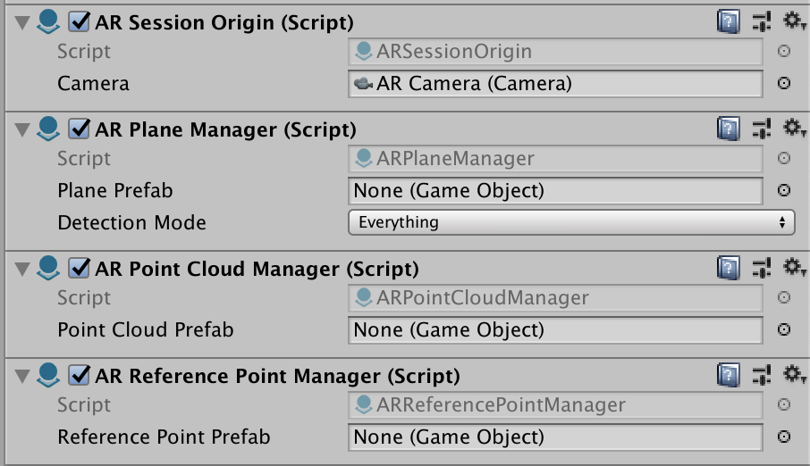
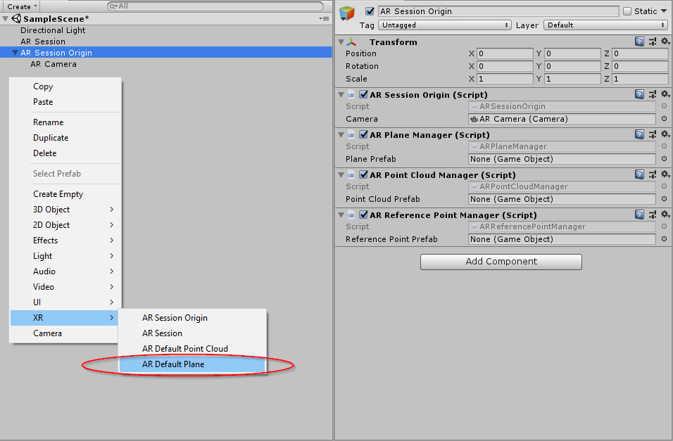

# About AR Foundation

AR Foundation allows you to work with augmented reality platforms in a multi-platform way within Unity.

AR Foundation is a set of `MonoBehaviour`s for dealing with devices that support following concepts:
- Planar surface detection
- Point clouds, also known as feature points
- Reference points: an arbitrary position and orientation that the device tracks
- Light estimation: estimates for average color temperature and brightness in physical space.
- World tracking: tracking the device's position and orientation in physical space.

If you are migrating from AR Foundation 1.0, see the [Migration Guide](migration-guide.md).

# Installing AR Foundation

To install this package, follow the instructions in the [Package Manager documentation](https://docs.unity3d.com/Packages/com.unity.package-manager-ui@latest/index.html).

AR Foundation is an interface for working with AR platforms, so you will also need to install at least one platform-specific AR package (*Window > Package Manager*):

 - ARKit XR Plugin
 - ARCore XR Plugin

# Glossary

| Term | Meaning |
|-|-|
| Tracking | The ability of the AR device to determine its relative position and orientation in the world. If the environment is too dark, for example, the device may "lose tracking", which means it can no longer accurately report its position. |
| Trackable | A real-world feature detected and/or tracked by the AR device, e.g., a planar surface. |
| Feature Point | A specific point in a point cloud. AR devices use a camera and image analysis to track specific points in the world which are used to build a map of its environment. These are usually high frequency elements, such as a knot in a wood-grain surface.|
| Session | Refers to an AR instance. |
| Session Space | The coordinate system relative to the beginning of the AR session. For example, session space (0, 0, 0) refers to the position at which the AR session was created. An AR device typically reports trackables and tracking information relative to its session origin.|

# Using AR Foundation

## Basic Setup

A basic AR scene hierarchy looks like this:


You can create these automatically by right-clicking in the scene hiearachy and selecting *XR > AR Session* and *XR > AR Session Origin*.



The required components are explained in more detail below.

### ARSession
An AR scene should include an `ARSession` component. The AR Session controls the lifecycle of an AR experience, enabling or disabling AR on the target platform. The `ARSession` can be on any `GameObject`.


If the `ARSession` is disabled, the system no longer tracks features in its environment, but if it is enabled at a later time, the system will attempt to recover and maintain previously detected features.

If "Attempt Update" is checked, the device will try to install AR software if possible. Support for this feature is platform dependent.

**Note:** An AR session is a global construct. An `ARSession` component manages this global session, so multiple `ARSession` components will all try to manage the same global session.

#### Checking for Device Support

Some platforms may support a limited subset of devices. On platforms where this is true, you need to be able to detect support for AR Foundation so that you may provide an alternative experience when AR is not supported.

The `ARSession` component has a static coroutine that you can use to determine whether AR is supported at runtime:

```csharp
public class MyComponent {
    [SerializeField] ARSession m_Session;

    IEnumerator Start() {
        if ((ARSession.state == ARSessionState.None ||)
            (ARSession.state == ARSessionState.CheckingAvailability))
        {
            yield return ARSession.CheckAvailability();
        }

        if (ARSession.state == ARSessionState.Unsupported)
        {
            // Start some fallback experience for unsupported devices
        }
        else
        {
            // Start the AR session
            m_Session.enabled = true;
        }
    }
}

```

#### Session State

To determine the current state of the session (for example, whether the device is supported, if AR software is being installed, and whether the session is working), use `ARSession.state`. You can also subscribe to an event when the session state changes: `ARSession.stateChanged`.

|`ARSessionState`|Meaning|
|-|-|
|`None`|The AR System has not been initialized and availability is unknown.|
|`Unsupported`|AR is not supported on the current device.|
|`CheckingAvailability`|The system is checking the availability of AR on the current device.|
|`NeedsInstall`|AR is supported on the current device, but requires an additional install.|
|`Installing`|AR software is being installed|
|`Ready`|AR is supported and ready|
|`SessionInitialized`|An AR session is initializing (i.e., starting up).  This usually means AR is working but has not gathered enough information about the environment|
|`SessionTracking`|An AR session is running and is tracking (i.e., the device is able to determine its position and orientation in the world).|

### ARSessionOrigin


The purpose of the `ARSessionOrigin` is to transform trackable features (such as planar surfaces and feature points) into their final position, orientation, and scale in the Unity scene. Because AR devices provide their data in "session space", an unscaled space relative to the beginning of the AR session, the `ARSessionOrigin` performs the appropriate transformation into Unity space.

This concept is similar to the difference between "model" or "local" space and world space when working with other assets in Unity. For instance, if you import a house asset from a DCC tool, then the door will have a position relative to the modeler's origin. This is commonly called "model space" or "local space". When it is instantiated in Unity, it will also have a world space, relative to Unity's origin.

Likewise, trackables produced by an AR device, such as planes, are provided in "session space", relative to the device's coordinate system. When instantiated in Unity as `GameObject`s, they also have a world space. In order to instantiate them in the correct place, AR Foundation needs to know where the session origin should be in the Unity scene.

The `ARSessionOrigin` also allows you to scale virtual content and apply an offset to the camera. If you are scaling or offseting the `ARSessionOrigin`, then its `Camera` should be a child of the `ARSessionOrigin`. Since the `Camera` is driven by the session, the `Camera` and detected trackables will move together in this setup.

#### Scale

To apply scale to the `ARSessionOrigin`, simply set its `transform`'s scale. This has the effect of scaling all the data coming from the device, including the `AR Camera`'s position and any detected trackables. Larger values will make AR content appear smaller, so, for example, a scale of 10 would make your content appear 10 times smaller, while 0.1 would make your content appear 10 times larger.

### TrackedPoseDriver

Parented to the `ARSessionOrigin`'s' `GameObject` should be (at least) one camera, which will be used to render any trackables you wish to visualize. The camera should also have a `TrackedPoseDriver` component on it, which will drive the camera's local position and rotation according to the device's tracking information. This setup allows the camera's local space to match the AR "session space".



The `Camera` must be a child of the `ARSessionOrigin`.

### ARCameraManager

The `ARCameraManager` enables camera features, such as textures representing the video feed and controls light estimation modes.


| Option | Meaning |
|-|-|
| Focus Mode | May be "Auto" or "Fixed". "Auto" enables the hardware camera's automatic focus mode, while "fixed" disables it (the focus is "fixed" and does not change automatically). |
| Light Estimation | May be "Disabled" or "Ambient intensity". If not disabled, this instructs the platform to produce light estimation information, estimating the average light intensity and color in the physical environment. This can have an impact on performance, so disable it if you are not using it. |

### ARCameraBackground

If you want to render the device's color camera texture to the background, you need to add an `ARCameraBackground` component to a camera. This will subscribe to AR camera events and blit the camera texture to the screen. This is not required, but common for AR apps.


The `Custom Material` property is optional, and typically you do not need to set it. The platform-specific packages provided by Unity (e.g., `ARCore` and `ARKit`) provide their own shaders for background rendering.

If `Use Custom Material` is `true`, then the `ARCameraBackground` will use the `Material` you specify for background rendering.

If you have exactly one `ARSessionOrigin`, then you can simply add the `ARCameraBackground` to that camera. If you have multiple `ARSessionOrigin`s (to selectively render different content at different scales, for instance), you should use separate cameras for each `ARSessionOrigin` and a separate, single camera for the `ARCameraBackground`.

#### Copying the Camera Texture to a Render Texture

The camera textures are likely [External Textures](https://docs.unity3d.com/ScriptReference/Texture2D.CreateExternalTexture.html) and may not last beyond a frame boundary. It can be useful to copy the camera image to a [Render Texture](https://docs.unity3d.com/Manual/class-RenderTexture.html) for persistence or further processing. This code will blit the camera image to a render texture of your choice:

```csharp
Graphics.Blit(null, m_MyRenderTexture, m_ARBackgroundCamera.material);
```

### Trackable Managers

The `ARSessionOrigin`'s' `GameObject` can also have a number of additional components on it, which manage the addition, updating, and removal of `GameObject`s to represent planes, point cloud, and reference points. These are the `ARPlaneManager`, `ARPointCloudManager`, and `ARReferencePointManager`, respectively, which each manager a single type of trackable:



Each manager creates `GameObject`s for each detected trackable. The generated `GameObject`s are parented to a special `GameObject` under the `ARSessionOrigin`, accessible via `ARSessionOrigin.trackablesParent`.

Each manager also accepts an optional prefab, which will be instantiated to represent the trackable. If no prefab is specified, a `GameObject` is created with an appropriate trackable component:

| Trackable Manager         | Trackable           |
|---------------------------|---------------------|
| `ARPlaneManager`          | `ARPlane`           |
| `ARPointCloudManager`     | `ARPointCloud`      |
| `ARReferencePointManager` | `ARReferencePoint`  |

Each trackable component stores information about the trackable, but does not visualize it. Its `Transform` is updated by its manager whenever the AR device reports an update.

Trackables can be enumerated via their manager with the `trackables` member, e.g.,

```csharp
var planeManager = GetComponent<ARPlaneManager>();
foreach (ARPlane plane in planeManager.trackables)
{
    // Do something with the ARPlane
}
```

#### Events

Each trackable manager has a single event which reports all added, updated, and removed trackables for that frame:

| Trackable Manager | Event |
|-|-|
|`ARPlaneManager`| `planesChanged`|
|`ARPointCloudManager`|`pointCloudsChanged`|
|`ARReferencePointManager`|`referencePointsChanged`|

Additionally, the `ARPlane` has a `boundaryChanged` event, which is invoked when the boundary points change by more than `ARPlane.vertexChangedThreshold`.

### Visualizing Trackables

The trackable components do not do anything on their own; they just contain data associated with each trackable. There are many ways to visualize the trackables, so AR Foundation includes some visualizers that can be used for debugging or as a starting point to create a visualizer suitable for your application.

#### ARPlaneMeshVisualizer

To visualize planes, you'll need to create a prefab or `GameObject` which includes a component that subscribes to `ARPlane`'s `boundaryChanged` event. `ARFoundation` provides an `ARPlaneMeshVisualizer`. This component will generate a `Mesh` from the boundary vertices and assign it to a `MeshCollider`, `MeshFilter`, and `LineRenderer`, if present.

There is a menu item `GameObject > XR > AR Default Plane` which will create a new `GameObject` which you can use to create your prefab.



Once created, you should assign it to the `ARPlaneManager`'s `Plane Prefab` field. You can use it directly or create a prefab by dragging the `GameObject` into your Assets folder.  It is recommended to save the `AR Default Plane` as a prefab first, delete the `AR Default Plane` GameObject, and then use that in the prefab field as leaving the plane in your scene will leave a zero scale plane artifact in the scene.


There is a similar menu item for point cloud visualization.

These components are included for ease of use, but you may wish to create your own visualizers (or other logic) as you see fit.

## Raycasting

Also known as hit testing, raycasting allows you to determine where a ray (defined by an origin and direction) intersects with a trackable. The current raycast interface only tests against planes and points in the point cloud. The raycasting interface is similar to the one in the Unity Physics module, but since AR trackables may not necessarily have a presence in the physics world, AR Foundation provides a separate interface.

To perform a raycast, add an `ARRaycastManager` to the same `GameObject` as the `ARSessionOrigin`. There are two raycasting methods on the `ARSessionOrigin`:

```csharp
public bool Raycast(Vector2 screenPoint, List<ARRaycastHit> hitResults, TrackableType trackableTypeMask = TrackableType.All);
public bool Raycast(Ray ray, List<ARRaycastHit> hitResults, TrackableType trackableTypeMask = TrackableType.All, float pointCloudRaycastAngleInDegrees = 5f);
```

The first method takes a two dimensional position on the screen. You can, for example, pass a touch position directly:

```csharp
rig.Raycast(Input.GetTouch(0).position, ...);
```

The second method takes an arbitrary `Ray` (a position and direction).

The following table summarizes the other parameters:

| Parameter | Description |
|-|-|
| `hitResults` | The results for both methods are stored in this `List`, which must not be `null` (this lets you reuse the same `List` object to avoid garbage-collected allocations). |
| `trackableTypeMask` | The type(s) of trackable(s) to hit test against. This is a flag, so multiple types can be bitwise OR'd together, e.g., `TrackableType.PlaneWithinPolygon` &#124; `FeaturePoint` |

# Technical details
## Requirements

This version of AR Foundation is compatible with the following versions of the Unity Editor:

* 2019.2 and later

## Known limitations

AR Foundation includes the following known limitations:

* No known issues

## Document revision history

|Date|Reason|
|---|---|
|March 4, 2019|Update documentation to reflect 2.0.0 changes.|
|November 15, 2018|Face Tracking added.|
|July 25, 2018|Update `ARCameraBackground` image and description following refactor.<br/>Add howto section for blitting the camera image to a render texture.|
|July 16, 2018|Additional explanation for `ARSessionOrigin`|
|June 14, 2018|Update `ARSessionOrigin` photos|
|June 12, 2018|Update `ARPlaneMeshVisualizer` and `ARPointCloudMeshVisualizer` with additional debug recommendations and standards.|
|June 7, 2018|Remove known issue.|
|June 6, 2018|Update ARSession image.|
|April 25, 2018|Updated docs and screen shots after package rename.|
|April 19, 2018|Updated screen shots and information after code changes. Added section on `ARBackgroundRenderer` component. |
|April 10, 2018|Document created.|
