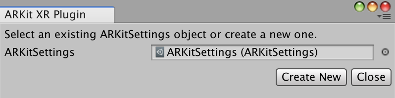
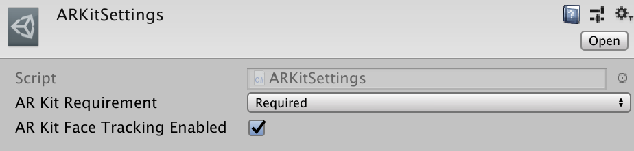
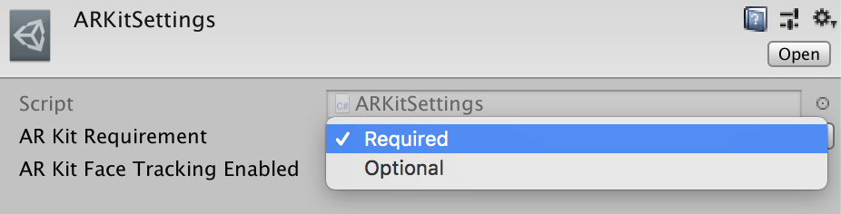

# About ARKit XR Plugin

Use the *ARKit XR Plugin* package enable ARKit support via Unity's multi-platform XR API. This package implements the following XR Subsystems:

* [Camera](https://docs.unity3d.com/2018.1/Documentation/ScriptReference/Experimental.XR.XRCameraSubsystem.html)
* [Depth](https://docs.unity3d.com/2018.1/Documentation/ScriptReference/Experimental.XR.XRDepthSubsystem.html)
* [Input](https://docs.unity3d.com/2018.1/Documentation/ScriptReference/Experimental.XR.XRInputSubsystem.html)
* [Planes](https://docs.unity3d.com/2018.1/Documentation/ScriptReference/Experimental.XR.XRPlaneSubsystem.html)
* [Raycast](https://docs.unity3d.com/2018.1/Documentation/ScriptReference/Experimental.XR.XRRaycastSubsystem.html)
* [ReferencePoints](https://docs.unity3d.com/2018.1/Documentation/ScriptReference/Experimental.XR.XRReferencePointSubsystem.html)
* [Session](https://docs.unity3d.com/2018.1/Documentation/ScriptReference/Experimental.XR.XRSessionSubsystem.html)
* [Face Tracking](https://docs.unity3d.com/Packages/com.unity.xr.facesubsystem@1.0/manual/index.html)

This version of *ARKit XR Plugin* supports the following features:

* Device Localization
* Horizontal Plane Detection
* Vertical Plane Detection
* Point Clouds
* Pass-through Camera View
* Light Estimation
* Reference Points
* Hit Testing
* Session Management
* Face Tracking

# Installing ARKit XR Plugin

To install this package, follow the instructions in the [Package Manager documentation](https://docs.unity3d.com/Packages/com.unity.package-manager-ui@latest/index.html). 

In addition, you will likely want to also install the *ARFoundation* package which makes use of *ARKit XR Plugin* package and provides many useful scripts and prefabs.

# Using ARKit XR Plugin

The *ARKit XR Plugin* implements the native iOS endpoints required for building Handheld AR apps using Unity's multi-platform XR API. However, this package does not expose any public scripting interface of its own and most developers should use the scripts, prefabs, and assets provided by *ARFoundation* as the basis for their Handheld AR apps.

Inclusion of the *ARKit XR Plugin* will result in the inclusion of source files, static libraries, shader files, and plugin metadata to be included in the XCode project generated as part of the Unity's standard iOS build process.

## Face Tracking
Using Face Tracking requires compatible hardware (iPhone X or above).  You also need to create a `ARKitSettings` asset and enable face tracking in order for that part of the plugin to be included in your build.

## Creating a ARKitSettings asset
From the menu, choose _Edit/Project Settings/ARKit XR Plugin_.  This will bring up a dialog box which can be used to select an existing ARKitSettings asset or create a new one:

Selecting the ARKitSettings asset from above will allow you to manipulate its values in the Inspector.

### Enable Face Tracking
For Face Tracking, you should check the box named ARKit Face Tracking Enabled:

### ARKit Required 
ARKit may be either "required" or "optional". If ARKit is set to optional, the app may be installed on a device that does not support ARKit. This is useful if you want to provide an experience which uses AR where available, and presents a different experience where AR is not available. By default, ARKit is required.

 

# Technical details
## Requirements

This version of *ARKit XR Plugin* is compatible with the following versions of the Unity Editor:

* 2018.1 and later (recommended)

## Known limitations

* The following ARKit features are not yet supported in this package:
    * 2D Image Recognition
    * 2D Image Tracking
    * 3D Object Recognition
    * Color Correction as an RGB Value
* If you tick the "Symlink Unity libraries" checkbox in the iOS Build Settings, then the trampoline Xcode project will not be able to find `UnityARKit.m`

## Package contents

This version of *ARKit XR Plugin* includes:

* A static library which provides implementation of the XR Subsystems listed above
* An Objective-C source file 
* A shader used for rendering the camera image
* A plugin metadata file 

## Document revision history
|Date|Reason|
|---|---|
|November 14, 2018|Add Face Tracking support.|
|October 9, 2018|Remove lack of ARWorldMap support as a known limitation; it is now supported.|
|April 19, 2018|Documentation update. Added support for vertical planes and boundary points for all planes.|

