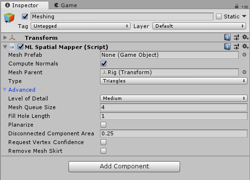
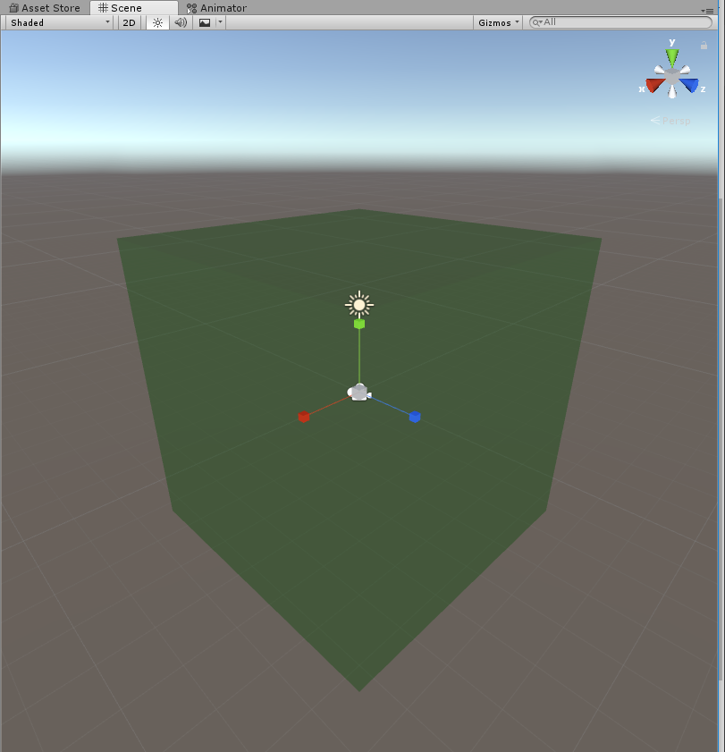
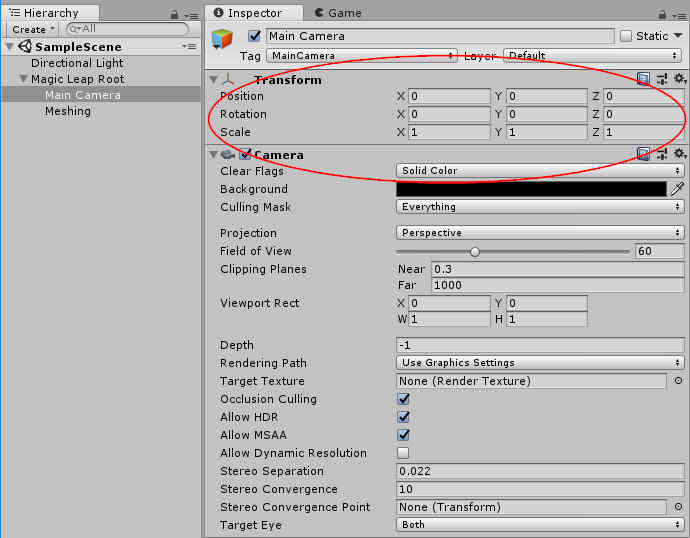
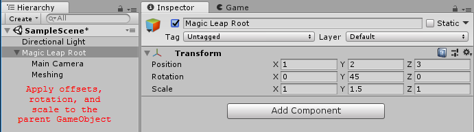

# About Magic Leap XR Plugin

Use the *Magic Leap XR Plugin* package enables Magic Leap Spatial Mapping support via Unity's multi-platform XR API. This package implements the following XR Subsystems:

* [Display](https://docs.unity3d.com/Documentation/ScriptReference/Experimental.XR.XRDisplaySubsystem.html) (Not Yet Implemented)
* [Input](https://docs.unity3d.com/Documentation/ScriptReference/Experimental.XR.XRInputSubsystem.html) (Not Yet Implemented)
* [Meshing](https://docs.unity3d.com/2019.1/Documentation/ScriptReference/Experimental.XR.XRMeshSubsystem.html)

This version of *Magic Leap XR Plugin* supports the meshing functionality provided by the Magic Leap One:

* Generate meshes of the environment
* Generate point clouds of the environment

# Installing Magic Leap XR Plugin

To install this package, follow the instructions in the [Package Manager documentation](https://docs.unity3d.com/Packages/com.unity.package-manager-ui@latest/index.html).

# Using Magic Leap XR Plugin

The *Magic Leap XR Plugin* implements the native endpoints required for meshing using Unity's multi-platform XR API.

Inclusion of the *Magic Leap XR Plugin* will result in the inclusion of a C# component, runtime libraries, and plugin metadata.

## Spatial Mapper

This package includes one component, `MLSpatialMapper`:

The spatial mapper generates [`Mesh`es](https://docs.unity3d.com/ScriptReference/Mesh.html) from data collected from the Magic Leap One's depth sensor. Each mesh is a relatively small area of the environment. A separate [`GameObject`](https://docs.unity3d.com/ScriptReference/GameObject.html) is created for each generated mesh.

|Field|Description|
|-|-|
|Mesh Prefab|This is the prefab that will be instantiated for each generated mesh. The prefab should at least have a [`MeshFilter`](https://docs.unity3d.com/ScriptReference/MeshFilter.html) on it. To visualize the meshes, add a [`MeshRenderer`](https://docs.unity3d.com/ScriptReference/MeshRenderer.html). If a [`MeshCollider`](https://docs.unity3d.com/ScriptReference/MeshCollider.html) is present, then a physics collider will be generated as well. This happens on a background thread, so it will not stall the main thread.|
|Compute Normals|If `true`, will request that the device also generate a normal for each vertex. If `false`, normals will be calculated from the triangle data.|
|Mesh Parent|The parent transform for the generated meshes. By default, the `MLSpatialMapper` will select its own parent, so that the generated meshes will be siblings of the `MLSpatialMapper`'s [`GameObject`](https://docs.unity3d.com/ScriptReference/GameObject.html).|
|Type|Whether to generate triangle meshes or a point cloud. If you select point cloud, then the resulting [`Mesh`](https://docs.unity3d.com/ScriptReference/Mesh.html) will have [`MeshTopology.Points`](https://docs.unity3d.com/ScriptReference/MeshTopology.Points.html).
|Level of Detail (LOD)|The detail of the generated meshes. Lower levels of detail will result in simplified meshes, and will reduce CPU and GPU load, but will be less accurate. Higher LOD levels will be more accurate, but require more CPU and GPU resources.|
|Mesh Queue Size|The number of concurrent meshes to generate. Each frame, the `MLSpatialMapper` will add meshes to a generation queue as necessary. Larger values will lead to heavier CPU usage, but will generate meshes faster.|
|Fill Hole Length|Perimeter (in meters) of holes you wish to have filled.|
|Polling Rate|How often to check for updates, in seconds. More frequent updates will increase CPU usage.|
|Batch Size|Maximum number of meshes to update per batch. Larger values are more efficient, but have higher latency.|
|Planarize|If `true`, the system will planarize the returned mesh (planar regions will be smoothed out).|
|Disconnected Component Area|Any component that is disconnected from the main mesh and which has an area (in meters squared) less than this size will be removed.|
|Request Vertex Confidence|If `true`, the system will compute the confidence values for each vertex, ranging from 0 to 1.|
|Remove Mesh Skirt|If `true`, the mesh skirt (overlapping area between two meshes) will be removed.|

### Bounds

Meshes are only generated inside a specific region, relative to the Magic Leap One's starting position. The `MLSpatialMapper`'s [`transform`](https://docs.unity3d.com/ScriptReference/Transform.html) is used to define this region. The [`transform`](https://docs.unity3d.com/ScriptReference/Transform.html)'s `localPosition`, `localRotation`, and `localScale` are used for this calculation.

A green, transparent box is drawn in Unity's Scene View to indicate the area in which meshing will occur:

## Spaces

Meshes are generated in "device space", also know as "session relative space". When the Magic Leap One boots up, its initial position is `(0, 0, 0)`. All meshing data is relative to this initial location.

The [`Camera`](https://docs.unity3d.com/ScriptReference/Camera.html)'s [`GameObject`](https://docs.unity3d.com/ScriptReference/GameObject.html) should have an identity transform to begin with.

If you wish to have the device start at a different location within the Unity scene, we recommend you use a parent [`GameObject`](https://docs.unity3d.com/ScriptReference/GameObject.html) to provide position, rotation, and scale (the `Magic Leap Root` in this image):

# Technical details
## Requirements

This version of *Magic Leap XR Plugin* is compatible with the following versions of the Unity Editor:

* Unity 2019.1 Beta or later (recommended)

## Known limitations

No known issues.

## Package contents

This version of *Magic Leap XR Plugin* includes:

* A shared library which provides implementation of the XR Subsystems listed above
* A plugin metadata file

## Document revision history
|Date|Reason|
|---|---|
|June 1, 2018|Create initial documentation.|
|August 17, 2018|Minor updates to docs to refer to 2018.3 version.|
|March 5, 2019|Minor updates to docs to refer to 2019.1 version.|
