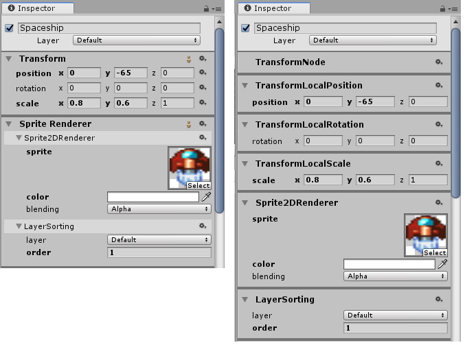
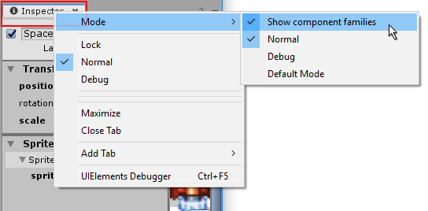

# Component Families

Component families are groups of related [components](components.md) which, in regular Unity, you would expect to see as a single component. They are separated in Tiny Mode so that individual parts can be included or omitted as required.

In regular Unity, some components such as the Sprite Renderer component or Camera component cover many different uses such as sorting, tiling, clipping, etc. that you may or may not need to use in your project. These regular Unity components have equivalent Tiny Mode components, but their features have been split into multiple smaller components so that if you do not need their features, you can omit them entirely. This allows you to trim unnecessary functionality from your project resulting in the smallest possible build.

When viewing an entity in the inspector, you can choose whether or not the inspector window groups component families together so they appear as a single component, or to have every single component displayed separately, ignoring family groupings.

 
_The inspector windows showing Component families ON (to the left), and OFF (to the right)_

To switch between showing component families or individual separate components, right-click on the **Inspector window tab** (right at the very top of the Inspector window), and select **Mode > Show component families**. Selecting this option will toggle the component families view on or off.

