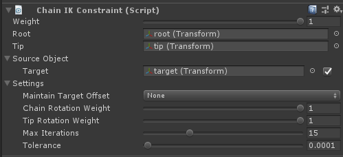

# ChainIK Constraint

A Chain IK constraint allows to inverse the control over a hierarchy of GameObjects in order to
provide a manipulation that behaves like a chain. By defining the Root and Tip GameObjects,
the Chain IK constraint will be able to find and constrain all GameObjects contained in between.

This constraint implements the FABRIK solver (Forward and Backward Reaching Inverse Kinematic).
More details can be found [here](http://www.andreasaristidou.com/FABRIK.html).

|Properties|Description|
|---|---|
|Weight|The weight of the constraint. If set to 0, the constraint has no influence the elements of the chain while when set to 1, it applies full influence given the specified settings.|
|Root|The chain hierarchy root GameObject.|
|Target|The GameObject that affects the constrained chain GameObject hierarchy.|
|Chain Rotation Weight|The weight of rotations applied throughout the chain. A weight of 1 causes the chain to fully reach for it's target goal while a value less then 1 blends current FK rotations in the chain.|
|Tip Rotation Weight|The weight of the rotation applied to the tip GameObject of the chain. If set to 1, the tip aligns it rotation to the specified target otherwise it blends with it's currently value.|
|Max Iterations|Max solver iterations performed if tolerance is not met.|
|Tolerance|Distance tolerance between the target and tip GameObjects. When respected, the solver will stop running even if it's max iteration has not been reached.|