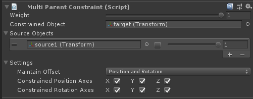

# Multi-Parent Constraint

A Multi-Parent Constraint moves and rotates a GameObject as if it is the child of another GameObject in the Hierarchy window.
However, it offers certain advantages that are not possible when you make one GameObject the parent of another:

- A Multi-Parent Constraint does not affect scale.
- A Multi-Parent Constraint can have multiple source GameObjects.
- The constrained GameObject does not have to be a child of any of the source GameObjects that the constraint references.
- You can vary the effect of the Constraint by specifying a weight, as well as weights for each of its source GameObjects.

|Properties|Description|
|---|---|
|Weight|The weight of the constraint. If set to 0, the constraint has no influence on the Constrained GameObject while when set to 1, it applies full influence given the specified settings.|
|Constrained Object|The GameObject affected by the constraint Source GameObjects|
|Source Objects|The list of GameObjects that influence the constrained GameObject position and orientation. Unity evaluates source GameObjects in the order that they appear in this list. This order affects how this constraint computes the final transform of the constrained GameObject. To get the result you want, drag and drop items in this list. Each source has a weight from 0 to 1.|
|Maintain Offset|Maintain the current offset from the constrained GameObject to the source GameObjects|
|Constrained Position Axes|Check X, Y, or Z to allow the Constraint to control the corresponding Position axis. Uncheck an axis to stop the Constraint from controlling it.|
|Constrained Rotation Axes|Check X, Y, or Z to allow the Constraint to control the corresponding Rotation axis. Uncheck an axis to stop the Constraint from controlling it.|
