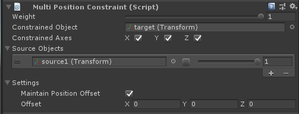

# Multi-Position Constraint

A Position Constraint component moves a GameObject to follow its source GameObjects.

|Properties|Description|
|---|---|
|Weight|The weight of the constraint. If set to 0, the constraint has no influence on the Constrained GameObject while when set to 1, it applies full influence given the specified settings.|
|Constrained Object|The GameObject affected by the constraint Source GameObjects|
|Constrained Axes|Check X, Y, or Z to allow the Constraint to control the corresponding Position axis. Uncheck an axis to stop the Constraint from controlling it.|
|Source Objects|The list of GameObjects that influence the constrained GameObject position. To get the result you want, drag and drop items in this list. Each source has a weight from 0 to 1.|
|Maintain Offset|Maintain the current offset from the constrained GameObject to the source GameObjects|
|Offset|Apply and extra post position offset to the constrained object. Specified in local space.|