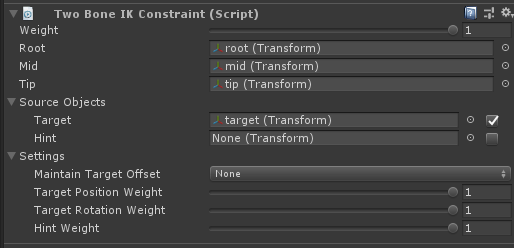

# Two Bone IK

Two Bone IK is a constraint that transforms a simple FK Hierarchy of composed of 2 bones into an inverse kinematic
expression that can be control and manipulate by a Target GameObject (Hand like control) and Hint GameObject (elbow like control).

|Properties|Description|
|---|---|
|Weight|The weight of the constraint. If set to 0, the constraint has no influence on the Constrained GameObjects while when set to 1, it applies full influence given the specified settings.|
|Root|The root of the constrained GameObject hierarchy.|
|Mid|The middle of the constrained GameObject hierarchy.|
|Tip|The last GameObject of the constrained hierarchy.|
|Target|The Source GameObject that acts as the chain IK target or effector.|
|Hint|Optional Source GameObject to control how the middle node bend normal is computed.|
|Maintain Target Offset|The current offset (in Position, Rotation or both) between the tip and target are maintained when not set to None|
|Target Position Weight|The amount in which the chain reaches to the target effector. If set to 1, the chain tries to fully reach for the target GameObject.|
|Target Rotation Weight|The amount in which the tip GameObject rotates to match the target GameObject rotation. If set to 1, the tip rotates to fully match it's target.|
|Hint Weight|The amount of influence the hint has on the configuration of the hierarchy. When set to 1, the hint fully influences the hierarchy configuration. If no hint GameObect is specified, the hint weight is ignored.|