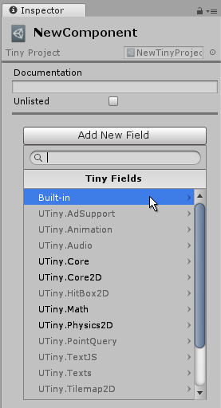
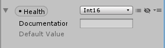

# Custom components

Custom components allow you to define your own sets of data that you can attach to Entities.

_Note: Tiny Mode components are different to [regular Unity components](https://docs.unity3d.com/Manual/UsingComponents.html). This page relates only to Tiny Mode components. [Read more about the difference here](intro-for-unity-developers.md)._

## Creating custom components

There are a number of ways to create components in Tiny Mode:

- Use the **Tiny > Create > Component** menu.

- Click the Create button in the Project window, and select **Tiny > Component** from the menu that appears.

- Right click in the Project window and select **Create > Tiny > Component** from the menu that appears.

The new component will be created in whichever folder you have selected in the Project window. When you create a new component, the component's name is selected, ready for you to give it a name. The name you choose for the component asset also acts as the name you use in your scripts to refer to the component, so it must conform to C# member naming requirements - for example, do not use spaces or special characters.

 
_A new component in the project window_

Once you have created a component, you can view its details in the inspector. The purpose of a component is to define a related set of data fields that you can later act on in your scripts. However, a new component has no data fields defined. You must add fields to your component, defining their name and type.

## Component documentation

Tiny Mode components provide a built-in field at the top of the inspector which allows you to add your own documentation to the component. This provides you with a way of making notes about the purpose of the component within your project, and any guidelines you may wish to provide about how it should be used.

 
_The documentation section of a component._

## Adding fields

To add new fields to the component, click the **Add New Field** button.

 
_A new empty custom component in the inspector showing the Add New Field button_

When adding a field, you must specify the type for the field. The available types are listed in the drop-down menu that appears. The types are grouped into categories. There are basic built-in types such as integers, floating point values, boolean, and string. There are also types that relate to specific Tiny Mode modules such as Audio or Physics.

Once you have added a field, it appears in the component inspector window, 

 
_A new field added to a component._

You can then name the field by clicking its name, and provide a default value for that field. Just like the name of the component itself, the name you choose for your field must be a valid C# member name and therefore cannot contain spaces or invalid characters.

 
_A field which has been given a suitable name and a default value._

You can also change the type of an existing field using the type drop-down menu, which is to the right of the field name. This drop-down menu contains the same set of types as the **Add New Field** menu.

 
_Changing the type of a field using the type drop-down menu_

## Adding fields from enabled or disabled modules

Tiny Mode modules can be enabled or disabled in your project, and they give you the option of including certain areas of functionality in your project, and excluding others that you don't need in order to reduce the footprint of your project.

The **Add New Field** drop-down menu shows which modules are currently enabled and disabled in your project by showing them in grey text (for disabled modules) or regular text (for enabled modules). For example, in the image below, the AdSupport, Animation, and Audio modules are shown as _not enabled._

 _The Add New Field menu showing some disabled modules._

You can select a type for your field from both the enabled_ and disabled_ modules, however if you add a field type from a disabled module, Unity shows a warning and provides you an option to add that module to your project.

 _A field using a type from a disabled module. The inspector provides a button allowing you to add this module to your project._

## Array fields

You can specify whether a field should contain a single value, or an array of values of the specified type. To switch between these two options, click the "array" button to the right of the right of the type drop-down menu. This button toggles the field between single-value mode or array mode.

 _The array/single value toggle button. It is currently in single value mode._

Single value mode is indicated by a diagonal stroke through the button icon. When you switch a field to array mode, the diagonal stroke on the button icon is removed. The component will now accept an array of values, and you no longer have the option to specify a default value for that field.

 _A field set to array mode_

_Note: The array of values is not visible in the component inspector itself. It is only visible when viewing an Entity which has this type of component attached. To add array elements to the field you must use this component on an Entity, then add the array values in the Entity's inspector._

## Field visibility

You can control whether a field is visible or invisible when viewed in an Entity's inspector. You might want to make a field invisible if it should only be modified by scripts at runtime, and you do not want the value to be set in the inspector.

To make a field invisible in the Entity inspector, click the visibility button (represented by an "eye" icon) to the right of the array button.

<!-- TO DO : add screenshot of visibility button -->

## Field options menu

The drop-down menu icon to the right of the field visibility icon provides a few other options for organising your fields.

|Menu Item|Description|
|:--|:--|
|Remove|Removes the selected field from the component|
|Duplicate|Duplicates the selected field in the component, with a numerically incremented suffix on the name|
|Move Up|Rearranges the order of the fields, moving this field up one place (if this field is not the first field)|
|Move Down|Rearranges the order of the fields, moving this field down one place (if this field is not the last field)|
|Documentation|Toggles the option for adding your own documentation to this field. Disabled by default. When enabled a documentation text field appears allowing you to enter your own description for the field's purpose.|

<!-- TO DO : add screenshot of dropdown menu and documentation field -->
