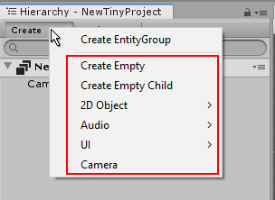
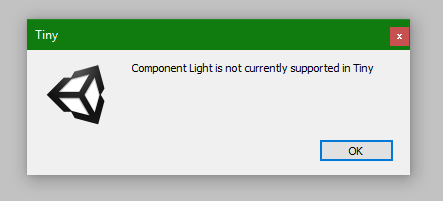

# Entities

Entities represent the building blocks of your game or app. For example, you might have an Entity which displays your player character as a sprite on-screen. You could create many entities which each represent environment objects, effects, enemies, or on-screen UI text.

Entities in Tiny mode can only exist as part of an Entity Group. 

## Creating Entities

There are a number of ways to create Entities in the Editor. When you create an Entity it becomes part of an Entity Group in the Hierarchy.

There are a number of ways of creating Entities:

**Creating Entities by using menus in the editor:**

Use the **Tiny > Create** menu.

Click on the **Create** button at the top of the Hierarchy window and select one of the Entity types in the lower portion of the menu. This creates an entity in the currently active EntityGroup.

Click on the **Create** button at the top of the Hierachy window and select **Create EntityGroup**.

*   Right-click within the lower part of the Hierachy window and select **New EntityGroup** from the context menu that appears.
*   Use the Project window Create Button, and select **Tiny > EntityGroup**.
*   Right click within the Project window and select **Create > Tiny > EntityGroup** from the context menu.
*   Select **Tiny > Create > EntityGroup** from the main menu at the top of the Unity editor.

The context menu allows you to create a new empty Entity, or a new Entity with some common built-in components such as Sprite, Audio, UI or Camera components. Unity will create the new Entity in the Entity Group that was under the cursor when you opened the context menu.

**Creating Entities by dragging Assets from the Project window:**

You can also create a new Sprite Entity by dragging a Sprite Asset from your Project window into the Hierachy. Unity will create the new Sprite Entity in the Entity Group that is under the cursor when you finish dragging.

<!-- TO DO : other types of asset that can be dragged into the hierarchy -->

If you try to use components or GameObject types that are not compatible with Tiny Mode (for example, if you try to add a Spot Light from the **GameObject > Lights** menu), Unity will display a warning, and will not allow you to add it to the Scene or Hierarchy.

