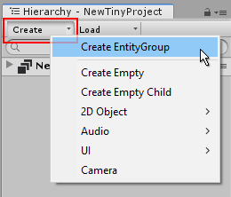

# Entity Groups

You can use Entity Groups to group related sets of Entities that you want to use together in your game or app. Entity groups can contain any number of entities, and you can arrange them in a hierarchical structure within the Entity Group.

Arranging your Entities in a hierarchical structure gives you a way to logically group Entities within an Entity group, and also provides the same [transform parenting features](https://docs.unity3d.com/Manual/Transforms.html) as in regular Unity.

You can have multiple Entity Groups in the Hierarchy at any given time, and Entity Groups can be loaded or unloaded at runtime. Each Entity Group is stored as an Asset in your Project, and has the _.utdata_ filename extension.

## Creating Entity Groups

 
_Creating a new EntityGroup from the Hierarchy window's Create button._

There are a number of other ways to create Entity Groups:

*   Click on the **Create **button at the top of the Hierachy window and select **Create EntityGroup**.
*   Right-click within the lower part of the Hierachy window and select **New EntityGroup **from the context menu that appears.
*   Use the Project window Create Button, and select **Tiny > EntityGroup**.
*   Right click within the Project window and select **Create > Tiny > EntityGroup **from the context menu.
*   Select **Tiny > Create > EntityGroup** from the main menu at the top of the Unity editor.

## The Startup Group

One Entity Group must be specified as the Startup Group. This is the group which will be loaded automatically when your game or app starts. You must use code to load other groups as required at runtime.

## The Active Group

One Entity Group can be the "active" group at any given time. The purpose of specifying an active group is to determine where new Entities should be created.

Some methods of creating new Entities in the editor implicitly allow you to specify the Entity Group they belong to while you are creating them - such as when you right-click an Entity Group, or drag an Asset from the Project window onto an Entity Group.

Other methods - such as using the **Tiny > Create** menu - allow you to create an Entity without specifying a group. When you create an Entity in the editor without explicitly specifying which Entity Group it should belong to, it is added to whichever is the currently active group.

You can change which is the currently active group by right-clicking on an Entity Group in the Hierarchy window, and selecting **Set active EntityGroup**.

