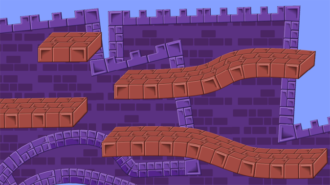
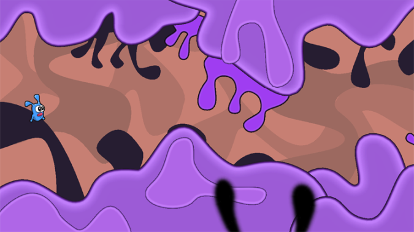
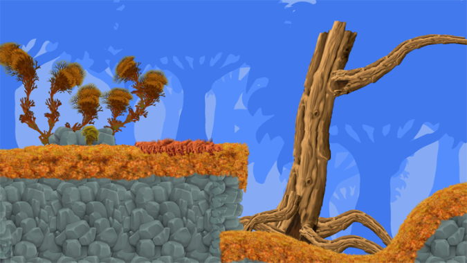

# 2D Sprite Shape

## Overview

The **Sprite Shape** is a flexible and powerful world building Asset that features Sprite tiling along a shape's outline that automatically deforms and swaps Sprites based on the angle of the outline.  Additionally, you can assign a Fill texture to a Sprite Shape to create filled shapes with tiled textures as backgrounds or other large level-building props. 

The following are examples of Sprite Shapes used to construct different parts of various levels.

Sprite Shapes comprise of two parts - the [Sprite Shape Profile](SSProfile.md) Asset, and the **[Sprite Shape Controller]()** component. The Sprite Shape Profile contains the angle settings and Sprites used by the Sprite Shape, and you edit the Sprite Shape's outline with the Sprite Shape Controller component.

## Importing Sprites for Sprite Shapes

We recommend using the following settings when importing Sprites for a Sprite Shape:

1. [Texture Type](https://docs.unity3d.com/Manual/TextureTypes.html#Sprite) - Set this to **Sprite (2D and UI)**. Other texture types are not supported for Sprite Shapes.
2. **Sprite Mode** - Set this to **Single** if the texture contains only a single Sprite.
3. **Mesh Type** - Set this to **Full Rect**. 

## Sprite Shape Workflow

Create **Sprite Shapes** in following the steps:

1. Create a **Sprite Shape Profile** from the main menu (menu: **Assets > Create > Sprite Shape Profile**). Select from the two available options: 
   - [Open Shape](SSProfile.html#open-shape)
   - [Closed Shape](SSProfile.html#closed-shape)
2. Create [Angle Ranges](SSProfile.html#creating-angle-ranges) and [assign Sprites](SSProfile.html#assigning-sprites) in the **Sprite Shape Profile**.
3. Drag the **Sprite Shape Profile** into the Scene to automatically generate a **Sprite Shape** GameObject based on that Profile. 
   - You can create a Sprite Shape GameObject without a Profile from the main menu (menu: **GameObject > 2D Object > Sprite Shape**). Then select a Sprite Shape Profile in the **Sprite Shape Controller**'s **Profile** settings. The same Profile can be used by multiple Sprite Shapes.   
4. Edit the outline of the Sprite Shape with the [Sprite Shape Controller](SSController.md) component settings.
5. Enable [Physics2D](https://docs.unity3d.com/Manual/class-Physics2DManager.html) interactions for your Sprite Shapes by attaching a [Collider](SSCollision.md) component.

