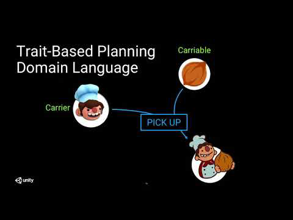
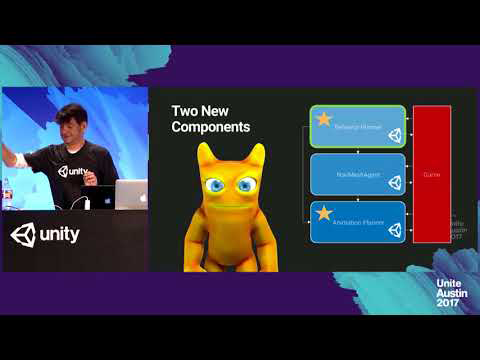

# About AI Planner

Use the AI Planner package to create agents that generate and execute plans. For example, use AI Planner to create an NPC, generate storylines, or validate game/simulation mechanics. The AI Planner package also includes authoring tools and a plan visualizer.

# Installing AI Planner

To install this package, follow the instructions in the [Package Manager documentation](https://docs.unity3d.com/Packages/com.unity.package-manager-ui@latest/index.html). 

# Using AI Planner
To create an AI agent with the AI Planner, see the following guides:
* [Creating a domain definition](DomainDefinition.md)
* [Creating a plan definition](PlanDefinition.md)
* [Extending the BaseAgent class](BaseAgent.md)
* [Implementing operational actions](OperationalActions.md)

During execution, it is also useful to view an agent's plan through the [plan visualizer](PlanVisualizer.md).

For a complete sample project, see: [Otto](https://github.com/Unity-Technologies/otto) 

## Talks
### Unite LA 2018 - _AI for Behavior: Advanced Research for Intelligent Decision Making_

### Unite Austin 2017 - _Unity Labs Behavioral AI Research_

# Technical details
## Requirements

This version of AI Planner is compatible with the following versions of the Unity Editor:
* 2019.1 and later 

## Package contents

The following table indicates the runtime folders that will be of interest to you as a developer:

|Location|Description|
|---|---|
|[`Runtime/Agent`](../Runtime/Agent)|Contains classes and interfaces for the agent and operational actions.|
|[`Runtime/Data`](../Runtime/Data)|Contains serialized data definitions.|
|[`Runtime/Planner`](../Runtime/Planner)|Contains the planning system.|
|[`Runtime/TraitBasedLanguage`](../Runtime/TraitBasedLanguage)|Contains state and action representations used by the planner.|
|[`Runtime/Utility`](../Runtime/Utility)|Contains utility classes for the package.|

## Document revision history
 
|Date|Reason|
|---|---|
|Mar 18, 2019|Document created. Matches preview package version 0.0.1.|