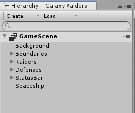
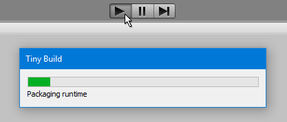

# Intro for Unity developers

If you already have experience using Unity to develop games or apps, you are already well on your way to developing in Tiny Mode. This page highlights the key similarities and differences between using "normal" Unity and working in Tiny Mode.

Firstly, Tiny Mode works within the context of the Unity Editor, and either directly uses or replicates many standard Unity features. For example, basic development tasks such as using the [Project window](https://docs.unity3d.com/Manual/ProjectView.html), [importing assets](https://docs.unity3d.com/Manual/AssetWorkflow.html), navigating the [scene view](https://docs.unity3d.com/Manual/UsingTheSceneView.html), and inspecting assets and scene objects in the [inspector](https://docs.unity3d.com/Manual/UsingTheInspector.html), all remain very similar in Tiny Mode.

However, many other workflows or features that you may be familiar with are either significantly different or not supported at all in Tiny Mode. Most importantly, Tiny Mode only supports 2D sprite-based rendering and therefore has no 3D rendering capabilities. The omission of features such as 3D Rendering, Navigation, Terrain, Multiplayer, detailed Physics, etc. is by design as this enables Tiny Mode to produce games and apps with such a small footprint. 

Your decision on whether to use Tiny Mode for your project will depend very much on the type of game or app you're making, and the characteristics and limitations of the platforms that you want to target. If you're making a game or app for consoles, MacOS or Windows, VR, or as a standalone smartphone release, Tiny Mode is probably not the best choice. However, if you want to create messenger games, ads, or other HTML5 projects with a very small file size and memory footprint, Tiny Mode is the right choice.

For a quick list of Unity features and workflows that have corresponding functionality in Tiny Mode, see the [Compatibility Cheat Sheet](compatibility.md).

## How does Tiny Mode differ from regular Unity?

### ECS is enforced

From a technical point of view, the most significant difference is that Tiny Mode _enforces_ use of the [Entity Component System](https://en.wikipedia.org/wiki/Entity%E2%80%93component%E2%80%93system) (ECS) pattern. ECS enables significant performance benefits but you can normally choose to construct all or part of your project using ECS or not. ECS is fundamental to Tiny Mode and is not optional, so you must build your project according to ECS principles.

If you have used Unity before, but not encountered ECS, you will need to familiarize yourself with the [basic concepts of ECS](https://en.wikipedia.org/wiki/Entity%E2%80%93component%E2%80%93system).

### Tiny Mode Projects

A Tiny Mode project is represented by a special Asset within a regular Unity Project, which means a single Unity Project can contain multiple Tiny Mode projects. Normally, the Unity Editor can only have one **project** open at a time. However, Tiny Mode projects are represented by an asset file with the .utproject filename suffix. The Tiny Mode project file contains information about which [Tiny Mode modules](modules.md) are used within the Tiny Mode project, and various [settings](settings-main.md) relating to Tiny Mode such as the display size.

### The Hierarchy window

There are some small differences when using the Hierarchy window in Tiny Mode.

 
_The Hierarchy window in Tiny Mode_

Instead of Scenes and GameObjects in your hierarchy, you now have Entity Groups and Entities. These are listed in a similar way to Scenes and GameObjects. EntityGroups are similar to Scenes, and Entities are similar to GameObjects and can be arranged in a hierarchical relationship inside their group, but it's important to remember the differences described below.

### Entity Components vs. GameObject Components

The similarity between Tiny Mode Entity Components and regular Unity GameObject Components is strong. Just like regular Unity components, there are a number of built-in Tiny Mode components which cover features such as Camera rendering, collision, audio, particles, UI, etc, and you can add them to Entities in the inspector, just like you would add built-in components to GameObjects. In addition - similar to regular Unity MonoBehaviours - you can also create custom components yourself and add them to your Entities.

However there are some important differences. Tiny Mode components are _purely data containers_. They can contain organised, named, and related sets of data such as ints, floats, Vectors, Colors, Strings and enums, however they cannot contain any code. This is in contrast to regular Unity components which can contain both data and code. This is part of the ECS pattern that Tiny Mode follows in order to achieve fast performance and a tiny runtime footprint.

Another important difference is that you _cannot add more than one component of the same type_ to an Entity.

### Entity Groups vs. Scenes

Tiny mode does not use regular Unity Scenes. Instead it uses Entity Groups. These are similar to Scenes, and like Scenes they have a hierarchical structure of contents, however they can only contain Entities, not GameObjects. You can have multiple Entity Groups in the Hierarchy at any given time, in a similar way to multi-scene editing, and Entity Groups can be loaded or unloaded at runtime. Entity Groups are stored as an Asset in your Project, but they are not the same as Unity Scene assets. They have a different file format and a different filename extension (.utdata).

### The Inspector window

When inspecting an Entity in Tiny Mode, the Inspector window displays the Tiny Mode components attached to that Entity, in a very similar way to viewing the components attached to a GameObject. There are many built-in Tiny Mode components which are similar - but not the same as - regular Unity components.

For example, Tiny Mode has its own **Sprite2DRenderer** component, which is similar to the regular Unity [SpriteRenderer](https://docs.unity3d.com/Manual/class-SpriteRenderer.html) component, but it is in fact a separate class with a different set of features. There are other similar components in Tiny Mode relating to Animation, Physics, Tile maps, Audio, and more. However even if you are familiar with these systems in regular Unity, you will need to carefully read the documentation for their Tiny Mode equivalent components because they differ significantly.

In addition, when viewing an Entity's components in the Inspector window, Tiny Mode uses a concept of [Component families](component-families.md) which is not present in regular Unity. Component families are groups of related functionality which, in regular Unity, you would expect to see as a single component. They are separated in Tiny Mode so that individual parts can be included or omitted as required. The inspector in Tiny Mode can either show every component separately, or it can display components in family groups, which make the related components (for example, all the Sprite Renderer family components) appear as if they were a single component.

### The Play button

In Tiny Mode, you cannot preview your project within the editor by pressing the Play button. Instead, pressing the play button performs the same action as exporting a build of your project. 

When you press the Play button, Tiny Mode quickly creates a build of your project and runs it in your default web browser.

 
_When pressing the play button in Tiny Mode, the project is built and run in your default web browser_

