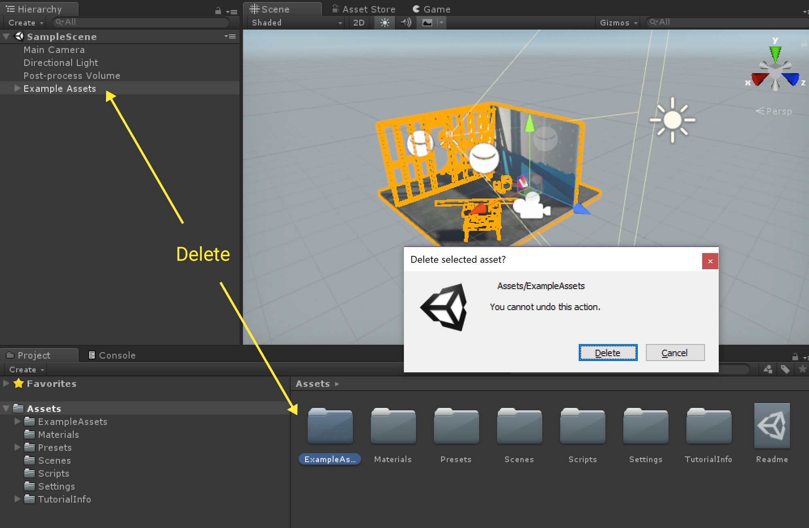
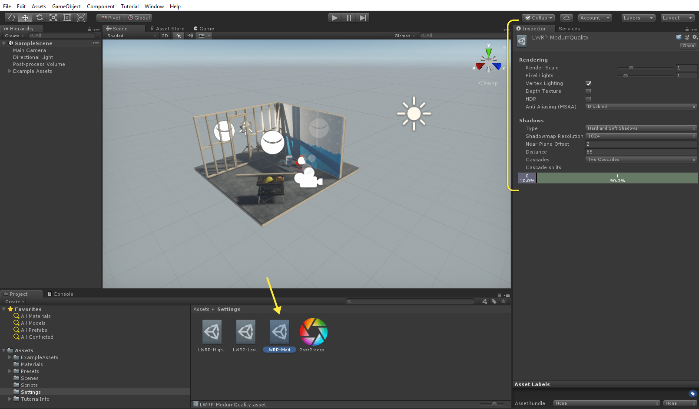
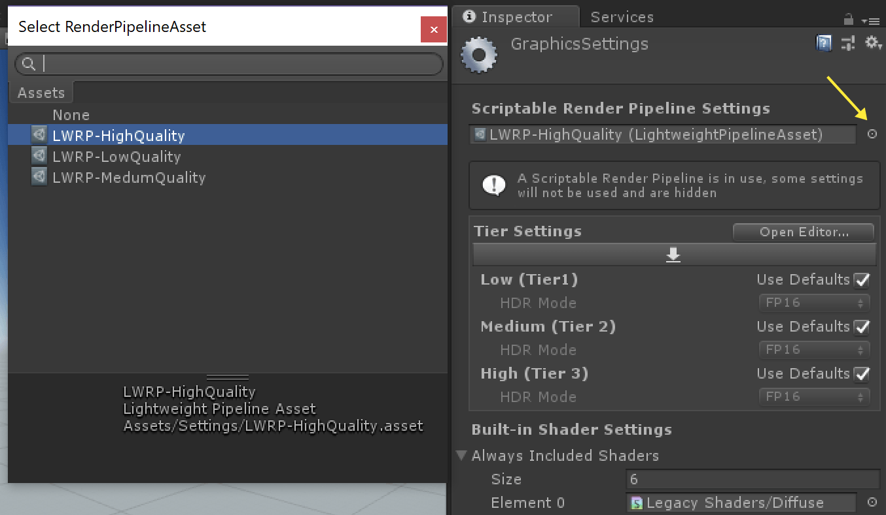

# _Lightweight Project Template_ #

The Lightweight Project Template configures Project settings for Projects where performance is a primary consideration and projects that use a primarily baked lighting solution. 
This template utilizes the Lightweight Scriptable Render Pipeline, which is a single-pass forward renderer that decreases the draw call count on your project, making it ideal for lower-end hardware. 
This template also  includes the new Shadergraph tool, Post-Processing stack, several Presets to jump start development, and example content.

This Project Template uses the following features:

* Lightweight Render Pipeline - For more information, see the <a href="https://github.com/Unity-Technologies/ScriptableRenderPipeline/wiki">wiki</a> on the Scriptable Render Pipeline repository.
* Shader Graph tool - This tool allows you to create shaders using a visual node editor instead of writing code. For more information on the Shader Graph, see the <a href="https://github.com/Unity-Technologies/ShaderGraph/wiki">wiki</a> on the Shader Graph repository.
* Post-processing stack - The Post-Processing Stack enables artists and designers to apply full -screen filters to scenes using an artist-friendly interface. For more information, see the <a href="https://github.com/Unity-Technologies/PostProcessing/wiki">wiki</a>  on the Post-Processing GitHub repository.

*Note:* The Lightweight Scriptable Render Pipeline is currently in development, so consider it incomplete and subject to change (API, UX, scope). As such, it is not covered by regular Unity support. Unity is seeking feedback on the feature. To ask questions about the feature, visit the <a href="https://forum.unity.com/forums/graphics-experimental-previews.110/?_ga=2.9250101.1048197026.1528313382-1647295365.1509665782">Unity preview forum</a>.

## Using the _Lightweight Project Template_ ##

This Template is setup to use the Lightweight Render Pipeline which is an easily accessible example of the new Scriptable Render Pipeline feature shipping with Unity 2018.1. The Lightweight Render Pipeline is optimized towards delivering 
high performance across lower-end hardware and resource intensive media such as VR.

As stated above, this Template was created with performance in mind. Not only are settings adjusted to use the Lightweight Render Pipeline, the project, lighting, and post-processing settings have been tuned for more performant results and to 
only include features that work with the Lightweight Render Pipeline. This makes it a great starting point for users targeting a broad range of mobile platforms, low-end to mid-tier hardware, or for developers making games that have limited realtime 
lighting needs.

This Template also includes default content intended to showcase how to set up lighting, materials, and post-processing for the best results for the lightweight render pipeline. The content itself provides a good reference for how to lightmap your meshes 
(for meshes marked as Lightmap Static), place light probes, and author textures for use with the Lightweight PBR material.

If you don’t want the example content in the scene you can easily delete it by deleting the ExampleAssets Object in the Hierarchy and ExampleAssets folder in the Project’s asset directory.

This will remove all the example content without breaking any Post-Processing or lighting settings. From here you can add your own meshes to this scene and have a well-lit asset without any additional work.

By default you will also find a script on the Camera that allows for simple WASD navigation through the scene and the speed of your movement is tunable via the camera inspector. This allows you to quickly navigate while in Play to inspect your geometry without having to write any C# code.

There are also a number of presets included in the scene and these have been tuned for use with the lightweight render pipeline. 

When using the Lightweight Render Pipeline a number of rendering settings have been moved to a special asset in your project. This Template comes with multiple of these setting assets allowing you to further customize your project based on what type 
of hardware you are targeting.

By default the project uses the LWRP-High asset to showcase the best visual results.

Try out the other ones by changing the Scriptable Render Pipeline asset in the Graphics Settings (Project Settings -> Graphics).

## Document revision history
|June 6, 2018|Initial Documentation Pass Added|
