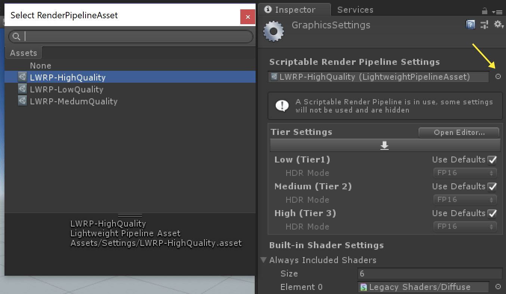

# _VR Lightweight Project Template_ #

The VR Lightweight Project Template configures Project settings for VR Projects that use a primarily baked lighting solution. 
This template utilizes the Lightweight Scriptable Render Pipeline, which is a single-pass forward renderer that decreases the draw call count on your project, making it ideal for lower-end hardware and resource intensive media such as VR.
This template also  includes the new Shadergraph tool, Post-Processing stack, several Presets to jump start development, and example content. 
Note that this project is designed to be used with a Virtual Reality device. Make sure you have the correct SDKs for the device you are using before using this template. 

This Project Template uses the following features:

* Lightweight Render Pipeline - For more information, see the <a href="https://github.com/Unity-Technologies/ScriptableRenderPipeline/wiki">wiki</a> on the Scriptable Render Pipeline repository.
* Shader Graph tool - This tool allows you to create shaders using a visual node editor instead of writing code. For more information on the Shader Graph, see the <a href="https://github.com/Unity-Technologies/ShaderGraph/wiki">wiki</a> on the Shader Graph repository.
* Post-processing stack - The Post-Processing Stack enables artists and designers to apply full -screen filters to scenes using an artist-friendly interface. For more information, see the <a href="https://github.com/Unity-Technologies/PostProcessing/wiki">wiki</a>  on the Post-Processing GitHub repository.

Please visit the Unity XR manual pages for more information about VR: <a href="https://docs.unity3d.com/Manual/VROverview.html">VR Overview</a>

*Note:* The Lightweight Scriptable Render Pipeline is currently in development, so consider it incomplete and subject to change (API, UX, scope). As such, it is not covered by regular Unity support. Unity is seeking feedback on the feature. To ask questions about the feature, visit the <a href="https://forum.unity.com/forums/graphics-experimental-previews.110/?_ga=2.9250101.1048197026.1528313382-1647295365.1509665782">Unity preview forum</a>.

## Using the VR _Lightweight Project Template_ ##

This Template is setup to use the Lightweight Render Pipeline for Virtual Reality. The Lightweight Render Pipeline is an easily accessible example of the new Scriptable Render Pipeline feature shipping with Unity 2018.1. The Lightweight Render Pipeline is optimized towards delivering 
high performance across lower-end hardware and resource intensive media such as VR.

As stated above, this Template was created with performance in mind. Not only are settings adjusted to use the Lightweight Render Pipeline, the project, lighting, and post-processing settings have been tuned for more performant results and to 
only include features that work with the Lightweight Render Pipeline. The VR Lightweight Template is very similar to the normal Lightweight Template, except it is more optimized (by default it only uses one pixel light, hdr is off, and only 
two shadow cascades) and some settings are tuned specifically for Virtual Reality (Post-Processing, anti-aliasing, texture anisotropic filtering, etc).

This Template also includes default content intended to showcase how to set up lighting, materials, and post-processing for the best results for the lightweight render pipeline. The content itself provides a good reference for how to lightmap your meshes 
(for meshes marked as Lightmap Static), place light probes, and author textures for use with the Lightweight PBR material.

If you don’t want the example content in the scene you can easily delete it by deleting the ExampleAssets Object in the Hierarchy and ExampleAssets folder in the Project’s asset directory.

This will remove all the example content without breaking any Post-Processing or lighting settings. From here you can add your own meshes to this scene and have a well-lit asset without any additional work.

There is also a VR Camera Rig setup designed to work with multiple VR headsets. It also includes options to use Stationary or Room Scale (when applicable) and set camera height for stationary experiences.

By default it assumes a seated, stationary experience.
This means you can just put on your headset, hit play, and enter the experience right away.

There are also containers setup for Left and Right Hand Controllers using the Tracked Pose Driver. Just add some geometry and you’ll be able to see your virtual hands without any additional work.

There are also a number of presets included in the scene and these have been tuned for use with the lightweight render pipeline. 

When using the Lightweight Render Pipeline a number of rendering settings have been moved to a special asset in your project. This Template comes with multiple of these setting assets allowing you to further customize your project based on what type 
of hardware you are targeting.

By default the project uses the LWRP-MediumQuality asset to have great performance in VR.

Try out the other ones by changing the Scriptable Render Pipeline asset in the Graphics Settings (Project Settings -> Graphics).

## Document revision history
|July 17, 2018|Initial Documentation Pass Added|
