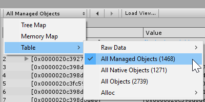

# The Main view

The right-hand pane of the [Memory Profiler window](memory-profiler-window.md) shows different views of the currently opened snapshot data.

The toolbar above it contains a drop-down menu that lets you choose different ways to represent snapshot data in the Main view. Choose between [Tree Map](tree-map.md), [Memory Map](memory-map.md), and various types of [Table views](table.md).

Next to the view drop-down are two arrow buttons that allow you to go backward and forwards in the view history. So if, for example, you follow references through a chain of referencing objects, those arrows allow you to return to previous views quickly, much like a browser back button.

The __Load View...__ button will open a dialog to import a custom view defined in an XML file.

[Back to manual](manual.md)