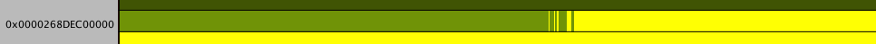

# Memory Map view

In this view, you find a visual representation of how the virtual memory is laid out:

This view contains different sections:

## Memory visualization

In the view, you can find a visual representation of memory layout in [virtual memory](https://en.wikipedia.org/wiki/Virtual_memory). 

### Addresses

The left side contains labels of the first virtual addresses corresponding to the row on the right:

* If there is a black background behind the label, it means that this is the beginning of a group and there is a discontinuity between this group and the address space of the group before it. Click on the group to select the whole block of memory (up until the next discontinuity).

* If there is no background, that means addresses are part of a memory block. If you click on them, there is no effect. Labels appear every ten lines of a continuous address space block to help orient yourself while navigating this view.

### Allocations

The right side of the Memory Map view contains a visual representation of all allocations captured inside the snapshot. At the top, there is a legend explaining what each color means and contains descriptions that correspond to the different view settings available.

You can modify the view settings using the drop-down menus in the top right corner of the window. Available options are:

* __Row Size__: select how much of virtual [address space](https://searchstorage.techtarget.com/definition/address-space) will be presented in one row of the Memory Map view.
* __Display Filters__: decide what kind of information you want to display in the Memory Map view:
  * __Allocations__: display native allocations.
  * __Managed Objects__: display managed objects (C#) in [managed heaps](https://www.techopedia.com/definition/27305/managed-heap).
  * __Native Objects__: display native objects inside native regions.
  * __Virtual Memory__: show virtual memory regions (reserved address space that is not assigned to any memory).

You can select regions by clicking on them, or you can click and drag to select a section of memory that interests you. When you do, the details about the address space will be updated to represent the selected range.

### Memory Map Table view

Below the Memory Map, you can find a [Table view](table.md) that displays details about the selected range. It has multiple modes that you can switch between by using the drop-down in the top right corner of the table. 

## Memory Map Diff view

The Memory Map Diff view compares two snapshots against one another. The view is similar to the main Memory Map view, with the following differences: 

* The top right corner has a drop-down labeled __Color Scheme__ that allows you to highlight new allocations or deallocated memory. This option makes it easier to see how memory changes between snapshots.
* The radio buttons, above the table containing further details, let you quickly switch between displaying the data of either of the two snapshots for the selected range.

## Further information

For more information on the Memory Map, see [Memory Profiler window](memory-profiler-window.md).

[Back to manual](manual.md)