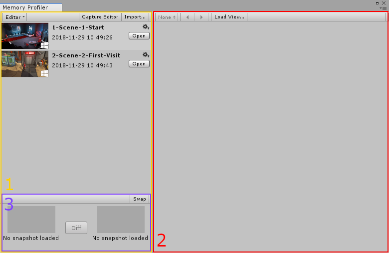

# Memory Profiler window

The Memory Profiler has a window that is separate from the existing [Profiler window](https://docs.unity3d.com/Manual/ProfilerWindow.html). 

To open the Memory Profiler window:

* First, make sure you have the [Memory Profiler package installed](index.md#installing-memory-profiler). 
* Then go to the menu: __Window__ > __Analysis__ > __Memory Profiler__.

## Window overview

The Memory Profiler window consists of three main areas:

1. The [Workbench](workbench.md)

2. The [Main view](main-view.md)

3. The [Open Snapshot view](workbench.md#open-snapshots-view)

The Main view displays three kinds of data views: [Tree Map](tree-map.md), [Memory Map](memory-map.md), and [Table view](table.md).

## Further information

For more information on the Memory Profiler window, see [Workflow: Understanding memory](workflow-understanding-memory.md).

[Back to manual](manual.md)

