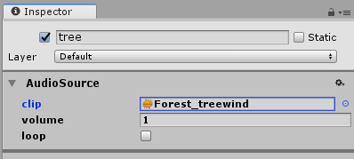

# Audio Module

The Tiny Mode Audio Module supports a subset of the audio features in regular [Unity Audio](https://docs.unity3d.com/Manual/AudioOverview.html). This page provides common use cases, an example, and a reference of the Audio components.

## Use Cases and Examples

This section demonstrates how to use the Audio module through common use cases and usage examples. If a use case or an example is similar to a topic in the Unity User Manual, a link is provided to the appropriate topic.

### Simple Audio Source

1. Create an entity.
2. Add an [AudioSource](#audiosource) component.
3. Set the `clip` property to an audio asset.
4. Set the `volume` property to 1.
5. Check the `playing` property (true).

After exporting your project, the audio clip will play through once.

Please refer to the `BackgroundMusic`, `Breeze`, `TreeWind`, `Walk` entities in the [`AudioForest`](#audioforest) project for examples.

Alternatively, you can play an AudioClip via scripting in a Tiny Mode system using an entity's AudioSource. Please refer to the `AudioInputSystem` in the [`AudioForest`](#example-audioforest) project for an example.

### Example: AudioForest

The `AudioForest` project found in `Assets/UTinySamples` covers the use of the Audio Module components. In the project, you will find an example about creating a simple AudioSource, playing an AudioClip, stopping an AudioClip, and pausing/resuming all AudioSources. Use keyboard inputs to add AudioSources and to control the AudioSources.

## AudioConfig

This setting is available in the inspector when you have a Tiny Mode project open, and have the [Tiny Mode project asset selected in the project window](tiny-mode-projects#AudioConfig). It allows you to pause or unpause the audio in your project.

## Components

The Audio Module provides two components, **AudioClip** and **AudioSource**

### AudioClip

* Unity Reference: [AudioClip](https://docs.unity3d.com/Manual/class-AudioClip.html)

Defines a container for audio data. AudioClips are referenced and used by AudioSources to play sounds.

[AudioClipStatus](#audioclipstatus) describes the current load state of the audio data associated with the AudioClip.

|Property|Description|
|--------|-----------|
|file|Represents an audio file or URL to load.|

### AudioSource

* Unity Reference: [AudioSource](https://docs.unity3d.com/Manual/class-AudioSource.html)

Plays back an audio clip in an EntityGroup. Controls the volume and audio clip properties (e.g. `loop`).

An AudioSource can play a single audio clip. Multiple AudioSources can exist in separate entities.

|Property|Description|
|--------|-----------|
|clip|A Tiny Mode entity representing a reference to an audio clip (sound asset) to be played.|
|volume|Represents the audio clip playback volume **between [0..1]**.|
|loop|Determines if the audio clip should replay when it reaches the end. If **true**, the audio clip replays when it ends.|
|playing|Determines if the audio clip is currently playing. If **true**, the audio clip is playing.|

## Systems

### AudioSystem

* Updates After: Shared.RenderingFence

Handles [AudioConfig](#audioconfig), [AudioClip](#audioclip) and [AudioSource](#audiosource) states. More specifically, it initializes the AudioConfig state as well as pausing all sounds if it's set to. It also takes care of the AudioClip load state (e.g. load an AudioClip if it's unloaded). Finally, it handles AudioSources state (e.g. if the source is not playing, the system will stop the music).

## Enums

### AudioClipStatus

Value describing the current load state of the audio data associated with an [AudioClip](#audioclip).

|Value|Description|
|-----|-----------|
|Unloaded|Value returned by AudioClip.status for an [AudioClip](#audioclip) that has no audio data loaded and where loading has not been initiated yet.|
|Loading|Value returned by AudioClip.status for an [AudioClip](#audioclip) that is currently loading audio data.|
|Loaded|Value returned by AudioClip.status for an [AudioClip](#audioclip) that has succeeded loading its audio data.|
|LoadError|Value returned by AudioClip.status for an [AudioClip](#audioclip) that has failed loading its audio data.|

(See this module's API documentation for more information)