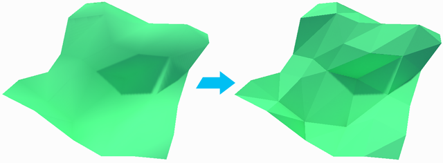
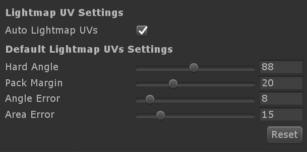

---

##  Merge Objects

Section Video: <a href="https://youtu.be/luxCckVIu8k?list=PLrJfHfcFkLM-b6_N-musBp4MFaEnxpF6y">Object Actions: Merge Objects</a>

Merges the selected objects into a single object.

##  Flip Object Normals

Section Video: <a href="https://youtu.be/Rwu4pr5EeIc?list=PLrJfHfcFkLM-b6_N-musBp4MFaEnxpF6y">Object Actions: Flip Object Normals</a>

Flips the normals of **all** faces on the selected object(s).

> Especially useful for converting an exterior modeled shape into an interior space.

##  Subdivide Object

Section Video: <a href="https://youtu.be/pIEvtGyvbOs?list=PLrJfHfcFkLM-b6_N-musBp4MFaEnxpF6y">Object Actions: Subdivide Object</a>

Divides every face on selected objects, allowing for greater levels of detail when modeling.

##  Reset / Freeze Transform

Section Video: <a href="https://youtu.be/IjXYkQ8PfAY?list=PLrJfHfcFkLM-b6_N-musBp4MFaEnxpF6y">Object Actions: Reset / Freeze Transform</a>

Sets the selected objects position, rotation, and scale to world-relative `{0,0,0}` without changing any vertex positions.

##  Move Pivot to Center of Object

Section Video: <a href="https://youtu.be/C5hCXTItzfE?list=PLrJfHfcFkLM-b6_N-musBp4MFaEnxpF6y">Object Actions: Center Pivot</a>

**Keyboard Shortcut** : `CTRL J`

Moves the mesh pivot to the center of the object’s bounds.

##  Conform Normals

Section Video: <a href="https://youtu.be/Dc6G1TDvBj4?list=PLrJfHfcFkLM-b6_N-musBp4MFaEnxpF6y">Object Actions: Conform Normals</a>

Sets all face normals on the selected object to the same relative direction.

##  Triangulate

Section Video: <a href="https://youtu.be/OQvY8j20MpY?list=PLrJfHfcFkLM-b6_N-musBp4MFaEnxpF6y">Object Actions: Triangulate</a>

Reduces all polygons to their base triangles, creating a sharp, faceted appearance.

##  Mirror Tool

Section Video: <a href="https://youtu.be/OvzNJ7z0OTs?list=PLrJfHfcFkLM-b6_N-musBp4MFaEnxpF6y">ProBuilder Toolbar: Mirror Tool</a>

Use the Mirror action to create mirrored copies of objects.

Mirror is especially useful when creating symmetrical items- build one half, mirror it, then weld the two together
for a perfectly symmetrical result.

 **Custom Settings Available** :

|**Setting:** |**Description:** |
|:---|:---|
|__X, Y, Z__| Choose which axis (single or multiple) to mirror on |
|__Duplicate__ | When **On**, a duplicate object will be created and mirrored, leaving the original unchanged. |

##  Lightmap UVs

Generates Lightmap UVs for any meshes in the open scenes that are missing them.

 **Custom Settings Available** :

|**Setting:** |**Description:** |
|:---|:---|
|__Auto Lightmap UVs__ |If **On**, ProBuilder will automatically build lightmap arrays as necessary. |
|__Default Lightmap UVs Settings__ | Define a set of default UV2 unwrapping parameters that all new shapes will use. This preference is per-project. |

##  Export

Export the selected ProBuilder objects to a 3D model.

|**Format:** |**Description:** |
|:---|:---|
|OBJ |Wavefront OBJ. Widely supported model format supports multiple textures and mesh groups. |
|STL |A widely supported format generally used in CAD software or 3D printing. Only supports triangle geometry. |
|PLY |Stanford PLY. Generally supported and very extensible. Supports quads and vertex colors, but not multiple materials. |
|Asset |Unity asset format, only readable in Unity. |

### Export options

|**Option:** |**Applicable Formats:** |**Description:** |
|:---|:---|:---|
|__Include Children__ |All |If enabled ProBuilder will include not only selected meshes, but also the children of selected objects in the exported model. |
|__Export as Group__ |OBJ, PLY |If enabled all selected objects will be combined and exported as a single model file. Otherwise each mesh will be exported separately. |
|__Apply Transforms__ |OBJ, PLY |Should the GameObject transform be applied to the mesh attributes before export? With this option and **Export as Group** enabled you can export your whole scene, edit, then re-import with everything exactly where you left it. |
|__Right Handed__ |OBJ, PLY |Unity's coordinate system is "Left Handed", where most other major 3D modeling packages operate in "Right Handed" coordinates. |
|__Copy Textures__ |OBJ |If enabled the exporter will copy texture maps to the OBJ file destination and reference them from local paths in the material library. If unchecked the material library will reference an absolute path to the textures and not copy them. If you're exporting an OBJ to use in Unity leave this unchecked and set the Mesh Importer "Material Naming" to "From Model's Material" and "Material Search" to "Project-Wide." |
|__Vertex Colors__ |OBJ |Some 3D modeling applications can import vertex colors from an unofficial extension to the OBJ format. Toggling this will write vertex colors using the MeshLab format. This can break import in some applications, please use with caution! |
|__Texture Scale, Offset__ |OBJ |Some 3D modeling applications import texture scale and offset paramters (Blender, for example). Toggling this will write these values to the exported mtlib file. This can break import in some applications, please use with caution! |
|__STL Format__ |STL |The STL file specification supports both ASCII and Binary representations. This toggles between the two types. |
|__Quads__ |PLY |Where possible, ProBuilder will preserve quads when exporting to PLY. |

##  ProBuilderize Object

Converts the selected object(s) into ProBuilder-editable objects.

 **Custom Settings Available** :

|**Setting:** |**Description:** |
|:---|:---|
|__Import Quads__ | If **On** ProBuilder will attempt to keep quadrangulate meshes on import. If **Off** the mesh will be imported as triangles. |
|__Import Smoothing__ | If **On** ProBuilder will use a smoothing angle value to calculate [smoothing groups](tool-panels/#smoothing-groups). |
|__Smoothing Threshold__ | When **Import Smoothing** is enabled any adjacent faces with an adjoining angle difference of less than this value will be assigned to a smooth group. |

##  Entity Type Tools

ProBuilder provides some default "entity" behaviours. These are simply MonoBehaviours that provide some commonly used functionality.

### Set Trigger

Assigns the `pb_TriggerBehaviour` script to selected objects, which does the following:

- If no collider is present, adds a `MeshCollider`.
- If collider is a `MeshCollider`, it is set to `Convex`.
- The collider `isTrigger` toggle is enabled.
- Sets the `Renderer` material to the ProBuilder Trigger material.
- When entering **Play Mode** or building the renderer is automatically disabled.

### Set Collider

Assigns the `pb_ColliderBehaviour` script to selected objects, which does the following:

- If no collider is present, adds a `MeshCollider`.
- Sets the `Renderer` material to the ProBuilder Collider material.
- When entering **Play Mode** or building the renderer is automatically disabled.

### pb_Entity (Deprecated)

Older versions of ProBuilder used a script called `pb_Entity` to manage trigger and collider objects. Projects making use of `pb_Entity` will still continue to function, but it is recommended to make use of the new `pb_TriggerBehaviour` and `pb_ColliderBehaviour` instead.
