# Unity Package Manager
A package is a container that holds any combination of Assets, Shaders, Textures, plug-ins, icons, and scripts that enhance various parts of your project, including Unity modules (such as Physics or Animation). Unity packages are newer, more tightly integrated versions of Asset Store packages, able to deliver a wide range of enhancements to Unity.

Use the Unity Package Manager (in Unity’s top menu: __Window__ > __Package Manager__) to view which packages are available for installation or already installed in your project. In addition, you can use this window to see [which versions are available](#VersionList), and [install](#PackManInstall), [remove](#PackManRemove), [disable](#PackManDisable), or [update](#PackManUpdate) packages for each project.

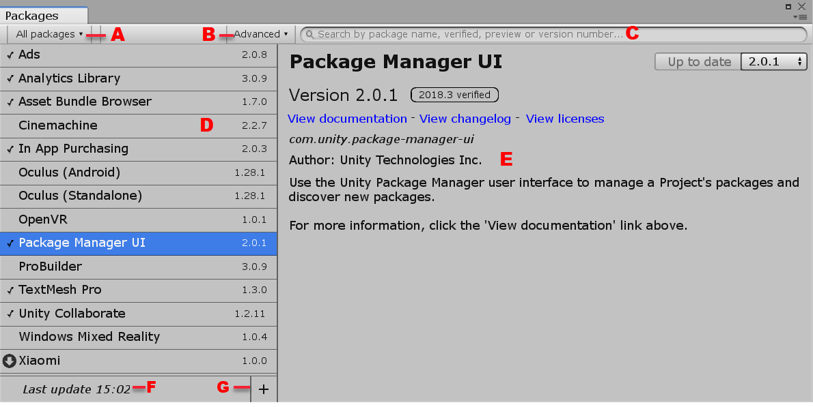

The Packages window displays a [list view](#PackManLists) on the left and a [detail view](#PackManDetails) on the right.

## Finding packages
The Packages window displays two types of Unity packages:

- 
  Read-only **Packages**, which the Package Manager downloads from the [Unity package registry](#PackManRegistry) as needed. They are not bundled with the Project source and they may have dependencies on other packages in external projects. This type is typical of most Unity packages.

- **Built In Packages**, which represent some of the core Unity features. You can use these packages to [turn Unity modules on and off](#PackManDisable).

**Note:** You can find out more about what each module implements in the [Unity Scripting API](https://docs.unity3d.com/ScriptReference/). Each module assembly page lists which APIs the built-in package implements.

By default, the Packages window displays the list of packages in the In Project mode, so that only the packages already installed in your project appear in the list.

To expand the list to include all available packages, click the **All** button. The list now displays everything registered in the [package registry](#PackManRegistry), regardless of whether they are already installed in the project.

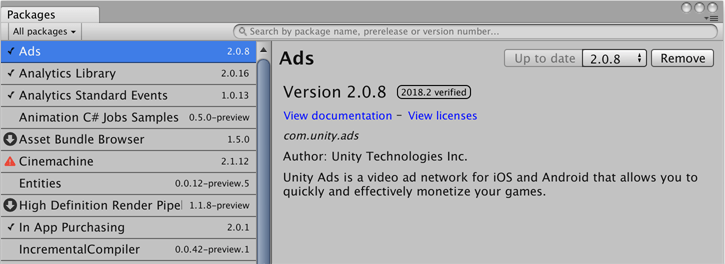

### Status bar

When the Package Manager installs or updates a package, it displays a message in the status bar under the list of packages:

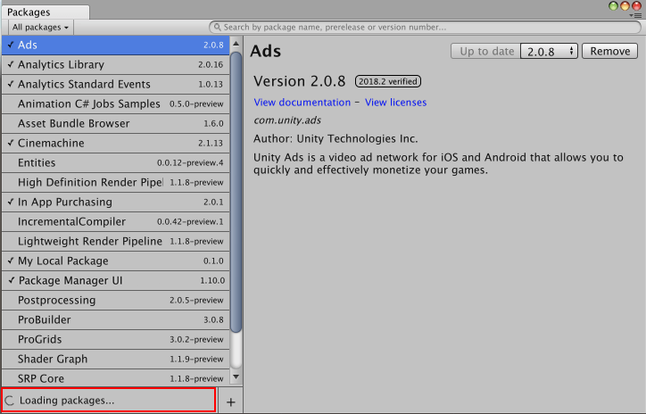

After the package successfully loads, the status bar clears.

## Viewing package details
The pane on the right side of the Packages window displays details about the selected package.

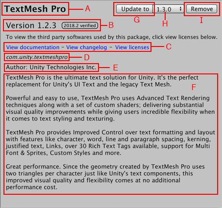

These details include the following information:
 - (A) The display name
 - (B) The version number (and tag, if available)
 - \(C\) The links to open the package documentation page, the package change log (if available), and the license information
 - (D) The official package name from the registry starting with `com.unity.`
 - (E) The author
 - (F) The installation or update status
 - (G) A brief description
 - (H) Button to install or update a package (or the **Up to date** message if the selected version is already installed)
 - (I) Package version drop-down menu
 - (J) Button to remove or disable the package

### List of versions

You can view the list of versions available for the current package by clicking the version drop-down menu beside the **Update to** or **Install** button. 

Click the version drop-down menu beside the **Update to** or **Install** button to view the list of versions available for the current package.

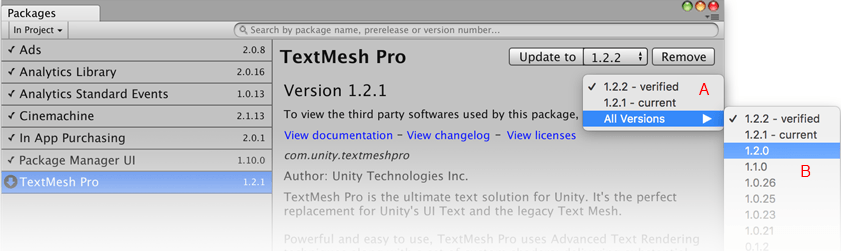

- (A) The main menu displays the current version, the latest version (even if it is a preview version), and the verified version.
- (B) The submenu displays all available versions.

To see the full list of available versions, choose **All Versions** from the main menu. 

You can select any of these versions and either install or switch to that specific version using the **Install** or **Update to** button.

### Version tags
Some packages display tags next to the version number. These tags convey information about that version of the package.

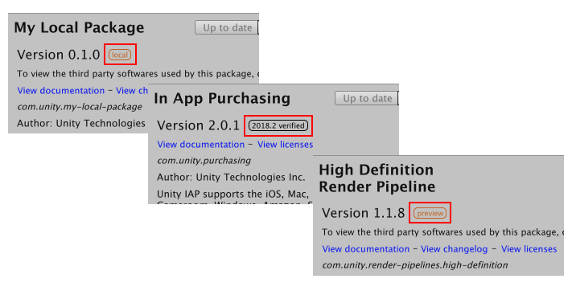

The Package Manager uses the following values:

| **Tag** | **Meaning** |
|--|--|
| `Verified` | This package has been verified by Unity's Quality Assurance team to work with a specific version of the Editor. |
| `Preview` | This package is at an early stage of the release cycle and may not have been documented and fully validated by either the development team or Unity's Quality Assurance team. |

A package without a tag is considered production quality.

### Finding more information
You can find out more about a package by viewing its documentation, its changelog, or its license information.

To access any of these pages, click one of the links in the [details pane](#PackManDetails):

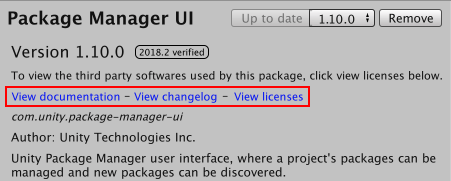

The package page opens in your default browser. 

To switch back and forth between the *Manual* documentation, the *Scripting API* documentation, the *Changelog*, and the *License* information for this package, click the corresponding link at the top of the page.

## Accessing the Packages window
You can perform a variety of tasks through the Packages window:

 - [Install a new package](#PackManInstall)
 - [Remove an installed package](#PackManRemove)
 - [Disable a built-in package](#PackManDisable)
 - [Update an installed package](#PackManUpdate)

To open the Packages window, navigate to Unity's main menu and go to **Window** > **Package Manager**.

### Installing a new package
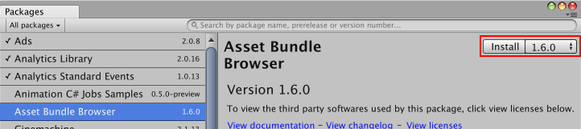

To install a new package:
  1. Open the Packages window and click the **All** button.
  2. Select the package you want to install from the [list of packages](#PackManLists). The package information appears in the [details pane](#PackManDetails).
  3. Select the version you want from the [version drop-down menu](#VersionList).
  4. Click the **Install** button. When the progress bar finishes, the new package is ready to use.

### Removing an installed package
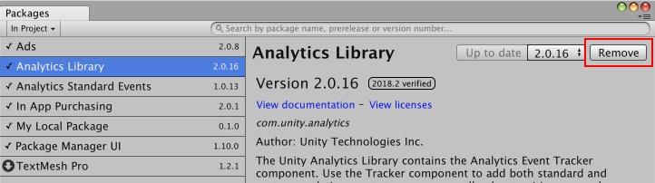

To remove an installed package:
 1. Open the Packages window.
 2. Click the **In Project** button if you are in **All** mode.
 3. Select the package you want to remove from the [list of packages](#PackManLists). The package information appears in the [details pane](#PackManDetails).
 4. Click the **Remove** button. When the progress bar finishes, the package disappears from the list.

**Notes:**
 - You can only remove packages which are not required by another package.
 - When you remove a package, any Editor or run-time functionality which it implemented is no longer available.
 - You can always restore a removed package from the list of **All** packages.

### Disabling a built-in package
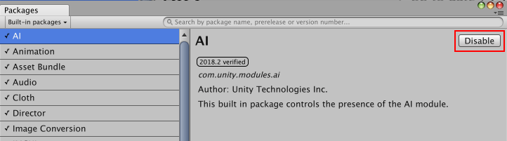

To disable a built-in package:
 1. Open the Packages window.
 2. Click the **In Project** button if you are in **All** mode. 
 3. Expand the **Built In Packages** list in the left pane.
 4. Select the package you want to remove from the [**Built In Packages** list](#PackManLists). Its information appears in the Details pane.
 5. Click the **Disable** button. When the progress bar finishes, the package disappears from the list.

**Note:** When you disable a built-in package, the corresponding Unity functionality is no longer available:
- If you use a Scripting API implemented by a disabled package, you get compiler errors.
- Components implemented by that built-in package are disabled too. You cannot add them to any GameObjects. If you have a GameObject that already has one of these components, Unity ignores them in Play mode. You can see them in the Inspector window but they are greyed out to indicate that they are not available.
- When building a game, Unity strips all disabled components. For build targets which support engine code stripping (like WebGL, iOS, and Android), Unity doesn't add any code from a disabled built-in package.

### Updating an installed package
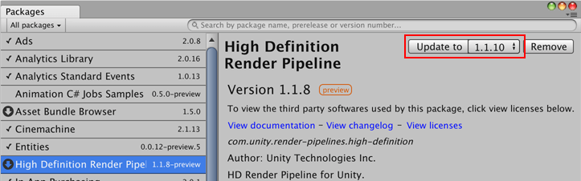

You can update a package while in either the **In Project** or **All** mode:
  1. Open the Packages window. An arrow indicator appears next to any packages that have updates available.
  2. Select the package you want to update from the [list of packages](#PackManLists). The package information appears in the [details pane](#PackManDetails).
  3. Select the version you want from the [version drop-down menu](#VersionList).
  4. Click the **Update to** button. When the progress bar finishes, the new package version information appears in the Details pane, and any new functionality is immediately available.

## Advanced package topics
This section provides more advanced information about the package manifest file. You don't need to know anything about these topics to install, remove, disable, and update packages.

In addition to its contents (Assets, Shaders, Textures, plug-ins, icons and scripts), a Unity package contains a [package manifest file](#PackManManifestsPackage). The package manifest tells Unity how to display its information page in the Packages window, and how to install the package in the project.

In addition, it contains several files that help manage the package deployment, including the tests, the samples, the license, the changelog, and the documentation.

### Manifests
There are two types of manifest files: [project](#PackManManifestsProject) manifests (`manifest.json`), and [package](#PackManManifestsPackage) manifests (`package.json`). Both files use JSON (JavaScript Object Notation) syntax to communicate with the Package Manager, by describing which packages are available for each project, and what each package contains.

#### Project manifests
Project manifests (`manifest.json`) tell the Package Manager which packages and versions are available to the project.

Project manifests support the following value:

| Key | JSON Type | Description |
|--|--|--|
| `dependencies` | Object |List of packages for the Package Manager to load. These are usually packages officially registered with Unity. |

Example of a `manifest.json` file:

	{
		"dependencies": {
			"com.unity.package-1": "1.0.0",
			"com.unity.package-2": "2.0.0",
			"com.unity.package-3": "3.0.0"
		}
	}

Unity stores each project manifest in the `[your_project_root_folder]/Packages/manifest.json` file.

#### Package manifests
The Package Manager uses package manifests (`package.json`) to determine which version of the package to load, and what information to display in the Packages window.

Package manifests support the following values:

| Key | JSON Type | Description |
|--|--|--|
| `name` | String |The officially registered package name, following this naming convention: `"com.unity.[your package name]"`. For example, `"com.unity.resourcemanager"` |
| `displayName` | String |The package name as it appears in the Packages window. For example, `"Resource Manager"` |
| `version` | String |The package version `"MAJOR.MINOR.PATCH"`. Unity packages follow the [Semantic Versioning](https://semver.org) system. For example, `"1.3.0"`. |
| `unity` | String |The Unity version that supports this package. For example, `"2018.1"` indicates compatibility starting with Unity version 2018.1. |
| `description` | String |A brief description of the package. This is the text that appears on the Details pane of the Packages window. Some special formatting character codes are supported, such as line breaks (`\n`) and bullets (`\u25AA`). |
| `keywords` | Array of Strings |Keywords used for searching in the Packages window, specified as a JSON array of strings. For example, `["Physics", "RigidBody", "Component"]`. |
| `category` | String |The category this packages is in. For example, `"Forces"`. |
| `dependencies` | Object |A list of packages that this package depends on, expressed as a JSON dictionary where the key is the package name and the value is the version number. Unity downloads all dependencies and loads them into the project alongside this package. |

Example of a `package.json` file:

	{
		"name": "com.unity.package-4",
		"displayName": "Package Number 4",
		"version": "2.5.1",
		"unity": "2018.1",
		"description": "This package provides X, Y, and Z. \n\nTo find out more, click the \"View Documentation\" link.",
		"keywords": ["key X", "key Y", "key Z"],
		"category": "Controllers",
		"dependencies": {
			"com.unity.package-1": "1.0.0",
			"com.unity.package-2": "2.0.0",
			"com.unity.package-3": "3.0.0"
		}
	}

Unity stores each package manifest in the `[your_package_root_folder]/package.json` file.

### The Package Registry
Unity maintains a central registry of official packages that are available for distribution. When Unity loads, the Package Manager communicates with the registry, checks the project manifest file, and displays the status of each available package in the Packages window.

When you remove a package from the project, the Package Manager updates the project manifest to exclude that package from the list in **In Project** mode but it is still available in **All** mode because it is still on the registry.

When you install or update a package, the Package Manager downloads the package from the registry.

# Technical details

## Requirements

This version of Unity Package Manager is compatible with the following versions of the Unity Editor:

* 2018.2 and later (recommended)

## Documentation revision history
|Date|Reason|
|---|---|
|May 25, 2018|Documentation updated. Matches package version 1.9.9.|
|May 4, 2018|Documentation updated. Matches package version 1.9.8.|
|March 19, 2018|Documentation updated. Matches package version 1.9.0.|
|Feb 8, 2018|Documentation updated. Matches package version 1.7.0.|
|Feb 6, 2018|Documentation cleaned up. Matches package version 1.6.1.|
|Jan 31, 2018|Documentation updated (developmental review)|
|Jan 29, 2018|Document updated. Matches package version 1.6.0.|
|Jan 18, 2018|Document updated. Matches package version 1.5.1.|
|Jan 17, 2018|Document updated. Matches package version 1.5.0.|
|Jan 12, 2018|Document updated. Matches package version 1.4.0.|
|Nov 7, 2017|Document created. Matches package version 1.0.0.|
