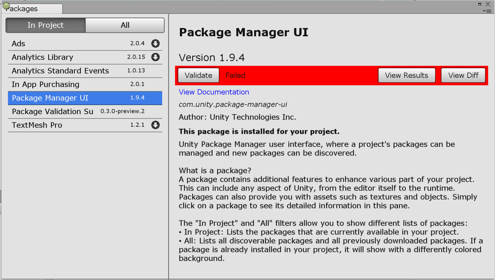

### **_Package Validation Suite_**

*Use the package validation suite to verify your package, making sure it meets Unity's package hosting standards before you submit your package for publishing. *

### Pre-requisites
The Package Validation Suite requires the Package Manager UI extension mechanism, which is available from version 1.9.3 or later.

### Installation
To add the Package Validation Suite to your project, edit your project's `manifest.json` file, adding the following lines:

```
{
    "dependencies": {
        "com.unity.package-validation-suite": "0.3.0-preview.6"
    }
}
```

## Validate Package
As shown below, once the validation package is installed in your project, the Package Manager UI will expose a new "Validate" option in the details section of the UI.


 By pressing the `Validate` button in the details pane of a package in development, the validation process will begin.  The following will take place:
 - The package being tested will get "built", to reflect the file set it will contain.
 - The previous version of the package will get downloaded, for comparison and upgrade testing.
 - The validation tests will get run.
 - A report will be produced for viewing.


 

## Known Limitations

* This is a temporary UI for internal development only.
* Not all validation tests are implemented, more to come!


# Technical details

## Requirements

This version of Unity Package Manager is compatible with the following versions of the Unity Editor:

* 2018.1 and later (recommended)

## Documentation revision history
|Date|Reason|
|---|---|
|April 12, 2018|Document created. Matches package version 0.3.0-preview.3.|
