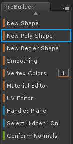

---

##  Poly Shape

Section Video: <a href="https://youtu.be/Xn8YPCnnoDc">Creating and Editing a Poly Shape</a>

**Poly Shape** is unlike the usual ProBuilder shapes in that it is interactive and editable indefinitely.  Once a **Poly Shape** has been created you may continue to edit it's control points and other settings.

> **Important!**: 
> Modifying control points or settings will clear any mesh edits.

## Quick Start

- In the [ProBuilder Toolbar](overview-toolbar.md) select **New Poly Shape**.
- In the Scene View click to add control points.  These will form the outer bounds of your mesh.
- Once finished placing points, hit `Enter / Return` or `Space` to finalize the shape.
- Move the mouse up and down to set the mesh height, then `Left Click` to finalize.

After the initial path and height setting, the mesh enters **Editing Mode**.

## Editing a Poly Shape

Even after the initial creation steps a **Poly Shape** can still be modified.

Select the **Edit Poly Shape** button in the **Unity Inspector**.  To disable Poly Shape Editing simply click this button again.

- Move existing control points by clicking and dragging.
- Add new points by clicking along the perimeter line.
- Remove existing points by clicking to select, then press `Backspace` (`Delete` on Mac).
- Set the height by clicking and dragging the handle in the center of the mesh.
- Flip the normals by selecting **Flip Normals** in the Inspector.

