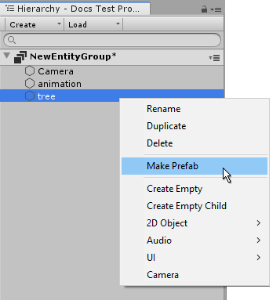
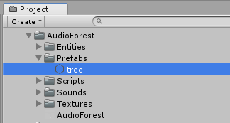
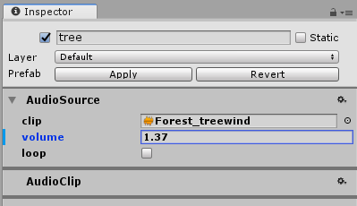

# Prefabs

Prefabs in Tiny Mode work similarly to [Prefabs in regular Unity](https://docs.unity3d.com/Manual/Prefabs.html). While not all Unity's Prefab features are supported, the basic concept remains the same, and you may find it useful to read through the Prefabs section of the regular Unity manual as well as this page.

Prefabs allow you to keep a "template" copy of an Entity in your project window as an asset. You can then place instances of that prefab in your hierarchy as many times as you want. Any changes to the prefab are reflected in the instances, which provides you with an easy way to make changes to many similar Entities across your game or app.

To create a prefab, set up an Entity in your hierarchy with whatever configuration of components you would like, then **right-click** on the Entity and select **Make Prefab**

A prefab asset is created in your project, and the entity you clicked on in the hierarchy becomes an **instance** of that prefab.

 
_The new prefab asset in the project window._

You can then drag that asset into the hierarchy (or double-click the asset) to create more instances of the prefab.

Each instance of the prefab reflects the original Prefab.

_Note: Prefabs in Tiny Mode do not support **Isolation Mode**_

## Instance Modifications

You can make **instance modifications** to Prefab instances in the scene. Instance modifications override the Prefab's original settings, and any instance modifications you make are indicated with a blue stripe on the left hand side of the inspector, next to their value in the inspector.

With all instance modifications listed below, you can **right-click** on the modification to either **apply** the change to the Prefab, or **revert** your change back to the Prefab's original value.

You can also use the two Prefab control buttons near the top of the inspector marked **Apply** and **Revert** to apply or revert **all** Prefab overrides in one go.

### Property overrides

You can override the value of individual properties of a component on a prefab instance by changing the value in the inspector.

 
_An instance of the "tree" prefab with an overridden value for the volume property_

You can right-click on any modified field to either **apply** this modification back to the prefab (in which case all instances of the prefab will reflect the new value), or to **revert** this modification back to the value on the Prefab.

### Component overrides

You can also add component overrides by adding a new component to a Prefab instance, or removing an existing one.

Again, these changes are shown in the inspector by a blue stripe which appears on the left hand side of the component.

Component overrides can also be **applied** or **reverted** back to the Prefab asset's original configuration.

### Entity overrides

Because Prefabs can contain a hierarchical structure of Entities, you can also override this structure, by adding or removing Entities to the Prefab instance's hierarchical structure. Entity overrides can also be **applied** or **reverted** back to the Prefab asset's original configuration.

