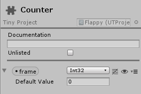

# Behaviours

If you have used Unity before, you may be familiar with the ubiquitous [MonoBehaviour](https://docs.unity3d.com/ScriptReference/MonoBehaviour.html) base class. In Tiny Mode, the **ut.ComponentBehaviour** attempts to replicate this pattern by providing a base class with **OnEnable**, **OnUpdate**, and **OnDisable** functions.

_Note: This does not provide Object-Oriented programming features - rather, it is an ECS construct to provide a **MonoBehaviour**-like scheduling pattern and event model._

Here's a quick example.

Consider this custom component defined in the editor:



The following script uses the OnEntityEnabled, OnEntityUpdate, and OnEntityDisabled events to reset the **frame** value, increment it, and write status messages to the console:

```
// Scripts/FrameCounter.ts

namespace game {

  export class FrameCounterFilter extends ut.EntityFilter {
    entity: ut.Entity;
    counter: game.Counter;
  }

  export class FrameCounter extends ut.ComponentBehaviour {

    data: FrameCounterFilter;

    OnEntityEnable(): void {
      console.log("FrameCounter enabled");
      this.data.counter.frame = 0;
    }

    OnEntityUpdate(): void {
      let frame = this.data.counter.frame + 1;
      this.data.counter.frame = frame;
      console.log(`frame ${frame}`);
      if (frame == 5) {
        this.Disable(this.world, this.data.entity);
      }
    }

    OnEntityDisable(): void {
      console.log("FrameCounter disabled");
    }
  }
}
```

When run, the console outputs:
```
FrameCounter enabled
frame 1
frame 2
frame 3
frame 4
frame 5
FrameCounter disabled
```

When extending **ut.ComponentBehaviour**, you must:


*   Define **exactly one** **ut.EntityFilter** field. In the example above, this is the **data** field.
*   Define **at least one** standard method
    *   OnEntityEnable: called once when an entity matching the filter is initialized or becomes enabled.
    *   OnEntityUpdate: called every frame when an entity matching the filter is enabled
    *   OnEntityDisable: called once when an entity matching the filter becomes disabled

You can also use the **ut.executeAfter** and **ut.executeBefore** decorators to control the execution order between behaviours. However, since behaviours come with implicit scheduling, **you can't schedule behaviours against individual systems or fences**.

The **OnEntityEnable** event methods are executed before **OnEntityUpdate**, which are executed before **OnEntityDisable**. For example, if you have 2 classes of **ComponentBehaviour**: **A** and **B**, with **B** scheduled after **A**, and with behaviours defining all supported behaviour methods, the execution order would be:


1.  A.OnEntityEnable
1.  B.OnEntityEnable
1.  ut.Shared.InputFence
1.  ...
1.  ut.Shared.UserCodeStart
1.  ...
1.  A.OnEntityUpdate
1.  B.OnEntityUpdate
1.  ...
1.  ut.Shared.UserCodeEnd
1.  ...
1.  ut.Shared.PlatformRenderingFence
1.  A.OnEntityDisable
1.  B.OnEntityDisable

Extending **ut.ComponentBehaviour** gives you:


*   Automatic behaviour state management per entity. No need to create extra components manually to track _initialized_ or _enabled_ states.
*   Automatic scheduling of the supported event methods: OnEnable happens before OnUpdate, which happens before OnDisable.

At runtime, exactly one **ut.ComponentBehaviour** instance is created per behaviour type. You can access this instance by using the **Instance** property of any behaviour type.

Note that using **ut.ComponentBehaviour** is not free - it comes with a small performance overhead. If state management is not required, or if you need to iterate over multiple sets of entities within a system, prefer **ut.ComponentSystem**.

